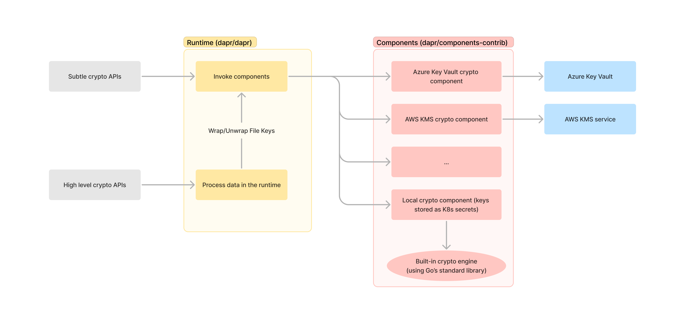

# Crypto(graphy) building block

- Author(s): Alessandro Segala (@ItalyPaleAle)
- Updated: 2023-03-27

## Overview

This is a proposal for a new building block for Dapr to allow developers to leverage cryptography in a SAFE and consistent way. Goal is to expose an API that allows developers to ask Dapr to perform operations such as encrypting and decrypting messages, and calculating and verifying digital signatures.

### Business problem

Modern applications make extensive use of cryptography, which, when implemented correctly, can make solutions safer even in case data is compromised. Even more, in certain cases the use of crypto is required to comply with industry regulations (think banking) or even with legal requirements (GDPR). However, leveraging cryptography is hard: developers need to pick the right algorithms and options, and need to learn the proper way to manage and protect keys. Additionally, there are operational complexities when teams want to limit who has access to cryptographic key material.

Organizations have increasingly started to leverage tools and services to perform cryptographic operations outside of applications. Examples include services such as Azure Key Vault, AWS KMS, Google Cloud KMS, etc. Customers may also use on-prem HSM products like Thales Luna. While those products/services perform the same or very similar operations, their APIs are very different.

This is an area where Dapr can help. Just like we're offering an abstraction on top of secret stores, we can offer an abstraction layer on top key vaults.

### Solution overview

Benefits include:

- Making it easier for developers to perform cryptographic operations in a safe way. Dapr provides safeguards against using unsafe algorithms, or using algorithms with unsafe options.
- Keeping keys outside of applications. Applications never see key material, but can request the vault to perform operations with the keys.
- Allowing greater separation of concerns. By using external vaults, only authorized teams can access private/shared key materials.
- Simplify key management and key rotation. Keys are managed in the vault and outside of the application, and they can be rotated without needing the developers to be involved (or even without restarting the apps).
- Enabling better audit logging to monitor when operations are performed with keys in the vault.

### APIs: High-level vs subtle

The building block features 2 kinds of operations:

- Low-level or "subtle" (term frequently used to indicate low-level crypto operations; one example is how in browsers, low-level operations are in the [`crypto.subtle`](https://developer.mozilla.org/en-US/docs/Web/API/SubtleCrypto) object). These offer developers full control over the schemes that are used, allowing them to specify parameters, keys, modes of operations, etc.  
  As the "subtle" name implies, using these operations requires a certain level of understanding about what they do and how to use them safely; they are not meant to be consumed by the "general public".  
  Dapr offers these low-level operations for two reasons:
  1. Just like it is Dapr's value proposition to, for example, offer a consistent API abstracting various state stores, we will offer a consistent API to interface with key vaults. It allows using key vaults from multiple cloud providers, as well as using keys stored as Kubernetes secrets, all while interfacing with the same API.
  2. Developers working on applications that require interacting with existing and/or external solutions need these lower-level APIs to be able to maintain compatibility with them.
- High-level operations. At launch, these will cover data encryption and decryption only.  
  When using these higher-leel methods, Dapr offers a great level of abstraction. Developers just need to provide a key (symmetric or asymmetric) and can then use Dapr to encrypt/decrypt data without having to worry about anything else. Dapr will choose the best ciphers and modes of operations, offering access to an encryption scheme that is secure and flexible.

### Low-level APIs

The new building block will feature 7 low-level APIs:

- `encrypt`: encrypts arbitrary data using a key stored in the vault. It supports symmetric and asymmetric ciphers, depending on the type of key in use (and the types of keys supported by the vault).
- `decrypt`: decrypts arbitrary data, performing the opposite of what `/encrypt` does.
- `wrapkey`: wraps keys using other keys stored in the vault. This is exactly like encrypting data, but it expects inputs to be formatted as keys (for example formatted as JSON Web Key) and it exposes additional algorithms not available when encrypting general data (like AES-KW)
- `unwrapkey`: un-wraps (decrypts) keys, performing the opposite of what `/wrap` does
- `sign`: signs an arbitrary message using an asymmetric key stored in the vault (we could also consider offering HMAC here, using symmetric keys, although not widely supported by the vault services)
- `verify`: verifies a digital signature over an arbitrary message, using an asymmetric key stored in the vault (same: we may be able to offer HMAC too)
- `getkey`: this can be used only with asymmetric keys stored in the vault, and returns the public part of the key

### High-level APIs

The high-level APIs at launch will only include support for **encrypting** and **decrypting** messages (of arbitrary length), using the [Dapr encryption scheme](#dapr-encryption-scheme-daprioencv1).

Although these APIs will be available over both gRPC and HTTP, the gRPC implementation is **strongly** preferred, since it allows encrypting/decrypting data as a stream. The HTTP implementation requires keeping the entire message in memory, both as plaintext and ciphertext (a limitation in the HTTP protocol itself we cannot work around), which is not desirable unless users are encrypting very small files.

### Components

Different components will be developed to perform those operations on supported backends such as the products/services listed above. Dapr would "translate" these calls into whatever format the backends require. Dapr never sees the private/shared keys, which remain safely stored inside the vaults.

Additionally, we will offer a "local" crypto component where keys are stored as Kubernetes secrets and cryptographic operations are performed within the Dapr sidecar. Although this is not as secure as using an external key vault, it still offers some benefits such as using standardized APIs and separation of concerns/roles with regards to key management.

Algorithms available will depend on what the backend vaults support, but in general developers should always find AES (encrypt/decrypt only) and RSA; when supported, we can offer also ChaCha20-Poly1305 (encrypt/decrypt only) and ECC with ECDSA or EdDSA (sign/verify only).

## Related Items

Previous proposal as GitHub issue: dapr/dapr#4508

## Data flow: runtime and components



## Dapr encryption scheme: dapr.io/enc/v1

In the first version of the building block, we define 2 higher level operations to encrypt and decrypt data, in addition to low-level operations.

> **Sources:** The encryption scheme that Dapr uses is heavily inspired by the [Tink wire format](https://developers.google.com/tink/wire-format) (from the Tink library maintained by Google), as well as by Filippo Valsorda's [age](https://age-encryption.org/v1), and Minio's [DARE](https://github.com/minio/sio).

The **Dapr encryption scheme** is optimized for processing data as a stream. Data is chunked into multiple parts which are encrypted independently. This allows us to return data to callers as a stream, even when decrypting messages, being confident that we are not flushing unverified data to the client.

### Key

Each message is encrypted with a 256-bit symmetric **File Key (FK)** that is randomly generated by Dapr for each new message. The key must be generated as 32 byte of output from a CSPRNG (such as Go's `crypto/rand.Reader`) and must not be reused for other files.

The FK is wrapped using a key stored in a key vault (**Key Encryption Key (KEK)**) by Dapr. The result of the wrapping operation is the **Wrapped File Key (WFK)**.  The algorithm used depends on the type of the KEK as well as the algorithms supported by the component: in order of preference:

- Symmetric keys:
    - AES-KW ([RFC 3394](https://www.rfc-editor.org/rfc/rfc3394.html)): `AES-KW`
    - AES-GCM-SIV: `AES-GCM-SIV`  
      This will be implemented if it can be used with keys stored in key vaults; to be confirmed.
- RSA keys:
    - RSA OAEP with SHA-256: `RSA-OAEP-256`

> In the future, we should explore how to add support for elliptic curve cryptography, for example P-256/P-384/P-521 or Curve25519, which requires performing a static ECDH key agreement.

### Ciphertext format

The ciphertext is formatted as:

```text
header || binary payload
```

### Header

The **header** is human-readable and contains 3 items, each terminated by a line feed (0x0A) character:

1. Name and version of the encryption scheme used. Currently, this is always `dapr.io/enc/v1`
2. The manifest, which is a JSON object.
3. The MAC for the header, base64-encoded

> Base64 encoding follows [RFC 4648 §4](https://datatracker.ietf.org/doc/html/rfc4648#section-4) ("standard" format, with padding included but optional when decoding)

```text
dapr.io/enc/v1
{"k":"mykey","kw":1,"wfk":"hGYjwDpWEXEymSTFZ95zgX8krElb3Gqyls67R8zJA3k=","cph":1,"np":"Y3J5cHRvIQ=="}
pBDKLrhAWL7IAvDKBV/v7lmbTG6AEZbf3srUN0Pnn30=
```

#### Manifest

The second line in the header is the **manifest**, which is a compact JSON object.

Its corresponding Go struct is:

```go
type Manifest struct {
	// Name of the key that can be used to decrypt the message.
	// This is optional, and if specified can be in the format `key` or `key/version`.
	KeyName string `json:"k,omitempty"`
	// ID of the wrapping algorithm used.
	// 0x01 = AES-KW
	// 0x02 = RSA-OAEP-256
	KeyWrappingAlgorithm int `json:"kw"`
	// The Wrapped File Key
	WFK []byte `json:"wfk"`
	// ID of the cipher used.
	// 0x01 = AES-GCM
	// 0x02 = ChaCha20-Poly1305
	Cipher int `json:"cph"`
	// Random sequence of 7 bytes generated by a CSPRNG
	NoncePrefix []byte `json:"np"`
}
```

- **`KeyName`** is the name of the key that can be used to decrypt the message. Usually this is the same as the name of the key used to encrypt the message, but when asymmetric ciphers are used, it could be different. Including a `KeyName` in the manifest is not required, but when i'ts present, it's used as the default value for the key name while decrypting the document (however, users can override this value by passing a custom one while decrypting the document).
- **`Cipher`** indicates the cipher used to encrypt the actual data, and it must be an [AEAD](https://en.wikipedia.org/wiki/Authenticated_encryption#Authenticated_encryption_with_associated_data_(AEAD)) symmetric cipher.
  - Dapr will choose AES-GCM as cipher by default.
  - ChaCha20-Poly1305 is offered as an option for users that work with hardware that doesn't support AES-NI (such as Raspberry Pi), and needs to be enabled manually.
  - In the future, we can support other authenticated ciphers such as AES-CBC with HMAC-SHA256.

#### MAC

The third and final line is the MAC for the header, which is computed with HMAC-SHA-256 over the previous 2 lines (including the final newline character) with a key that is derived from the (plain-text) File Key with HKDF-SHA-256:

```text
mac-key = HKDF-SHA-256(ikm = file key, salt = empty, info = "header")
MAC = HMAC-SHA-256(key = mac-key, message = first 2 lines of the header)
```

> HKDF-SHA-256 is a key derivation function based on HMAC with SHA-256. See [RFC 5869 ("HMAC-based Extract-and-Expand Key Derivation Function (HKDF)")](https://www.rfc-editor.org/rfc/rfc5869.html). Being based on HMAC, it's not vulnerable to length-extension attacks, so we do not consider necessary using SHA-512 and truncating the output to 256-bits.

Note that there's one newline character (0x0A) at the end of the MAC, which concludes the header.

> Because each JSON encoder could produce a slightly different output, when verifying the manifest the MAC should be computed on the exact manifest string as included in the header. Verifiers should not re-encode the raw message as JSON.

### Binary payload

The binary payload begins immediately after the header (after the 3rd newline character) and it includes the each segment of data encrypted:

```text
segment_0 || segment_1 || ... || segment_k
```

### Segments

The plaintext is chunked into segments 64KB (65,536 bytes) each; the last segment may be shorter. Segments must never be empty, unless the entire file is empty.

> Because segments are 64KB each, and we can have up to 2^32 segments, the maximum size of the encrypted message is 256TB.

Each segment of plaintext is encrypted independently and stored together with its authentication tag:

```text
encrypted chunk || tag
```

Segments are encrypted with a **Payload Key (PK)** that is derived from the (plain-text) File Key and the nonce prefix:

```text
payload-key = HKDF-SHA-256(ikm = file key, salt = nonce prefix, info = "payload")
```

Each segment is encrypted using a different 12-byte nonce:

```text
nonce_prefix || i || last_segment
```

Where:

- `nonce_prefix` (7 bytes) is the nonce prefix from the header
- `i` (4 bytes) is the sequence number, as a 32-bit unsigned integer counter, encoded as big-endian. The first segment has sequence number 0, and it increases.
- `last_segment` (1 byte) is `0x01` if this is the last segment, or `0x00` otherwise

## Components

Components in dapr/components-contrib implement low-level primitives only, while all higher-level operations are performed by the runtime, so they are executed in a consistent way across all backends/services. This is because the job of the components is limited to actually interacting with the key vaults, and everything else is best handled by the runtime.

Components are to be placed in the `crypto` folder and must implement the `SubtleCrypto` interface:

```go
import "github.com/lestrrat-go/jwx/v2/jwk"

// SubtleCrypto offers an interface to perform low-level ("subtle") cryptographic operations with keys stored in the vault
type SubtleCrypto interface {
    // GetKey returns the public part of a key stored in the vault
    // This method returns an error if the key is symmetric
    GetKey(
        // Context that can be used to cancel the running operation
        ctx context.Context,
        // Name (or name/version) of the key to use in the key vault
        key string,
    ) (
        // Object containing the public key
        pubKey jwk.Key,
        // Error
        err error,
    )

    // Encrypt a small message and returns the ciphertext
    Encrypt(
        // Context that can be used to cancel the running operation
        ctx context.Context, 
        // Input plaintext
        plaintext []byte,
        // Encryption algorithm to use
        algorithm string,
        // Name (or name/version) of the key to use in the key vault
        key string,
        // Nonce / initialization vector
        // Ignored with asymmetric ciphers
        nonce []byte,
        // Associated Data when using AEAD ciphers
        // Optional, can be nil
        associatedData []byte,
    ) (
        // Encrypted ciphertext
        ciphertext []byte,
        // Authentication tag
        // This is nil when not using an authenticated cipher
        tag []byte,
        // Error
        err error,
    )

    // Decrypt a small message and returns the plaintext
    Decrypt(
        // Context that can be used to cancel the running operation
        ctx context.Context, 
        // Input ciphertext
        ciphertext []byte,
        // Encryption algorithm to use
        algorithm string,
        // Name (or name/version) of the key to use in the key vault
        key string,
        // Nonce / initialization vector
        // Ignored with asymmetric ciphers
        nonce []byte,
        // Authentication tag
        // Ignored when not using an authenticated cipher
        tag []byte,
        // Associated Data when using AEAD ciphers
        // Optional, can be nil
        associatedData []byte,
    ) (
        // Decrypted plaintext
        plaintext []byte,
        // Error
        err error,
    )

    // WrapKey wraps a key
    WrapKey(
        // Context that can be used to cancel the running operation
        ctx context.Context, 
        // Key to wrap as jwk.Key object
        plaintextKey jwk.Key,
        // Encryption algorithm to use
        algorithm string,
        // Name (or name/version) of the key to use in the key vault
        key string,
        // Nonce / initialization vector
        // Ignored with asymmetric ciphers
        nonce []byte,
        // Associated Data when using AEAD ciphers
        // Optional, can be nil
        associatedData []byte,
    ) (
        // Wrapped key
        wrappedKey []byte,
        // Authentication tag
        // This is nil when not using an authenticated cipher
        tag []byte,
        // Error
        err error,
    )

    // UnwrapKey unwraps a key
    UnwrapKey(
        // Context that can be used to cancel the running operation
        ctx context.Context, 
        // Wrapped key
        wrappedKey []byte,
        // Encryption algorithm to use
        algorithm string,
        // Name (or name/version) of the key to use in the key vault
        key string,
        // Nonce / initialization vector
        // Ignored with asymmetric ciphers
        nonce []byte,
        // Authentication tag
        // Ignored when not using an authenticated cipher
        tag []byte,
        // Associated Data when using AEAD ciphers
        // Optional, can be nil
        associatedData []byte,
    ) (
        // Plaintext key
        plaintextKey jwk.Key,
        // Error
        err error,
    )

    // Sign a digest
    Sign(
        // Context that can be used to cancel the running operation
        ctx context.Context, 
        // Digest to sign
        digest []byte,
        // Signing algorithm to use
        algorithm string,
        // Name (or name/version) of the key to use in the key vault
        // The key must be asymmetric
        key string,
    ) (
        // Signature that was computed
        signature []byte,
        // Error
        err error,
    )

    // Verify a signature
    Verify(
        // Context that can be used to cancel the running operation
        ctx context.Context, 
        // Digest of the message
        digest []byte,
        // Signature to verify
        signature []byte,
        // Signing algorithm to use
        algorithm string,
        // Name (or name/version) of the key to use in the key vault
        // The key must be asymmetric
        key string,
    ) (
        // True if the signature is valid
        valid bool,
        // Error
        err error,
    )
}
```

A few notes about all methods above:

1. Keys are passed as `jwk.Key` objects, from the (excellent) [lestrrat-go/jwx library](https://pkg.go.dev/github.com/lestrrat-go/jwx/v2)
1. The `algorithm` should be represented as constant as defined by [RFC 7518 ("JSON Web Algorithms (JWA)")](https://www.rfc-editor.org/rfc/rfc7518.html). For the most part, Dapr components should not try to parse the value submitted by the user (unless the component is the "local" one that performs crypto operations directly), and pass whatever value directly to the key vault.
1. The `key` parameter can contain a version if keys can be versioned in the vault. The format should be `name/version`. If no version is specified, it's assumed to be the latest.

Notes on `WrapKey` and `UnwrapKey`:

1. If the key need to be encoded (common with asymmetric keys), it needs to be encoded before being passed to the component. For example, in the runtime, RSA keys may be represented in a [`rsa.PrivateKey` object](https://pkg.go.dev/crypto/rsa#PrivateKey), and need to be encoded in PKCS#1 format. Symmetric keys can be passed as-is, as they are normally stored in a byte slice already.
1. `WrapKey` and `UnwrapKey` can be implemented on top of `Encrypt` and `Decrypt` if the underlying key vault does not have a special operation for key wrapping/unwrapping. 

Notes on `Encrypt` and `Verify`:

1. When using an asymmetric key, these operations can be performed using the public key without hitting the key vault. However, for consistency and to ensure that we always use the last version of the key, components should always perform them in the vault. Exception could be if the key has a specific version, in which case components may opt to download the public key, cache it, and perform the operation locally.

Notes on `Sign` and `Verify`:

1. Certain algorithms (currently `Ed25519`) do not operate on a message digest's, but rather on the message itself.

## gRPC APIs

In the Dapr gRPC APIs, we are extending the `runtime.v1.Dapr` service to add new methods:

> Note: APIs will have "Alpha1" added while in preview

```proto
// (Existing Dapr service)
service Dapr {
  // SubtleGetKey returns the public part of an asymmetric key stored in the vault.
  rpc SubtleGetKey(SubtleGetKeyRequest) returns (SubtleGetKeyResponse);

  // SubtleEncrypt encrypts a small message using a key stored in the vault.
  rpc SubtleEncrypt(SubtleEncryptRequest) returns (SubtleEncryptResponse);

  // SubtleDecrypt decrypts a small message using a key stored in the vault.
  rpc SubtleDecrypt(SubtleDecryptRequest) returns (SubtleDecryptResponse);

  // SubtleWrapKey wraps a key using a key stored in the vault.
  rpc SubtleWrapKey(SubtleWrapKeyRequest) returns (SubtleWrapKeyResponse);

  // SubtleUnwrapKey unwraps a key using a key stored in the vault.
  rpc SubtleUnwrapKey(SubtleUnwrapKeyRequest) returns (SubtleUnwrapKeyResponse);

  // SubtleSign signs a message using a key stored in the vault.
  rpc SubtleSign(SubtleSignRequest) returns (SubtleSignResponse);

  // SubtleVerify verifies the signature of a message using a key stored in the vault.
  rpc SubtleVerify(SubtleVerifyRequest) returns (SubtleVerifyResponse);

  // Encrypt encrypts a message using the Dapr encryption scheme and a key stored in the vault.
  rpc Encrypt(stream EncryptRequest) returns (stream EncryptResponse);

  // Decrypt decrypts a message using the Dapr encryption scheme and a key stored in the vault.
  rpc Decrypt(stream DecryptRequest) returns (stream DecryptResponse);
}

// rpc SubtleGetKey(SubtleGetKeyRequest) returns (SubtleGetKeyResponse);

// SubtleGetKeyRequest is the request object for SubtleGetKey.
message SubtleGetKeyRequest {
  enum KeyFormat {
    // PEM (SPKI) (default)
    PEM = 0;
    // JSON (JSON Web Key) as string
    JSON = 1;
  }
 
  // Name of the component
  string component_name = 1 [json_name="component"];
  // Name (or name/version) of the key to use in the key vault
  string name = 2;
  // Response format
  KeyFormat format = 3;
}

// SubtleGetKeyResponse is the response for SubtleGetKey.
message SubtleGetKeyResponse {
  // Name (or name/version) of the key.
  // This is returned as response too in case there is a version.
  string name = 1;
  // Public key, encoded in the requested format
  string public_key = 2 [json_name="publicKey"];
}

// rpc SubtleEncrypt(SubtleEncryptRequest) returns (SubtleEncryptResponse);

// SubtleEncryptRequest is the request for SubtleEncrypt.
message SubtleEncryptRequest {
  // Name of the component
  string component_name = 1 [json_name="component"];
  // Message to encrypt.
  bytes plaintext = 2;
  // Algorithm to use, as in the JWA standard.
  string algorithm = 3;
  // Name (or name/version) of the key.
  string key = 4;
  // Nonce / initialization vector.
  // Ignored with asymmetric ciphers.
  bytes nonce = 5;
  // Associated Data when using AEAD ciphers (optional).
  bytes associated_data = 6 [json_name="associatedData"];
}

// SubtleEncryptResponse is the response for SubtleEncrypt.
message SubtleEncryptResponse {
  // Encrypted ciphertext.
  bytes ciphertext = 1;
  // Authentication tag.
  // This is nil when not using an authenticated cipher.
  bytes tag = 2;
}

// rpc SubtleDecrypt(SubtleDecryptRequest) returns (SubtleDecryptResponse);

// SubtleDecryptRequest is the request for SubtleDecrypt.
message SubtleDecryptRequest {
  // Name of the component
  string component_name = 1 [json_name="component"];
  // Message to decrypt.
  bytes ciphertext = 2;
  // Algorithm to use, as in the JWA standard.
  string algorithm = 3;
  // Name (or name/version) of the key.
  string key = 4;
  // Nonce / initialization vector.
  // Ignored with asymmetric ciphers.
  bytes nonce = 5;
  // Authentication tag.
  // This is nil when not using an authenticated cipher.
  bytes tag = 6;
  // Associated Data when using AEAD ciphers (optional).
  bytes associated_data = 7 [json_name="associatedData"];
}

// SubtleDecryptResponse is the response for SubtleDecrypt.
message SubtleDecryptResponse {
  // Decrypted plaintext.
  bytes plaintext = 1;
}

// rpc SubtleWrapKey(SubtleWrapKeyRequest) returns (SubtleWrapKeyResponse);

// SubtleWrapKeyRequest is the request for SubtleWrapKey.
message SubtleWrapKeyRequest {
  // Name of the component
  string component_name = 1 [json_name="component"];
  // Key to wrap
  bytes plaintext_key = 2 [json_name="plaintextKey"];
  // Algorithm to use, as in the JWA standard.
  string algorithm = 3;
  // Name (or name/version) of the key.
  string key = 4;
  // Nonce / initialization vector.
  // Ignored with asymmetric ciphers.
  bytes nonce = 5;
  // Associated Data when using AEAD ciphers (optional).
  bytes associated_data = 6 [json_name="associatedData"];
}

// SubtleWrapKeyResponse is the response for SubtleWrapKey.
message SubtleWrapKeyResponse {
  // Wrapped key.
  bytes wrapped_key = 1 [json_name="wrappedKey"];
  // Authentication tag.
  // This is nil when not using an authenticated cipher.
  bytes tag = 2;
}

// rpc SubtleUnwrapKey(SubtleUnwrapKeyRequest) returns (SubtleUnwrapKeyResponse);

// SubtleUnwrapKeyRequest is the request for SubtleUnwrapKey.
message SubtleUnwrapKeyRequest {
  // Name of the component
  string component_name = 1 [json_name="component"];
  // Wrapped key.
  bytes wrapped_key = 2 [json_name="wrappedKey"];
  // Algorithm to use, as in the JWA standard.
  string algorithm = 3;
  // Name (or name/version) of the key.
  string key = 4;
  // Nonce / initialization vector.
  // Ignored with asymmetric ciphers.
  bytes nonce = 5;
  // Authentication tag.
  // This is nil when not using an authenticated cipher.
  bytes tag = 6;
  // Associated Data when using AEAD ciphers (optional).
  bytes associated_data = 7 [json_name="associatedData"];
}

// SubtleUnwrapKeyResponse is the response for SubtleUnwrapKey.
message SubtleUnwrapKeyResponse {
  // Key in plaintext
  bytes plaintext_key = 1 [json_name="plaintextKey"];
}

// rpc SubtleSign(SubtleSignRequest) returns (SubtleSignResponse);

// SubtleSignRequest is the request for SubtleSign.
message SubtleSignRequest {
  // Name of the component
  string component_name = 1 [json_name="component"];
  // Digest to sign.
  bytes digest = 2;
  // Algorithm to use, as in the JWA standard.
  string algorithm = 3;
  // Name (or name/version) of the key.
  string key = 4;
}

// SubtleSignResponse is the response for SubtleSign.
message SubtleSignResponse {
  // The signature that was computed
  bytes signature = 1;
}

// rpc SubtleVerify(SubtleVerifyRequest) returns (SubtleVerifyResponse);

// SubtleVerifyRequest is the request for SubtleVerify.
message SubtleVerifyRequest {
  // Name of the component
  string component_name = 1 [json_name="component"];
  // Digest of the message.
  bytes digest = 2;
  // Signature to verify.
  bytes signature = 3;
  // Algorithm to use, as in the JWA standard.
  string algorithm = 4;
  // Name (or name/version) of the key.
  string key = 5;
}

// SubtleVerifyResponse is the response for SubtleVerify.
message SubtleVerifyResponse {
  // True if the signature is valid.
  bool valid = 1;
}

// rpc Encrypt(stream EncryptRequest) returns (stream EncryptResponse);

message EncryptRequest {
  // Request details. Must be present in the first message only.
  EncryptRequestOptions options = 1;
  // Chunk of data of arbitrary size.
  common.v1.StreamPayload payload = 2;
}

message EncryptRequestOptions {
  // Name of the component
  string component_name = 1 [json_name="component"];
  // Name (or name/version) of the key.
  string key = 2;
  // Force algorithm to use to encrypt data: "aes-gcm" or "chacha20-poly1305" (optional)
  string algorithm = 10;
  // If true, the encrypted document does not contain a key reference.
  // In that case, calls to the Decrypt method must provide a key reference (name or name/version).
  // Defaults to false.
  bool key_unbound = 11 [json_name="keyUnbound"]; 
  // Key reference to embed in the encrypted document (name or name/version).
  // This is helpful if the reference of the key used to decrypt the document is different from the one used to encrypt it.
  // If unset, uses the reference of the key used to encrypt the document (this is the default behavior).
  // This option is ignored if key_unbound is true.
  string key_binding = 12 [json_name="keyBinding"];
}

message EncryptResponse {
  // Chunk of data.
  common.v1.StreamPayload payload = 1;
}

// rpc Decrypt(stream DecryptRequest) returns (stream DecryptResponse);

message DecryptRequest {
  // Request details. Must be present in the first message only.
  DecryptRequestOptions options = 1;
  // Chunk of data of arbitrary size.
  common.v1.StreamPayload payload = 2;
}

message DecryptRequestOptions {
  // Name of the component
  string component_name = 1 [json_name="component"];
  // Name (or name/version) of the key to decrypt the message.
  // Overrides any key reference included in the message if present.
  // This is required if the message doesn't include a key reference (i.e. was created with key_unbound set to true).
  string key = 12;
}

message DecryptResponse {
  // Chunk of data.
  common.v1.StreamPayload payload = 1;
}
```

> For the `common.v1.StreamPayload` message, see [dapr/dapr#5170](https://github.com/dapr/dapr/pull/5170)

The `Encrypt` and `Decrypt` methods are stream-based. Dapr will read from the client until it has sufficient data, and will then send back the encrypted/decrypted data to the client. Clients must thus both send data to the RPC and listen for incoming messages. SDKs can offer to consumer methods to read the data as a stream (e.g. in Go, they accept an `io.Reader` and return an `io.Reader`)

## HTTP APIs

### Low-level

The low-level HTTP APIs are developed in a way that is the exact "port" of the gRPC "subtle" APIs, and the contents of the request and response bodies match exactly the fields in the gRPC APIs (except for the component name in the URL).

List of HTTP endpoints and the corresponding gRPC method:

- `POST /v1.0/subtlecrypto/[component]/getkey` -> SubtleGetKey
- `POST /v1.0/subtlecrypto/[component]/encrypt` -> SubtleEncrypt
- `POST /v1.0/subtlecrypto/[component]/decrypt` -> SubtleDecrypt
- `POST /v1.0/subtlecrypto/[component]/wrapkey` -> SubtleWrapKey
- `POST /v1.0/subtlecrypto/[component]/unwrapkey` -> SubtleUnwrapKey
- `POST /v1.0/subtlecrypto/[component]/sign` -> SubtleSign
- `POST /v1.0/subtlecrypto/[component]/verify` -> SubtleVerify

> Note: URL will begin with `/v1.0-alpha1` while in preview

> These APIs are implemented as "Universal" APIs in Dapr, where the business logic is implemented in gRPC only, and the APIs are then exposed as HTTP using the Universal API wrapper.

### High-level

For high-level APIs, we cannot use Universal APIs because we cannot perform bi-directional streaming with HTTP.

As mentioned earlier, using HTTP for the high-level APIs is **highly inefficient** and users will be strongly advised against doing that outside of development or testing scenarios. In fact, while the Dapr encryption scheme is designed for streaming, that is not possible when using HTTP: first, the Dapr sidecar needs to receive the entire message (e.g. plaintext while encrypting), and only after that can begin responding to the caller; this means the Dapr sidecar needs to keep the entire message in-memory.

List of high-level HTTP endpoints:

- `PUT /v1.0/crypto/[component]/encrypt`
  - Query-string arguments:
    - `key` (required): name–or name/version (URL-encoded)–of the key
    - `algorithm` (optional): `aes-gcm` (default) or `chacha20-poly1305`
  - Body: the plain-text message to encrypt (in "raw format", e.g. not using multipart/form-data)
  - Response: the ciphertext (in "raw format")
- `PUT /v1.0/crypto/[component]/decrypt`
  - Query-string arguments:
    - `key` (required): name–or name/version (URL-encoded)–of the key
  - Body: the ciphertext to decrypt (in "raw format", e.g. not using multipart/form-data)
  - Response: the plain-text message (in "raw format")

> Note: URL will begin with `/v1.0-alpha1` while in preview

> Note: the body is limited by Dapr's ["http-max-request-size" option](https://docs.dapr.io/operations/configuration/increase-request-size/).
