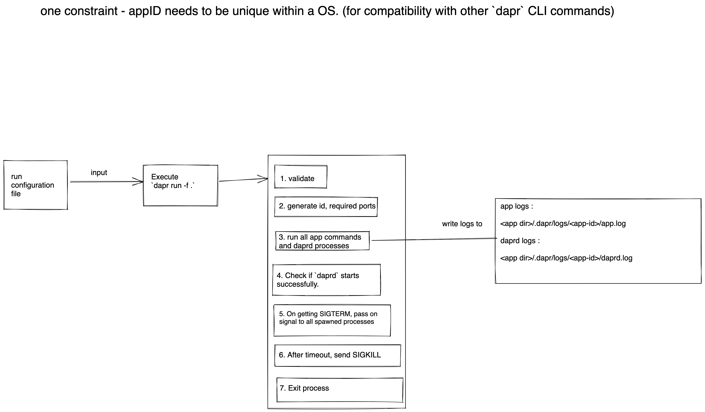

# Run multiple applications with Dapr sidecars

Author(s): Mukundan Sundararajan

State: Ready for implementation

Updated: 30th Nov 2022

## Overview

This is a proposal for feature to be included in the dapr CLI which allows easy way to start multiple services that needs to be run in tandem along with their `daprd` sidecars in local self-hosted mode.

## Background

Currently to run multiple services along with `dapr sidecar` locally, users need to run multiple `dapr run` commands, keep track of all ports opened, the components folders that each service refers to, the config file each service refers to etc.
There are also multiple other flags that can be used to tweak behavior of `dapr run` command eg: `--unix-domain-socket`, `--dapr-internal-grpc-port`, `--app-health-check-path` etc.

This increases the complexity of using dapr in development, where users want to run multiple services in local mode and be able to partially/fully replicate the production sceanrio.

In K8s mode this is alleviated through the use of helm/deployment YAML files. There is currently no such capability available for local self hosted mode.

Asking a user to run multiple different `dapr run` commands each with different flags, increases the complxity for users onboarding onto Dapr.

### Why dapr CLI?

From the initial [proposal](https://github.com/dapr/community/issues/207), the solution was proposed as a seprate repo and CLI in itself. But later it was suggested to use dapr CLI itself to have a `compose` command in it instead of a having a separate CLI.
The main reason for including it in the dapr CLI itself is that, users do not have to download and use a new CLI in addition to the dapr CLI.

This feature is tightly coupled and opinionated on how `dapr` is going to be run locally, and having a separate CLI `dapr-compose` deciding on how `dapr` CLI should be used, is not a good pattern to start with.

> Note: `daprd` is more generally used and considered a binary and not necessarily a CLI tool. So `dapr` CLI is not making use of another CLI but rather passing on configs for running a binary.

## Related Items

### Related Proposals
- https://github.com/dapr/community/issues/207
- https://github.com/dapr/cli/issues/1123

### Related Issues

## Expectations and alternatives

The scope of this proposal is to enhance the `run` CLI command which allowing users to define and run multiple services from a single run configuration file.

This proposal specifically targets running in local environments and `slim` mode, where container engines are available. For running `daprd` container along with `app` container the solution is to use Kubernetes or docker-compose.

For this proposal we will targetting runnning the applications and side cars as processes in the OS.

> Note: All other commands in `dapr` CLI for self hosted mode are written to work with processes

## Requirements

The main requirements for the command:
- being able to configure multiple dapr apps from a single configuration file
- users should be able to use normal `dapr` CLI commands for self hosted mode against any apps that are started through `dapr compose`

Additional requirement for this feature is to come up with conventions on how to organize/run Dapr projects locally.

## Proposed Structure for organizing Dapr projects locally

Currently `dapr` CLI initializes in the home directory(user profile dir for windows) a folder called `.dapr` and the default configurations and resources to be used are stored there.

Users developing different apps using dapr will have different resources/configurations that they use per application. Each time the user has to run the application with a particular config and resources directory value, they have to override the flag for `dapr run` command.

Instead the following convention is proposed for loading the resources/config for an application.
The command expects the following directory structure:
```
.dapr/
  |____ config.yaml
  |
  |____ resources/
          |
          |____ statestore.yaml
          |____ pubsub.yaml
          |____ resiliency_conf.yaml
          |____ subscription.yaml
```
In each app directory,there can be a `.dapr` folder, which contains a `resources` directory and a `config.yaml` file. If that directory is not present, the default locations is used which are `~/.dapr/resources/` and `~/.dapr/config.yaml` (`%USERPROFILE%` instead of `~` for windows).

> Note: This change will be made in `dapr run` only when the newly introduced `-f` flag is used. See [below](#precedence-rules) for details on which folder content will take preceedence when a run configuration is given as input.

> Note: This change does not impact the `bin` folder where `dapr` CLI looks for the `daprd` and `dashboard` binaries. That will still remain the same `~/.dapr/bin/` (%USERPROFILE% for windows).

## Proposed Structure for run configuration file

> Expected default file name is `dapr.yaml`

```yaml
version: 1
common:
  resources_dir: ./app/components # any dapr resources to be shared across apps
  env:  # any environment variable shared among apps
    - DEBUG: true
apps:
  - app_id: webapp
    app_dir: ./webapp/
    resources_dir: ./webapp/components # (optional) can be default by convention too, ignore if dir is not found.
    config_file: ./webapp/config.yaml # (optional) can be default by convention too, ignore if file is not found.
    app_protocol: HTTP
    app_port: 8080
    app_health_check_path: "/healthz" # All _ converted to - for all properties defined under daprd section
    command: ["python3" "app.py"]
    restart: false
  - app_id: backend
    app_dir: ./backend/
    app_protocol: GRPC
    app_port: 3000
    unix_domain_socket: "/tmp/test-socket"
    env:
      - DEBUG: false
    command: ["./backend"]
    restart: true
```
> Note: Running the dependencies for each app as contianers is out of scope for this discussion initially. We might consider that in the future.

- Each file contains a `common` object which contains `env`, `resources_dir` and `config_file` that can be used in common across all the apps defined in this YAML
- There is an `apps` section that lists the different app configs.
- Each app config has the following
  - `app_id` application ID (mandatory field). Passed to `daprd` as `--app-id`.
  - `app_dir` directory of the application (mandatory field).
  - `resources_dir` (optional) directory(ies) of all dapr resources (components, resiliency policies, subscription crds) (overrides common def). Passed to `daprd` as `--resources-dir`.
  - `config_file` (optional) the configuration file to be used for this app (overrides common def). Passed to `daprd` as `--config-file`.
  - `app_protocol` Application protocol, HTTP, gRPC defaults to HTTP. Passed to `daprd` as `--app-protocol`.
  - `app_port` port the app listens to if any. Passed to `daprd` as `--app-port`.
  - other dapr run parameters (mostly pass through flags to `daprd`) All properties must have `_` as separators which will be validated(so that no unknown flags are passed) and translated to `-` for cmd line arguments for `daprd`.
  - `command` ["exec" "arg1" "arg2"] format for application command
  - `env` which overrides or adds to common env var defined or the shell env var passed in when `dapr compose` is called
  - `restart` field which lets `dapr compose` know if the app/sidecar should be restarted on crash or not

The DAPR_HTTP_PORT and DAPR_GRPC_PORT will be passed in as extra environment variables to the application that is being run. Those flags for `daprd` can be overridden in the run configuration file above but that is optional as random ports will be assigned as needed.

### Precedence rules

For `env` field:
> Note: In addition to the defined env fields the app also gets the `DAPR_HTTP_PORT` and `DAPR_GRPC_PORT` fields.

- If no field is present, the environment variables of the current shell which executes the CLI command is passed to the app and dir.
- if `env` field is present in the `common` section, in addition to the shell environment variables, the `env` map defined will be passed to all `apps` and `daprd` sidecars.
- if `env` field is present only in a particular `apps` section, any shell environment variables, `env` maps from `common` section and the `env` map for the current app will be passed to both the `app` and `daprd`.
- The more specific `env` key-value pairs will override the lesser specific ones i.e. `apps` section specific `env` key-value pairs will override the key-value pairs from the `common` section which will override the passed in shell environment variables.


For each app in the `apps` section, the `resources_dir` and `config_file` values will be resolved in the following order:

- If `reosurce_dir` and/or `config_file` fields are given for any `apps[i]` configuration use that value as is.
- If not, check for `.dapr` folder in the **`apps[i].app_dir`** folder. If found, use the `.dapr/resources` folder for configuring the resources and `.dapr/config.yaml` for the `daprd` configuration file(argument `--config-file` in `daprd`).
- If not, check if a `resources_dir` and/or `config_file` fields are defined in the `common` section of the compose configuration file. If so use those values for those fields.
- If not, default to `~/.dapr/resources/` for `resources_dir` and `~/.dapr/config.yaml` for `config_file` values.


## Proposed command format

Given the run configuration file defined above, there should be a way to use the configuration file and run the differnt commands and `daprd` with the configuration given in the file.

For this there will be a flag `-f, --file` that will be defined in the `dapr run` command. If the input path is a `file`, it expectes the file to have [structure defined above](#proposed-structure-for-run-configuration-file).
If the path for the flag is a directory, then it expects the `dapr.yaml` file to be present in the directory with the same [structure defined above](#proposed-structure-for-run-configuration-file).

### Interaction flow

The interaction flow for the `dapr run -f <path>` is shown as below.



> Note: app-id needs to be unique across all applications that have been run using `dapr run`.
### Logging options

Right `dapr run` executes as a foreground interactive process, and both the `daprd` logs and associated application logs are directly written to the STDOUT of the `dapr run` _process shell_ and it is not stored anywhere.

Considering that executing `dapr run -f <path>` will run multiple applciations, routing all the logs to STDOUT for all applications and `daprd` processes will make the STDOUT completely chaotic and the user will be overwhelmed with log output.

For example, consider two applications `order-proc` and `checkout` that are run on executing `dapr run -f <path>` and logs are routed to STDOUT:

```
<order-proc> ==APP== waiting for daprd to start
<order-proc> INFO[0000] enabled gRPC tracing middleware               app_id=order-proc instance=Mukundans-MacBook-Pro.local scope=dapr.runtime.grpc.api type=log ver=1.9.3
<checkout> ==APP==pinging dapr API
<checkout> INFO[0000] enabled gRPC tracing middleware               app_id=checkout instance=Mukundans-MacBook-Pro.local scope=dapr.runtime.grpc.api type=log ver=1.9.3
<order-proc> INFO[0000] started daprd              app_id=order-proc instance=Mukundans-MacBook-Pro.local scope=dapr.runtime.grpc.api type=log ver=1.9.3
<order-proc> ==APP== starting the application
<order-proc> ==APP== processing request 1
<order-proc> ==APP== processing request 2
<checkout> INFO[0000] started daprd               app_id=checkout instance=Mukundans-MacBook-Pro.local scope=dapr.runtime.grpc.api type=log ver=1.9.3
<checkout> ==APP== processing request 2
<order-proc> ==APP== processing request 3. request 3 calls dapr API
<order-proc> INFO[0000] requst 3 is calls dapr API             app_id=order-proc instance=Mukundans-MacBook-Pro.local scope=dapr.runtime.grpc.api type=log ver=1.9.3
<checkout> ==APP== processing request 3

```

The logs will be as shown above, it will be chaotic to see what application is in which state and so on.

Instead of writing to STDOUT, each application and associated `daprd` process will write the logs to `{application dir}/.dapr/logs/{app id}/app_{datetime}.log`, `{application dir}/.dapr/logs/{app id}/daprd_{datetime}.log`.

## Feature lifecycle outline

Compatibility with `dapr run` is expected to be maintained. But in certain cases there might be introduction of new behavior which might be _opt-in_ for running individual applications using `dapr run` whereas it might be _on by default_ when `dapr run -f <path>` is used.

The expectation is for this feature to be refined and stabilized over a series of releases.

### Recommendation for initial version

- Initial implementation will only support Linux OS.
- `dapr run -f <path>` will be an interactive process running completely for the lifecycle of applications, on exiting the process, all other spawned processes will also quit.
- logs will be written to a predefined location. Users will need to manually tail the file. (Present in app-dir)
- [optional] change the full `dapr run` command itself to honor [proposed organization for dapr projects](#proposed-structure-for-organizing-dapr-projects-locally). If not only when `-f` flag is used will the proposed organizing structure be used.

### Changes for future releases

- Extend support for Windows and macOS.
- Extend `dapr run` to have a detached mode `-d, --detach` flag. This will also be honoroed when running multiple applications using the `-f` flag.
- Add support for `dapr logs` to query from saved logs when the application is being run.


## Completion checklist
For initial version
- [ ] Implement initail version of `dapr run -f <path>` feature
  - [ ] Add E2E tests for this feature
- [ ] Add documenteation for this feature

For later
- [ ] Enahance `dapr run` command to have a detached mode
- [ ] Enahance `dapr logs` command to track and output logs in self-hosted mode
