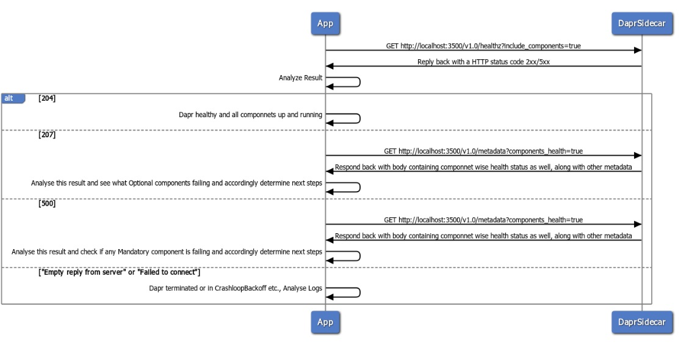
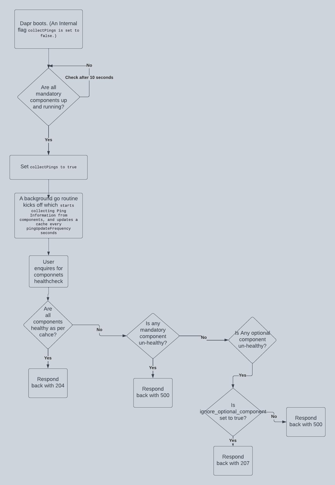

# Components Healthcheck In Dapr

* Author(s): Deepanshu Agarwal (@DeepanshuA)
* State: Draft
* Updated: 07/20/2023

## Overview
As a user, I should be able to enquire the health of dapr system, which is possible currently - but this health check should also optionally include health of connected dapr components as well.

## Tenets
1. It should be extensible i.e. tomorrow if any feature to check health of Actors etc. is required, it should not require a new endpoint.

## Current Scenario
There are many components in Dapr which don't yet implement Ping. 
Ping is not mandatory to be implemented by Components, which is the correct behavior, as it could lead to false positives.
For this components health-check, components not implementing Ping will be omitted out.

## Use-Case
If a mandatory* component fails at the start-up, Dapr will terminate or will move to some non-workable state like CrashLoopBackoff etc., so `healthz` API or any other API can't be used.

After Dapr has started, if any Mandatory component fails, this healthcheck can be used to determine what component has failed and accordingly some steps can be undertaken.

If an Optional component fails, either at start-up or afterwards, it can help indicate to App/down-stream user system that what component has failed.



Note *: A mandatory component is one which does NOT have proprty `spec.ignoreErrors` set to True.

## API Design
### Endpoint:
Instead of an additional endpoint, the Approach underneath works with a query parameter, in addition to `healthz` endpoint.

Following are the possible responses for `healthz` API:

| HTTP | Response Codes | 
| -------- | -------- | 
| 204     | dapr is healthy     | 
| 500     | dapr is not healthy     | 

Hence, if dapr is healthy, then the response code changes, as per the enlisted cases below.
If dapr is NOT healthy, then the components Health check should anyways NOT be checked.

http://localhost:3500/v1.0/healthz?include_components=true

### Approach: 
- Maintain a cache with status of all components loaded successfully and keep updating this cache in a background go routine at a configurable `pingUpdateFrequency`. By default, `pingUpdateFrequency` to be 30 seconds.
If a component is marked un-healthy in cache currently, then `pingUpdateFrequency` to work as given `pingUpdateFrequency` / 3. i.e. In a default case, it would update every 10 seconds.

- This cache will not start to be built, right at the boot of daprd sidecar. There will be an internal flag (let's say `collectPings`), which will be `false` at the beginning of the daprd sidecar and which will be turned `true`, once all the mandatory components are ready.
Once, `collectPings` is `true`, the cache will start to be populated.

- But, what happens if a component fails to initialize? 
If a mandatory component fails to initialize, then daprd will not come up healthy and will eventually terminate Or be in an inconsistent state like CrashLoopBackoff.
If an optional component fails to initialize OR if it is not healthy afterwards as well, then it is governed by a query parameter `ignore_optional_component`, which is `true` by default. So, as the name suggests, if this query param is not set to `false`, then optional components failure to initialize OR failure to report healthy will not result in a un-healthy status. Rather, the http status code 207 will be reported back.

Working:




- For components which don't yet implement Ping, they will be ignored for their health check.

- Response of healthz endpoint will be always only a http status code.
If App/user wants to enquire about detailed json kind of result, per component - metadata API can be used for this.
This is done, as dapr healthz endpoint is publicly accessible, so for security constraints, it doesn't deem good to provide component names etc. as a response of `healthz` endpoint.
The result i.e. `status` of healthCheck and `errorCode`/`message`, will be provided as part of `metadata` API.

Currently, this is how metadata response body looks like:


If metadata endpoint is queried with a query parameter `components_health` set to true, it will include following:
- Example For a healthy component:
```
	{
      "name": "txnstore",
      "type": "state.redis",
	  "version": "v1",
	  "capabilities": [
        "ETAG",
        "TRANSACTIONAL",
        "QUERY_API",
        "ACTOR"
      ],
      "status": "OK"
    }
```
- Example for an un-healthy component:
```
	{
      "name": "txnstore",
      "type": "state.redis",
	  "version": "v1",
	  "capabilities": [
        "ETAG",
        "TRANSACTIONAL",
        "QUERY_API",
        "ACTOR"
      ],
      "status": "NOT_OK",
      "errorMessage": "redis store: error connecting to redis at localhost:6379: dial tcp 127.0.0.1:6379: connect: connection refused"
    }
```
- For a componnet not implementing `Ping`, `status` will not be included.


- To implement only http endpoint, at least for the first version of this API.

- This endpoint is not supposed to support query for a particular component Health check.
