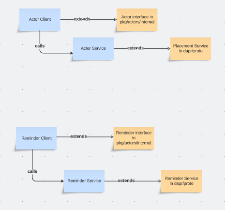

# Allow Multiple Versions of Reminder/Actors Implementation

* Author(s): Deepanshu Agarwal (@DeepanshuA), Alessandro Segala (@ItalyPaleAle)
* State: Ready for Implementation
* Updated: 2023-12-28

## Overview

As a user, I should be able to use Dapr core functionality of Actors/reminders i.e. leverage Actors/reminders interfaces BUT to be able to implement these interfaces in a new Control Plane service, which as a user, I should be allowed to design as per the way it solves issues for me.
This is a proposal to allow multiple versions of Reminders/Actors Implementation.

## Background

Currently, we see multiple issues with Reminders creation/deletion at scale and with placement Service.
We should be able to allow users to use core reminders/actors functionality of Dapr runtime; while implementing Reminders/Actors interface in their own way to solve these issues.

This would let users solve reminders/actors issues as per their own requirements and design.
This would also let users design their solution in an independent way.

## Related Items

This has already been discussed in different maintainers meetings, notably in [this issue](https://github.com/dapr/dapr/issues/7203).

## Implementation Details

### Design

Reminders / Actors should have their Interfaces segregated in such a way that it should be possible to implement them in an independent way.
There are two places where APIs or functions required for Actors and Reminders are defined.

1. Protos in dapr/proto package.

2. Interfaces in pkg/actors/internal for placement and reminder.

Out of these 2, protos are not to be updated, as every implementation will have their own RPCs defined accordingly.

Only interfaces in pkg/actors/internal have to be updated. A major work has already been done for them in release 1.12 already by segregating actors, reminders and timers interfaces (https://github.com/dapr/dapr/pull/6669).

```go

// PlacementService allows for interacting with the actor placement service.
type PlacementService interface {
	io.Closer

	// Start connects placement service to register for membership.
	Start(context.Context) error
	// WaitUntilReady waits until placement service is ready.
	WaitUntilReady(ctx context.Context) error
	// LookupActor resolves to actor service instance address
	LookupActor(ctx context.Context, req LookupActorRequest) (LookupActorResponse, error)
	// AddHostedActorType registers an actor type by adding it to the list of known actor types (if it's not already registered)
	AddHostedActorType(actorType string, idleTimeout time.Duration) error
	// ReportActorDeactivation is sent by Client to Service to report an actor that has been deactivated.
	// This is useful when actors lifecycle information needs to be updated in Placement service.
	ReportActorDeactivation(ctx context.Context, actorType, actorID string) error
	// HaltActorFn sets the function to be called, when actor deactivation is triggered.
	SetHaltActorFns(haltFn HaltActorFn, haltAllFn HaltAllActorsFn)
	// SetOnAPILevelUpdate sets the function to be called when the API level is updated.
	SetOnAPILevelUpdate(fn func(apiLevel uint32))
	// SetOnTableUpdateFn sets afterTableUpdateFn, which is the function invoked after table updates,
	// such as draining actors and resetting reminders.
	SetOnTableUpdateFn(fn func())

	// PlacementHealthy returns true if the placement service is healthy.
	PlacementHealthy() bool
	// StatusMessage returns a custom status message.
	StatusMessage() string
}

```

```go
type RemindersProvider interface {
	io.Closer

	Init(ctx context.Context) error
	GetReminder(ctx context.Context, req *GetReminderRequest) (*Reminder, error)
	CreateReminder(ctx context.Context, req *Reminder) error
	DeleteReminder(ctx context.Context, req DeleteReminderRequest) error
	DrainRebalancedReminders(actorType string, actorID string)
	OnPlacementTablesUpdated(ctx context.Context)

	SetExecuteReminderFn(fn ExecuteReminderFn)
	SetStateStoreProviderFn(fn StateStoreProviderFn)
	SetLookupActorFn(fn LookupActorFn)
}

```
Idea behind this is that interfaces defined in pkg/actors/internal will be used to form a Building Block / Client which will implement all these methods defined in these interfaces.

Whereas, methods defined for Services in protos will be implemented by respective new/existing Control Plane Service(s).

And, the methods from these clients will call methods of the servers, wherever required.



Depending on the implementation, it can be decided what all RPCs need to be defined for a Service. For example, for the Placement Service which creates and pushes Actor Types v/s Dapr Hosts table information to all sidecars, only table related to ReportDaprStatus needs to be an rpc.

Whereas, for a Service, where Actor information is Pulled by sidecars from Actors Service needs some methods like LookupActor or ReportActorDeactivation, which thus form a part of RPCs.

For some minor changes left in interfaces,  has been raised (https://github.com/dapr/dapr/pull/7281).

## How to build and deploy Actors/Scheduler/Placement Service?

There are two sub-systems that we are dealing with here: Actors and Reminders. And, as we know, going forward, there can be multiple variants of Services providing either of these sub-systems or both.

There will be multiple possibilities, like:

1. Placement Service used for Actors and Distributed Scheduler used for Reminders.

2. ABC Service used for both Actors and Reminders.

3. XYZ used for Actors and Distributed Scheduler used for Reminders.

So, how to decide what all to deploy in what case for user?

### Steps:

1. Dapr Configuration changes to depict what services to load for Control Plane and what not.

2. Component loading capability, specifically by operator, for Control Plane. This is required, in case CP requires a component to be loaded.

#### Step 1: Configuration changes:

A) Changes in charts/dapr/charts/dapr_config/templates/dapr_default_config.yaml

B) Changes in charts/dapr/values.yaml for global values to take inputs from users.

C) Changes in templates/deployment.yaml of particular service in charts to check if it needs to be deployed.

##### CLI flags and annotations:

* Injector is configured (via env vars set by Helm) with what actor and/or reminders service to use. Default value is to use placement and no reminders service (so it uses built-in reminders). It is possible to set in the Helm chart values to use different reminders and/or placement services.

For reminders:

* Default is to set nothing in the CLI, which means use the built-in reminders (that use state stores)
* If in the Helm chart the injector is configured with a reminders service, then it adds the CLI flag `--reminders-service <name>:<address>`, for example `--reminders-service scheduler:k8s-svc-name.svc.cluster.local:port` (the `<name>` part tells daprd which implementation to load)

For placement:

* If the user has set the `dapr.io/placement-host-address` annotation, that forces the injector to set `--placement-host-address` to the value passed, as is the case today
* Otherwise, if there's no explicit dapr.io/placement-host-address annotation:
    * If the configuration (via Helm) is to use placement, then sets `--placement-host-address` exactly as today (this is default value)
    * If the configuration is to use another actors service, it sets `--actors-service <name>:<address>:<port>` following the same logic as the reminders svc)
This is backwards-compatible.

Note: Exception is thrown when `--actors-service` or `--reminders-service` are set, if the injector is trying to inject a sidecar that use an oldeer version of Dapr, daprd that will crash because the flag doesn't exist. This is a "feature": if the cluster wants to use a different actors/reminders service, versions of Dapr that don't support that should crash.


(https://github.com/dapr/dapr/pull/7318)

#### Step 2: Component Loading:

This Control Plane Service may require some component, like a database etc. which it should be able to load, using Operator. But, components visible to a Control Plane service should not be visible to Daprd sidecar and vice-versa.
Hence, just a logical grouping is required.

(https://github.com/dapr/dapr/pull/7314)