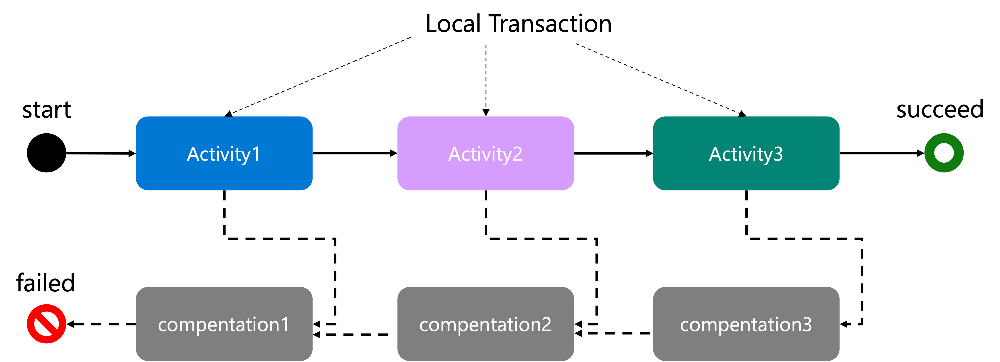

# Saga pattern support in Dapr workflow

* Author(s): Sky Ao(@skyao)
* State: Ready for Implementation
* Updated: 2023-11-30

## Overview

This document is a design proposal to support Saga pattern in Dapr workflow. 

This proposal will allow applications to support distributed transactions using Dapr Workflow and its Saga pattern support feature. It will be helpful when there are consistency requirements for some activities in the workflow. 

## Background

### Transaction and Saga

#### **Transactional Requirements** 

In various business usage scenarios for Dapr workflow, customers sometimes have transactional requirements. The picture below is the scenario we used in Dapr workflow example, an order-processing workflow that contains multiple activities. 


Typically, we expect the outcome of an order-processing workflow to be either a successful order, in which the fee is charged and the inventory is updated, or a failed order, in which the fee is not charged and the inventory is not updated.

 This is often referred to as a **Distributed Transaction**.

Introducing a distributed transaction solution to address transactional requirements in workflows is necessary, and traditional two-phase-commit is too heavy for workflows. Therefore,  we introduce a lightweight solution called Saga to help customers develop transactional applications based on the Dapr workflow.

#### Saga Pattern 

The Saga pattern **provides transaction management using a sequence of local transactions.**



> "A local transaction is the unit of work performed by a Saga participant. Every operation that is part of the Saga can be rolled back by a compensating transaction. Further, the Saga pattern guarantees that either all operations complete successfully or the corresponding compensation transactions are run to undo the work previously completed."
>
> Reference to [Saga Pattern in Microservices](https://www.baeldung.com/cs/saga-pattern-microservices)

For a more detailed description about the Saga pattern, please refer to:

- [Pattern: Saga (microservices.io)](https://microservices.io/patterns/data/saga.html)
- [Saga distributed transactions pattern](https://learn.microsoft.com/en-us/azure/architecture/reference-architectures/saga/saga)
- [Saga Pattern in Microservices](https://www.baeldung.com/cs/saga-pattern-microservices)
- [SAGA Design Pattern](https://www.geeksforgeeks.org/saga-design-pattern/)
- [Saga Pattern in Distributed Systems](https://orkes.io/blog/saga-pattern-in-distributed-systems/)
- [Saga Pattern: how to manage distributed transactions with microservices](https://mia-platform.eu/blog/saga-pattern/)
- [Saga: How to implement complex business transactions without two phase commit](https://blog.bernd-ruecker.com/saga-how-to-implement-complex-business-transactions-without-two-phase-commit-e00aa41a1b1b)

### Motivation

- Support distributed transactions in Dapr workflow using Saga pattern.

### Goals

1. **Functionality**: Dapr users can support distributed transactions using Dapr workflow.
2. **User Experience**: Keep the user experience as simple as possible to Dapr workflow authoring.

### Scope

- This proposal applies to all language SDKs.
- The first implementation will be in the Java SDK. The examples in this proposal will be written in Java.
- The implementations of other language SDKs will follow the design of this proposal.
- There may be language-specific handling for different languages, which will be added separately in the appendix section.

### The gap between workflow and Saga

The saga pattern has two parts: 

1. **Forward Part**:  Dapr workflow already implements it.
2. **Backward Part**: no built-in implementation in Dapr workflow, but an out-of-the-box solution


The gap between the Dapr Workflow and Saga pattern support is that the customers need to implement the backward part to do the Saga compensation themself. 

Dapr workflow has provided support for the implementation of compensation logic. As described in [Dapr documentation](https://docs.dapr.io/developing-applications/building-blocks/workflow/workflow-patterns/): "the Dapr Workflow runtime enables error handling to be expressed naturally in your target programming language, allowing you to implement compensation logic easily."

There is [an example in Python](https://github.com/dapr/samples/blob/da3611f5b190b4bb4dc0654b8d7ac2cefc36a981/workflow-orderprocessing-python/services/orderprocessing/app.py#L92-L106) that shows how it works:

```python
    # Submit the order for shipping
    try:
        yield ctx.call_activity(submit_order_to_shipping, input=order)
    except Exception as e:
        # Shipping failed, so we need to refund the payment
        yield ctx.call_activity(notify, input=f"Error submitting order for shipping: {str(e)}")
        yield ctx.call_activity(refund_payment, input=order)
        yield ctx.call_activity(notify, input="Payment refunded")

        # Allow the workflow to fail with the original failure details
        raise
```

Below, I will describe why adding a Saga abstraction layer is necessary even though Workflow already provides support for distributed transactions with compensation logic out-of-the-box.

## Complexity and User Experience

The biggest challenge with the above approach comes from the **complexity** and **user experience**. When the business complexity of the compensation process increases, the code complexity of the compensation implementation also increases, leading to a serious impact on the user experience of workflow authoring.

Let's assume that user William now starts developing an application with distributed transaction requirements using dapr workflow. Let's assume that all activities in this workflow need to be compensated. 

We also assume that William will add more and more activities to this application, and all kinds of complex user cases will occur over time. We ignore implementing the activities and the corresponding compensation activities and focus on how William wrote the workflow code.

### User Case 1: Too many compensation activities

William wrote down the pseudo-code as follows, starting from two activities: 

```java
ctx.callActivity("A").await();

try {
	ctx.callActivity("B").await();
} catch (Exception e) {
  ctx.callActivity("compensate-A").await();
  return;
}
```

William continues to write code to support the third activities:

```java
ctx.callActivity("A").await();;

try {
	ctx.callActivity("B").await();
} catch (Exception e) {
  ctx.callActivity("compensate-A").await();
  return;
}

try {
	ctx.callActivity("C").await();
} catch (Exception e) {
  ctx.callActivity("compensate-B").await();
  ctx.callActivity("compensate-A").await();
  return;
}
```

The code of calling for compensation activity A begins to repeat. William continues to write code to support the fourth activities:

```java
ctx.callActivity("A").await();

try {
	ctx.callActivity("B").await();
} catch (Exception) {
  ctx.callActivity("compensate-A").await();
  return;
}

try {
	ctx.callActivity("C").await();
} catch (Exception e) {
  ctx.callActivity("compensate-B").await();
  ctx.callActivity("compensate-A").await();
  return;
}

try {
	ctx.callActivity("D").await();;
} catch (Exception e) {
  ctx.callActivity("compensate-C").await();
  ctx.callActivity("compensate-B").await();
  ctx.callActivity("compensate-A").await();
  return;
}
```

So, as the number of activities that need to be compensated increases, the complexity of the code that performs the compensation operation gradually rises. William must write a lot of duplicate codes for compensation.

### User Case 2: Activities don’t always fail by throwing exceptions

In the above user cases, William relies on the try-catch exception logic to execute the compensation function. However, there are cases where activities don’t fail by throwing exceptions but instead return activity output with business failure logic, such as billing failure or insufficient inventory. 

Let's simplify this activity output in terms of a simple boolean type in the pseudo-code like below. William had to embed compensation functions inside the logic code in case the boolean result was false.

```java
ctx.callActivity("A").await();

try {
  boolean result = ctx.callActivity("B").await();
  if (!result) {
    ctx.callActivity("compensate-A").await();
    return;
  }
} catch (Exception e) {
  ctx.callActivity("compensate-A").await();
  return;
}

try {
  boolean result = ctx.callActivity("C").await();
  if (!result) {
    ctx.callActivity("compensate-B").await();
    ctx.callActivity("compensate-A").await();
    return;
  }
} catch (Exception e) {
  ctx.callActivity("compensate-B").await();
  ctx.callActivity("compensate-A").await();
  return;
}
```

### User Case 3: Compensation failure and throws an exception

There is also a possibility that the compensation operation will fail to execute. Therefore, when multiple compensation operations are executed in sequence, if one compensation fails with an exception, how to ensure that the subsequent compensation operations will continue to be executed? 

William added try/catch block for each compensation activity so that every one of them will be executed:

```java
ctx.callActivity("A").await();
......
ctx.callActivity("B").await();
......
try {
	boolean result = ctx.callActivity("C").await();
	......
} catch (Exception e) {
  try{
    ctx.callActivity("compensate-B").await();
  } catch (Exception e) {
    …...
  }
  
  try{
    ctx.callActivity("compensate-A").await();
  } catch (Exception e) {
    ......
  }
  return;
}
```

### User Case 4: Compensation in parallel

When the number of compensation operations is significant, William found that executing compensation operations in sequence may take a long time. 

```java
ctx.callActivity("A").await();
ctx.callActivity("B").await();
ctx.callActivity("C").await();
ctx.callActivity("D").await();
......
  
try {
	ctx.callActivity("E").await();
} catch (Exception e) {
	ctx.callActivity("compensate-D").await();
  ctx.callActivity("compensate-C").await();
  ctx.callActivity("compensate-B").await();
  ctx.callActivity("compensate-A").await();
  return;
}
```

We assume that the compensation operations do not depend on each other. 

William decided to accelerate the compensation operations by running them in parallel. Then he tried to use the fan-out/fan-in pattern to do compensation in his workflow: 

```java
    List<Task<Void>> tasks = new ArrayList<>(compensationActivities.size());
    for (CompensatationInformation compensationActivity : compensationActivities) {
      Task<Void> task = executeCompensateActivity(ctx, compensationActivity);
      tasks.add(task);
    }

    try {
      ctx.allOf(tasks).await();
    } catch (Exception e) {
      ......
    }
```

### User case 5: control the concurrency of compensation

William noticed that sometimes there are too many threads executing compensation, and he added a small control to the compensation concurrency: up to 8 compensation threads.

Because Dapr workflow doesn’t have a built-in feature to control the concurrency of “fan out” now. William had to implement it by himself: 

```java
    List<Task<Void>> tasks = new ArrayList<>(compensationActivities.size());
    List<Task<?>> inFlightTasks = new ArrayList<>();
    for (CompensatationInformation compensationActivity : compensationActivities) {
      // Wait for one of the in flight tasks to finish
      if (inFlightTasks.size() >= this.option.getMaxParallelThread()) {
        Task<?> finishedTask = ctx.anyOf(inFlightTasks).await();
        inFlightTasks.remove(finishedTask);
      }

      Task<Void> task = executeCompensateActivity(ctx, compensationActivity);
      tasks.add(task);
      inFlightTasks.add(task);
    }

    try {
      ctx.allOf(tasks).await();
    } catch (Exception e) {
      ……
    }
```

### User Case 6: handling OrchestratorBlockedException

In fact, William accidentally discovered a problem when writing the try/catch block in the user case 1:

```java
ctx.callActivity("A").await();

try {
	ctx.callActivity("B").await();
} catch (Exception e) {
  ctx.callActivity("compensate-A").await();
  return;
}
```

William found some OrchestratorBlockedException in the log:

```bash
com.microsoft.durabletask.interruption.OrchestratorBlockedException: The orchestrator is blocked and waiting for new inputs. This Throwable should never be caught by user code.
at com.microsoft.durabletask.TaskOrchestrationExecutor$ContextImplTask$CompletableTask.await(TaskOrchestrationExecutor.java:1284)
at io.dapr.quickstarts.saga.OrderProcessingWorkflow.lambda$create$0(OrderProcessingWorkflow.java:92)
at io.dapr.workflows.Workflow.run(Workflow.java:50)
at io.dapr.workflows.runtime.OrchestratorWrapper.lambda$create$0(OrchestratorWrapper.java:62)
at com.microsoft.durabletask.TaskOrchestrationExecutor$ContextImplTask.processEvent(TaskOrchestrationExecutor.java:835)
at com.microsoft.durabletask.TaskOrchestrationExecutor$ContextImplTask.access$1300(TaskOrchestrationExecutor.java:75)
at com.microsoft.durabletask.TaskOrchestrationExecutor$ContextImplTask$OrchestrationHistoryIterator.moveNext(TaskOrchestrationExecutor.java:944)
at com.microsoft.durabletask.TaskOrchestrationExecutor$ContextImplTask.processNextEvent(TaskOrchestrationExecutor.java:804)
at com.microsoft.durabletask.TaskOrchestrationExecutor$ContextImplTask.access$000(TaskOrchestrationExecutor.java:75)
at com.microsoft.durabletask.TaskOrchestrationExecutor.execute(TaskOrchestrationExecutor.java:53)
at com.microsoft.durabletask.DurableTaskGrpcWorker.startAndBlock(DurableTaskGrpcWorker.java:135)
at java.base/java.lang.Thread.run(Thread.java:829)
```

This is a particular internal exception used by the implementation of Java SDK. The Java SDK relies on the “OrchestratorBlockedException” to communicate. 

As it says: "This Throwable should never be caught by user code." Therefore, William added extra handling of OrchestratorBlockedException in the try/catch code: rethrow it.

```java
try {
	ctx.callActivity("B").await();
} catch (OrchestratorBlockedException e) {
  throw e;
} catch (Exception e) {
  ......
}
```

### Conclusion

As the complexity of the compensation operation increases over time, William can't perform the compensation operations in the workflow code as straightforward as in the workflow example. 

In the user cases above, William had to add more and more technical implementation code to his workflow business code to ensure that the compensation behaviors were executed correctly and effectively.

Obviously, such a user experience is not friendly to William.

At this point, we need a Saga abstraction layer to encapsulate and simplify the execution of the compensation operations rather than leaving this responsibility to William.

Here is an example of pseudo-code to use Dapr workflow with Saga abstraction in this proposal. It enables compensation in parallel and sets max parallel thread. With the help of the Saga abstraction layer, William now just needs to write the following code:

```java
public class OrderProcessingWorkflow extends Workflow {  
@Override
  public WorkflowStub create() {
    return ctx -> {
      ctx.callActivity("A").await();
      ctx.registerCompensation("A");

      boolean result = ctx.callActivity("B").await();
      if (!result) {
        ctx.compensate();
        return;
      }
      ctx.registerCompensation("B");

      ctx.callActivity("C").await();
      ctx.registerCompensation("C");
      ......
    };
  }
      @Override
  public SagaOption getSagaOption() {
    return SagaOption.newBuilder()
      .setParallelCompensation(true)
      .maxParallelThread(8).build();
  }
}
```

As you can see from the pseudo-code above, introducing the Saga abstraction layer makes support for the Saga pattern easy. The Saga abstraction layer shields a lot of implementation details and provides a pleasant user experience.

Even compared to workflows that don't enable Saga, it just adds some registerCompensation()methods to collect the compensation information during workflow execution and calls the compensate() method to activate the trigger for compensation when the business logic fails. 

Now William doesn't have to worry about how to implement compensation, and he can focus on the business logic of the workflow. And that's precisely what Dapr workflow was designed to do.

## Implementation Details

This proposal would introduce built-in support for Saga in Dapr workflows and simplify the authoring of workflows with distributed transaction requirements through the Saga abstraction layer.

### Functional Requirements

In the previous background introduction, we mentioned that the Dapr workflow has fulfilled the functional requirements of the Saga pattern. Here, we are primarily concerned with the eventual consistency after introducing the Saga pattern.

#### Guaranteeing Eventual Consistency


To satisfy the **determinism** requirement of Dapr workflow, the entire workflow with saga pattern support needs to ensure that:

1. The forward part of Dapr workflow is determinism: OK.
2. Saga compensation triggering is determinism: Almost OK, except for a few exceptional cases.
3. The backward part of Dapr workflow is determinism: OK, after making compensation operations to workflow activities.

The current challenge comes mainly from the triggering of saga compensation. Below we list the possible scenarios:

- **Successful activity with business logic failure in output**

  ```java
  boolean result = ctx.callActivity("B").await();
  if (!result) {
    ctx.compensate();
  }
  ```

  It is OK since the activity execution is successful and will be saved in the workflow activity history event. In the subsequent replay, the Saga compensation triggering will reappear.

- **Failed activity throwing an exception**

  ```java
  try {
    ctx.callActivity("C").await();
  } catch (Exception) {
    ctx.compensate();
  }
  ```

  The failed activities throwing exceptions will also be saved in the workflow activity history event. So, it’s OK.

- **Workflow Timeout**

  Workflow has no concept of timeout today. 

   If the concept of timeout is added to Dapr workflow in the future, we must ensure that Saga compensation can still be triggered when the workflow is timeout.

- **Management API - Terminate**

  Workflow status will be changed from RUNNING to TERMINATED. Because termination of workflow is not graceful, Saga compensation won’t be triggered.

- **Management API - Cancel**

  Workflow has no concept of "cancel" today. 
  
  If cancel API is added to Dapr workflow to cancel a workflow gracefully in the future, we must ensure that Saga compensation can still be triggered when the workflow is canceled.

### Improving User Experience

In this proposal, the implementation of the Saga pattern will be divided into three tasks while maintaining user experience as friendly as possible.

1. Collect the compensation information during workflow execution.
2. Trigger compensation when workflow failed
3. Complete compensation by using the saved compensation information

#### Saga Abstraction Layer and Core Implementation

This proposal will introduce the Saga abstraction layer to help customers use Saga in workflow. The core implementation of the saga abstraction layer is the class named Saga.

```java
public final class Saga {
  private final SagaOption option;
  private final List<CompensationInformation> compensationActivities = new ArrayList<>();
  
  public void registerCompensation(String activityClassName, Object activityInput, TaskOptions taskOptions) {
    // ** Task1: Collect the compensation information during workflow execution**
    this.compensationActivities.add(
        new compensationContext(activityClassName, activityInput, taskOptions));
  }
  
  // **task3: Complete compensation by using the saved compensation information**
    public void compensate() {
    if (config.isParallelCompensation() && compensationActivities.size() > 1) {
      compensateInParallel();
    } else {
      compensateSequentially();
    }
  }
  ......
```

The saga class will implement task1 and task3 of the above tasks.

#### Initial saga with options

Two methods are added to the Workflow class to inform if Saga pattern support is enabled and what is the Saga option if enabled:

```java
public abstract class Workflow {
  ......
  public boolean isSagaEnabled() {
    return this.getSagaOption() != null;
  }
  public SagaOption getSagaOption() {
    return null;
  }
}
```

The isSagaEnabled and SagaOption are hard code in the Dapr workflow implementation class. So Dapr workflow can get back this information in the replay.

The Saga object will be passed into WorkflowContext. So later workflow can use it by "ctx.registerCompensation()" / "ctx.compensate()" and provide built-in support.

#### Task1: collect compensation information

Compensation information is saved for each workflow instance execution. Suppose an activity (in the below example, UpdateInventoryActivity) is executed successfully, and it needs to do compensation when a workflow fails. In that case, the related information about the compensation activity (in the below example, UpdateInventoryCompensationActivity) is saved in the Saga object(in memory): 

```java
  public WorkflowStub create() {
    return ctx -> {
      ......
        inventoryResult = ctx.callActivity(UpdateInventoryActivity.class.getName(),
            inventoryRequest, InventoryResult.class).await();
        if (!inventoryResult.isSuccess()) {
					......
          return;
        }
        // ** Task1: Collect the compensation information during workflow execution**
        ctx.registerCompensation(UpdateInventoryCompensationActivity.class.getName(), inventoryRequest);
      ......
    }
  }
```

Compensation will be performed later based on the saved compensation information if needed. To support retry in compensation activities, registerCompensation() method will have an override method to set its retry strategy:

```java
ctx.registerCompensation(
              UpdateInventoryCompensationActivity.class.getName(), 
              inventoryRequest);	
ctx.registerCompensation(
              UpdateInventoryCompensationActivity.class.getName(), 
              inventoryRequest, taskOptions);
```

The customer must write a corresponding compensation activity for each activity to be compensated.

```java
public class ProcessPaymentActivity implements WorkflowActivity {......}
public class ProcessPaymentCompensationActivity implements WorkflowActivity {......}

public class UpdateInventoryActivity implements WorkflowActivity {......}
public class UpdateInventoryCompensationActivity implements WorkflowActivity {......}
```

These compensation activities should also be registered like normal activities:

```java
    WorkflowRuntimeBuilder builder = new WorkflowRuntimeBuilder().registerWorkflow(OrderProcessingWorkflow.class);
    builder.registerActivity(ReserveInventoryActivity.class);
    builder.registerActivity(UpdateInventoryActivity.class);
		......
    builder.registerActivity(ProcessPaymentCompensationActivity.class);
    builder.registerActivity(UpdateInventoryCompensationActivity.class);
```

####  Task2: trigger saga compensation

For a successful activity with business logic failure in output, it's easy to trigger Saga compensation gracefully:

```java
        inventoryResult = ctx.callActivity(UpdateInventoryActivity.class.getName(),
            inventoryRequest, InventoryResult.class).await();
        if (!inventoryResult.isSuccess()) {
          ......
          // ** Task2: trigger saga compensation gracefully**
          ctx.compensate();
          ctx.complete(orderResult);
          return;
        }
```

For the failed activity throwing an exception, we can use a "try/catch" block in Java SDK to catch the exception and then trigger the compensation. This logic can be implemented without exposing it to the customers.

The implementation of the run() method in Workflow Class should be updated from:

```java
  public void run(WorkflowContext ctx) {
    this.create().run(ctx);
  }
```

To:

```java
  public void run(WorkflowContext ctx) {
    WorkflowStub stub = this.create();

    if (!this.isSagaEnabled()) {
      // saga disabled
      stub.run(ctx);
    } else {
      // saga enabled
      try {
        stub.run(ctx);
      } catch (OrchestratorBlockedException e) {
        throw e;
      } catch (SagaCompensationException e) {
        // Saga compensation is triggered gracefully but failed in exception
        // don't need to trigger compensation again
        throw e;
      } catch (Exception e) {
        try {
          ctx.compensate();
        } catch (Exception se) {
          se.addSuppressed(e);
          throw se;
        }

        throw e;
      }
    }
  }
```

This change removes the logic that triggers Saga compensation because of an exception from the customer's perspective. Also, customers no longer need to deal with OrchestratorBlockedException.

With these changes, most of the implementation details related to the Saga pattern are moved to the Saga abstraction layer, which significantly reduces the complexity of authoring the workflow. Here is the sample code for the order-processing workflow (with the business detail code removed):

```java
public class OrderProcessingWorkflow extends Workflow {  
@Override
  public WorkflowStub create() {
    return ctx -> {
      ctx.callActivity(NotifyActivity.class.getName(), notification).await();
      InventoryResult inventoryResult = ctx.callActivity(ReserveInventoryActivity.class.getName(),
          inventoryRequest, InventoryResult.class).await();

      ApprovalResult approvalResult = ctx.callActivity(RequestApprovalActivity.class.getName(),
            order, ApprovalResult.class).await();
      
      boolean isOK = ctx.callActivity(ProcessPaymentActivity.class.getName(),
          paymentRequest, boolean.class).await();
      if (!isOK) {
				......
        return;
      }
      ctx.registerCompensation(ProcessPaymentCompensationActivity.class.getName(), paymentRequest);
      ......
        
      inventoryResult = ctx.callActivity(UpdateInventoryActivity.class.getName(),
          inventoryRequest, InventoryResult.class).await();
      if (!inventoryResult.isSuccess()) {
				......
        // trigger saga compensation gracefully
        ctx.compensate();
        orderResult.setCompensated(true);
        ctx.complete(orderResult);
        return;
      }
      ctx.registerCompensation(UpdateInventoryCompensationActivity.class.getName(), inventoryRequest);
      
      ctx.callActivity(DeliveryActivity.class.getName()).await();
      ctx.complete(orderResult);
    };
  }
  
  @Override
  public SagaOption getSagaOption() {
    return SagaOption.newBuilder()
      .setParallelCompensation(true)
      .maxParallelThread(8).build();
  }
}
```

The implementation code of workflow is back to almost the same as before (without saga pattern support) except registerCompensation() and compensate(). We hide other Saga-related operations from workflow business logic to improve the user experience. This will simplify the workflow authoring and clarify to improve the user experience when Saga is enabled.

#### Task3: complete compensation

To do compensation based on saved compensation activities, there are two strategies:

1. Sequentially

   Execute the compensation one by one in the reverse order of saved compensation activities.
   There is an option named "ContinueWithError" to control if the current compensation failed, should we continue to do the next compensation: 

   ```java
     private void compensateSequentially() {
       for (int i = compensationActivities.size() - 1; i >= 0; i--) {
         try {
           executeCompensateActivity(compensationActivities.get(i));
         } catch (SagaCompensationException e) {
           if (!config.isContinueWithError()) {
             throw e;
           }
         }
       }
     }
   ```

2. In parallel

   Execute the compensation for all the compensation activities at the same time.

   To support parallel compensation, we need to use “fan out/fan in” pattern of Dapr workflow to execute the compensation activities: 

   ```java
       List<Task<Void>> tasks = new ArrayList<>(compensationActivities.size());
       for (CompensatationInformation compensationActivity : compensationActivities) {
         Task<Void> task = executeCompensateActivity(ctx, compensationActivity);
         tasks.add(task);
       }
   
       try {
         ctx.allOf(tasks).await();
       } catch (Exception e) {
         ......
       }
   ```
   
   The option is "MaxParallelThread" to set the max parallel thread number during Saga compensation. 
   
   ```java
   List<Task<Void>> tasks = new ArrayList<>(compensationActivities.size());
       List<Task<?>> inFlightTasks = new ArrayList<>();
       for (CompensatationInformation compensationActivity : compensationActivities) {
         // Wait for one of the in-flight tasks to finish
         if (inFlightTasks.size() >= this.option.getMaxParallelThread()) {
           Task<?> finishedTask = ctx.anyOf(inFlightTasks).await();
           inFlightTasks.remove(finishedTask);
         }
   
         Task<Void> task = executeCompensateActivity(ctx, compensationActivity);
         tasks.add(task);
         inFlightTasks.add(task);
       }
   
       try {
         ctx.allOf(tasks).await();
       } catch (Exception e) {
         ……
       }
   ```

This should be a built-in feature of “fan out / fan in” mode, not just for Saga compensation. We should support this feature at the language SDK level to avoid making customers write such complex business-agnostic code themselves.

## Code example and Demo

There are two PRs to show how to implement and use Saga in the Dapr workflow:  

- Add saga pattern support(saga-in-workflow) in Dapr java-sdk repo : https://github.com/dapr/java-sdk/pull/956
- Add saga pattern support(saga-in-workflow) in Dapr QuickStarts repo: https://github.com/dapr/quickstarts/pull/957

All Saga implementations and usages mentioned in this proposal are included in these two PRs.

## Appendix: Language SDKs

For different programming languages, there may be language-related special handling that will be recorded in this section.

### Java SDK

- `com.microsoft.durabletask.interruption.OrchestratorBlockedException` : this exception is an internal implementation of Dapr workflow in Java and should not be exposed to customers. Therefore it should be hidden in the saga abstraction layer as much as possible. 

### .net SDK / Python SDK

There may be a similar processing mechanism like OrchestratorBlockedException in Java. Try to hide it from the customer in a similar way if needed. 

TBD: later, when we start implementing Saga mode support in .net SDK and python SDK, add the relevant content here.

## Appendix: Follow-up Improvements

This section records the improvements mentioned in this proposal that need to be followed up. These improvements are closely related to this proposal, but are outside its scope. We may provide these features in a later version of Dapr, such as v1.14.

### Improvements in Management API

- support for workflow cancel API.
- support for workflow timeout.

### Improvements in Language SDKs

- concurrency control of the "fan out/fan in" pattern in the Dapr workflow.

### Improvements in Saga

- **support for complex compensations**, which allows multiple compensation activities to be organized ( like a small workflow but only triggered by saga compensation). 

  ```java
          boolean result = ctx.callActivity("A").await();
          if (!result) {
  					......
            return;
          }
          ctx.registerCompensation(ctx --> {
            Output output = ctx.callActivity("compensate-A1")
            if (output.isXxxx()) {
              ctx.callActivity("compensate-A2")
            } else {
              ctx.callActivity("compensate-A3")
            }
          });
  ```

  
