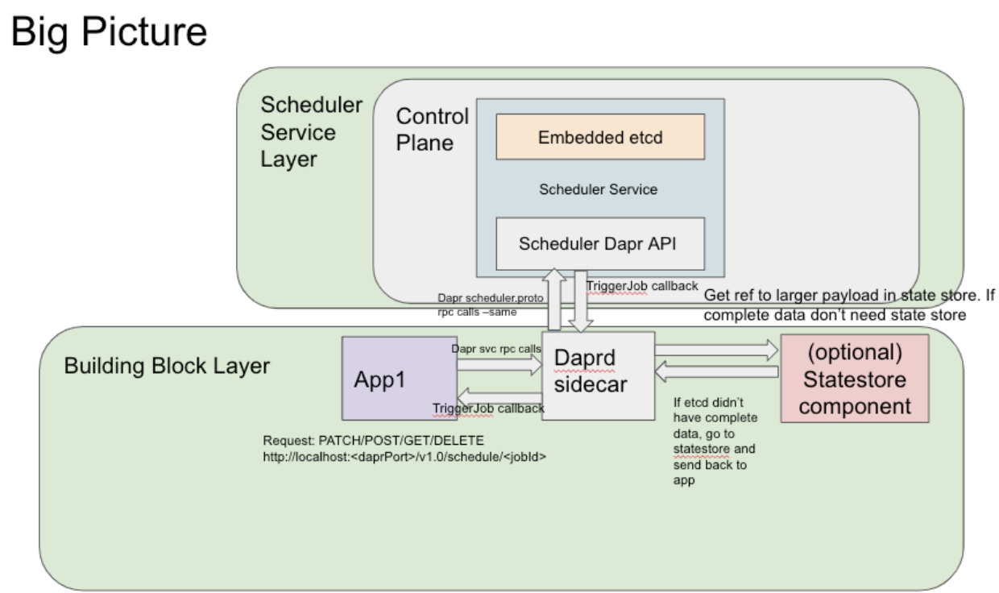
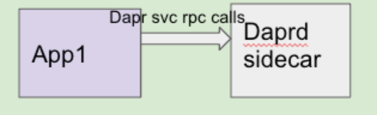
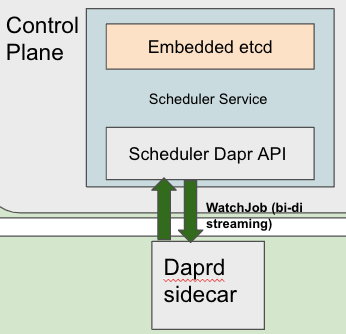
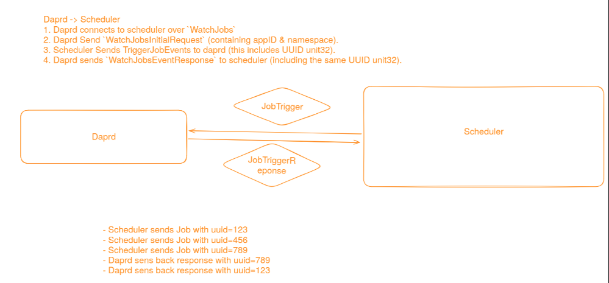
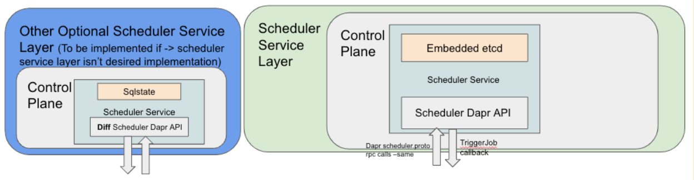

# Distributed Scheduler Building Block and Service

* Author(s): 
    * Cassie Coyle (@cicoyle)
    * Yaron Schneider (@yaron2)
    * Artur Souza (@artursouza)
* State: Ready for Review
* Updated: 2024-05-28

## Overview

This design proposes 2 additions:
- A Distributed Scheduler API Building Block
- A Distributed Scheduler Control Plane Service

## Description

A distributed scheduler is a system that manages the scheduling and orchestration of jobs across a distributed computing environment at specified times or intervals.

## Motivation

Dapr users have a need for a distributed scheduler. The idea is to have an *orchestrator* for scheduling jobs in the future either at a specific time or a specific interval.

Examples include:
- Scalable actor reminders
- Scheduling any Dapr API to run at specific times or intervals. For example sending Pub/Sub messages, calling service invocations, input bindings, saving state to a state store. 

## Goals

Implement a change into `dapr/dapr` that facilitates a seamless experience allowing for the scheduling of jobs across API building blocks using a new scheduler API building block and control plane service. The Scheduler Building Block is a job orchestrator, not executor. The design guarantees *at least once* job execution with a bias towards durability and horizontal scaling over precision. This means we **can** guarantee that a job will never be invoked *before* the schedule is due, but we **cannot** guarantee a ceiling time on when the job is invoked *after* the due time is reached.

## Non-Goals

- Retry logic 
    - From the Scheduler Service to the Sidecar. A new 'sidecar' target will be added to available targets such that users can configure the Dapr Resiliency Policies. 
- Deep observability into jobs in control plane
    - Things beyond basic ListJobs. This might entail things like the history of prior triggered jobs or future jobs.
- Applications to do REST on Jobs in other namespaces. Currently, jobs will be namespaced to the app/sidecar namespace.

## Current Shortfalls

The **Workflows** building block is built on top of Actor Reminders, which have scale limitation issues today. The goal is to improve the performance and scale of Actor Reminder by using the distributed scheduler.

Currently, Dapr users are able to use the **Publish and Subscribe** building block, but are unable to have delayed PubSub scheduling. This scheduler  service enables users to publish a message in a future specific time , for example a week from today or a specific UTC date/time.

For **Service Invocation**, this building block could also benefit from a scheduler in that it would enable the scheduling of method calls between applications.

As of now, Dapr does have an **input cron binding** component, which can allow users to schedule tasks. This requires the component yaml file, where users can listen on an endpoint that is scheduled. This is limited to being an input binding only. The Scheduler Service will enable the scheduling of jobs to scale across multiple replicas, while guaranteeing that a job will only be triggered by 1 Scheduler Service instance.

*Note:* Performance is the primary focus while implementing this feature given the current shortfalls.

## Big Picture Idea



If a user would like to store their user associated data in a specific state store of their choosing, then they can provision a state store using the Dapr State Management Building Block and set `jobStateStore ` as `true` in the state store component’s metadata section. Having the `jobStateStore` set to `true` means that their user associate data will be stored in the state store of their choosing, but their job details will still be stored in the embedded etcd. If the `jobStateStore` is not configured, then the embedded etcd will be used to store both the job details and the user associated data.

*Note:* The Scheduler functionality is usable by both Standalone (Self-Hosted) and Kubernetes modes.

## Implementation Details

### Building Block

#### Scenarios

##### Example Usage

Users will have a job they would like scheduled. For example, an application performs a daily backup of their database. This backup task should run every day at a specific time to ensure data integrity. The user calls to schedule their job
using the new Dapr Scheduler Building Block.

Example JSON (shown below) that you can use to schedule a job by making a request to `http://localhost:<daprPort>/v1.0/job/schedule/prd-db-backup`. This request schedules a job named `prd-db-backup` to run daily for the purpose of performing a database backup. The `@daily` schedule specification indicates that the job will run once a day, specifically at midnight (for more details, refer to the Schedule table below).

Note: This is an example to illustrate intent. The fields are purposeful for this example, and data can take any form for a job. 
```Json
{
  "schedule": "@daily",
  "data": {
    "task": "db-backup",
    "metadata": {
      "db_name": "my-prod-db",
      "backup_location": "/backup-dir"
    }
  }
}
```

Potential `dapr/go-sdk` example code:
```go
import(
    ...
    schedulerapi "github.com/dapr/dapr/pkg/proto/scheduler/v1"
    ...
)
...

type Metadata struct {
    DBName         string `json:"db_name"`
    BackupLocation string `json:"backup_location"`
}

type DBBackup struct {
    Task     string   `json:"task"`
    Metadata Metadata `json:"metadata"`
}

func main() {
...

    // Define a job to be scheduled
    job := &schedulerapi.Job{
        Name:     "prd-db-backup",
        Schedule: "@daily",
        Data: &ptypes.Any{
            Value: &DBBackup{
                Task: "db-backup",
                Metadata: Metadata{
                    DBName:         "my-prod-db",
                    BackupLocation: "/backup-dir",
                },
            },
        },
    }

    // Schedule a job
	scheduleJobRequest := &schedulerapi.ScheduleJobRequest{
		Job:          job,
	}

    err = client.ScheduleJobAlpha1(context.Background(), scheduleJobRequest)
	if err != nil {
		fmt.Printf("Error scheduling job: %v\n", err)
	}

	// Get a job by name
	getJobRequest := &schedulerapi.GetJobRequest{
		Name: "prd-db-backup",
	}

	response, err := client.GetJobAlpha1(context.Background(), getJobRequest)
	if err != nil {
		fmt.Printf("Error getting job: %v\n", err)
	} else {
		job := response.Job
		fmt.Printf("Got job: %v\n", job)
	}

	// List all jobs by app_id
	listJobsRequest := &schedulerapi.ListJobsRequest{
		AppID: "your-app-id",
	}

	// List to be added after 1.14 release
	listResponse, err := client.ListJobsAlpha1(context.Background(), listJobsRequest)
	if err != nil {
		fmt.Printf("Error listing jobs: %v\n", err)
	} else {
		jobs := listResponse.Jobs
		fmt.Printf("List of jobs: %v\n", jobs)
	}

	// Delete a job by name
	deleteJobRequest := &schedulerapi.DeleteJobRequest{
		Name: "prd-db-backup",
	}

	err = client.DeleteJobAlpha1(context.Background(), deleteJobRequest)
	if err != nil {
		fmt.Printf("Error deleting job: %v\n", err)
	}
...
}
```

##### Actor Reminders

The Scheduler Service will be deployed by default. However, for users to use the Scheduler Service for actor reminders, they will need to explicitly opt in via a preview feature.

The interval functionality of the Actor Reminder is similar to the job schedule. With Actor Reminders, a user can specify:
```json
{
    "dueTime": "10s",
    "period": "R4/PT3S",
    "ttl": "10s"
}
```

Similar logic can be applied to a job in the following manner: 

- `dueTime` => The time after which the job is invoked.
- `period` => Is baked into the job parameters and can be showcased below where the job will run 4 times (`repeats`) and auto deletes after 10s (`ttl`)
- `repeats` => The job will run up to the number of `repeats` specified, otherwise if unspecified it runs based on the `schedule` provided until deleted via a `ttl` or a user specified deletion via the APIs

```json
{
    "schedule": "@every 10s",
    "dueTime":"10s",
    "repeats": 4,
    "ttl": "10s"
}
```

The `dueTime` for jobs will follow the same format from Actor Reminders. Supported formats:
```
RFC3339 date format, e.g. 2020-10-02T15:00:00Z
time.Duration format, e.g. 2h30m
ISO 8601 duration format, e.g. PT2H30M
```

The `ttl` for jobs will follow the same format from Actor Reminders. Supported formats:
```
RFC3339 date format, e.g. 2020-10-02T15:00:00Z
time.Duration format, e.g. 2h30m
ISO 8601 duration format. Example: PT2H30M
```

##### Schedule

We will be using [this library](https://github.com/diagridio/go-etcd-cron), and will support the following `schedule` format.

A cron expression, represents a set of times, using 6 space-separated fields.

	Field name   | Mandatory? | Allowed values  | Allowed special characters
	----------   | ---------- | --------------  | --------------------------
	Seconds      | Yes        | 0-59            | * / , -
	Minutes      | Yes        | 0-59            | * / , -
	Hours        | Yes        | 0-23            | * / , -
	Day of month | Yes        | 1-31            | * / , - ?
	Month        | Yes        | 1-12 or JAN-DEC | * / , -
	Day of week  | Yes        | 0-6 or SUN-SAT  | * / , - ?

A user may use one of several pre-defined schedules in place of a cron expression.

Entry                  | Description                                | Equivalent To
-----                  | -----------                                | -------------
@yearly (or @annually) | Run once a year, midnight, Jan. 1st        | 0 0 0 1 1 *
@monthly               | Run once a month, midnight, first of month | 0 0 0 1 * *
@weekly                | Run once a week, midnight on Sunday        | 0 0 0 * * 0
@daily (or @midnight)  | Run once a day, midnight                   | 0 0 0 * * *
@hourly                | Run once an hour, beginning of hour        | 0 0 * * * *

Examples of how a user's `schedule` may look:
```
"0 30 * * * *"
"0 * * 1,15 * Sun"
"@hourly"
"@every 1h30m"
"@daily"
```

#### APIs

*Note:* For cases where there are multiple instances of an application trying to write the same job name concurrently, we will follow the [last-write-wins concurrency pattern](https://docs.dapr.io/developing-applications/building-blocks/state-management/howto-stateful-service/?_gl=1*1bpqtb2*_ga*MTg0MDc4OTE4NS4xNjkzMjI0NDIw*_ga_60C6Q1ETC1*MTY5ODA3Mzc2OC4xMTkuMS4xNjk4MDc0NTk1LjAuMC4w#first-write-wins-and-last-write-wins), as used in our state-management Building Block and Actor Reminders.

##### HTTP

- Create a scheduled job
    - POST
    - http://localhost:{daprPort}/v1.0-alpha1/job/schedule/{name}

- Delete a specific job by name
    - DELETE 
    - http://localhost:{daprPort}/v1.0-alpha1/job/{name}

- Get a specific job by name
    - GET
    - http://localhost:{daprPort}/v1.0-alpha1/job/{name}

- List all jobs for an application
    - GET
    - http://localhost:{daprPort}/v1.0-alpha1/jobs/{app_id}

##### gRPC



###### User-Facing APIs

```proto
service Dapr {
…
// Create and schedule a job
rpc ScheduleJobAlpha1(ScheduleJobRequest) returns (google.protobuf.Empty) {}

// Gets a scheduled job
rpc GetJobAlpha1(GetJobRequest) returns (GetJobResponse) {}

// Delete a job
rpc DeleteJobAlpha1(DeleteJobRequest) returns (google.protobuf.Empty) {}

// List all jobs by app
rpc ListJobsAlpha1(ListJobsRequest) returns (ListJobsResponse) {}
}


// Job is the definition of a job.
message Job {
  // The unique name for the job.
  string name = 1;

  // The schedule for the job.
  optional string schedule = 2;

  // Optional: jobs with fixed repeat counts (accounting for Actor Reminders).
  optional uint32 repeats = 3;

  // Optional: sets time at which or time interval before the callback is invoked for the first time.
  optional string due_time = 4;

  // Optional: Time To Live to allow for auto deletes (accounting for Actor Reminders).
  optional string ttl = 5;

  // Job data.
  google.protobuf.Any data = 6;
}

// ScheduleJobRequest is the message to create/schedule the job.
message ScheduleJobRequest {
  // The job details.
  Job job = 1;
}

// GetJobRequest is the message to retrieve a job.
message GetJobRequest {
  // The name of the job.
  string name = 1;
}

// GetJobResponse is the message's response for a job retrieved.
message GetJobResponse {
  // The job details.
  Job job = 1;
}

// DeleteJobRequest is the message to delete the job by name.
message DeleteJobRequest {
  // The name of the job.
  string name = 1;
}

// ListJobsRequest is the message to list jobs by app_id.
message ListJobsRequest {
    // The id of the application (app_id) for which to list jobs.
    string app_id = 1;
}

// ListJobsResponse is the response message to convey the list of jobs.
message ListJobsResponse {
    // List of jobs that match the request criteria.
    repeated Job jobs = 1;
}
```

###### Daprd Sidecar to Scheduler Service APIs

For the daprd sidecar to Scheduler Service communication, 


We will use the same exact protos from the Public Dapr API, but inside a **new**: `dapr/proto/scheduler/scheduler.proto`.
The Schedule/Get/Delete job(s) will be performed via a unary call to the Scheduler Service.

There is a bidirectional streaming connection between the daprd sidecar and the Scheduler Service to allow for the acknowledgment of successfully triggered jobs.

###### Scheduler Service APIs

In the **new** `dapr/proto/scheduler/scheduler.proto`, the daprd sidecar upon startup will establish a streaming connection with the Scheduler Service such that at the trigger time for a job the Scheduler Service will send that job to the daprd sidecar which is watching for jobs. Then the daprd sidecar will send the job to the app sending the `WatchJobsResponse` back to the Scheduler.



```proto
service Scheduler {
	// ScheduleJob is used by the daprd sidecar to schedule a job.
	rpc ScheduleJob(ScheduleJobRequest) returns (ScheduleJobResponse) {}
	
	// Get a job
	rpc GetJob(GetJobRequest) returns (GetJobResponse) {}
	
	// DeleteJob is used by the daprd sidecar to delete a job.
	rpc DeleteJob(DeleteJobRequest) returns (DeleteJobResponse) {}
	
	// WatchJobs is used by the daprd sidecar to connect to the Scheduler
	// service to watch for jobs triggering back.
	rpc WatchJobs(stream WatchJobsRequest) returns (stream WatchJobsResponse) {}
}

message Job {
  // The schedule for the job.
  optional string schedule = 1;

  // Optional: jobs with fixed repeat counts (accounting for Actor Reminders).
  optional uint32 repeats = 2;

  // Optional: sets time at which or time interval before the callback is invoked for the first time.
  optional string due_time = 3;

  // Optional: Time To Live to allow for auto deletes (accounting for Actor Reminders).
  optional string ttl = 4;

  // Job data.
  google.protobuf.Any data = 5;
}

// TargetJob is the message used by the daprd sidecar to schedule a job
// from an App.
message TargetJob {}

// TargetActorReminder is the message used by the daprd sidecar to
// schedule a job from an Actor Reminder.
message TargetActorReminder {
  // id is the actor ID.
  string id = 1;

  // type is the actor type.
  string type = 2;
}

// JobTargetMetadata holds the typed metadata associated with the job for
// different origins.
message JobTargetMetadata {
  oneof type {
    TargetJob job = 1;
    TargetActorReminder actor = 2;
  }
}

// JobMetadata is the message used by the daprd sidecar to schedule/get/delete a
// job.
message JobMetadata {
  // app_id is the App ID of the requester.
  string app_id = 1;

  // namespace is the namespace of the requester.
  string namespace = 2;

  // target is the type of the job.
  JobTargetMetadata target = 3;
}

// WatchJobsRequest is the message used by the daprd sidecar to connect to the
// Scheduler and send Job process results.
message WatchJobsRequest {
  oneof watch_job_request_type {
    WatchJobsRequestInitial initial = 1;
    WatchJobsRequestResult result = 2;
  }
}

// WatchJobsRequestInitial is the initial request to start watching for jobs.
message WatchJobsRequestInitial {
  // app_id is the App ID of the requester.
  string app_id = 1;

  // namespace is the namespace of the requester.
  string namespace = 2;

  // actor_types is the optional list of actor types to watch for.
  repeated string actor_types = 3;
}

// WatchJobsRequestResult is the result of a job execution to allow the job to
// be marked as processed.
message WatchJobsRequestResult {
  // uuid is the uuid of the job that has finished processing.
  uint64 uuid = 1;
}

// WatchJobsResponse is the response message to convey the details of a job.
message WatchJobsResponse {
  // name is the name of the job which was triggered.
  string name = 1;

  // uuid is the uuid of the job trigger event which should be sent back from
  // the client to be marked as processed.
  uint64 uuid = 2;

  // Job data.
  google.protobuf.Any data = 3;

  // The metadata associated with the job.
  JobMetadata metadata = 4;
}

message ScheduleJobRequest {
  // name is the name of the job to create.
  string name = 1;

  // The job to be scheduled.
  Job job = 2;

  // The metadata associated with the job.
  JobMetadata metadata = 3;
}

message ScheduleJobResponse {
  // Empty as of now
}

// GetJobRequest is the message used by the daprd sidecar to delete or get a job.
message GetJobRequest {
  // name is the name of the job.
  string name = 1;

  // The metadata associated with the job.
  JobMetadata metadata = 2;
}

// GetJobResponse is the response message to convey the details of a job.
message GetJobResponse {
  // The job to be scheduled.
  Job job = 1;
}

// DeleteJobRequest is the message used by the daprd sidecar to delete or get a job.
message DeleteJobRequest {
  string name = 1;

  // The metadata associated with the job.
  JobMetadata metadata = 2;
}

message DeleteJobResponse {
  // Empty as of now
}
```

To allow for the triggered job to be sent back to any instance of the same app id that scheduled the job, we will add:
```proto
// AppCallback allows user application to interact with Dapr runtime.
// User application needs to implement AppCallback service if it needs to
// receive message from dapr runtime.
service AppCallback {
...
  // Sends job back to the app's endpoint at trigger time.
  rpc OnJobEvent (JobEventRequest) returns (JobEventResponse);
}

message JobEventRequest {
  // Job name.
  string name = 1;

  // Job data to be sent back to app.
  google.protobuf.Any data = 2;

  // Required. method is a method name which will be invoked by caller.
  string method = 3;

  // The type of data content.
  //
  // This field is required if data delivers http request body
  // Otherwise, this is optional.
  string content_type = 4;

  // HTTP specific fields if request conveys http-compatible request.
  //
  // This field is required for http-compatible request. Otherwise,
  // this field is optional.
  common.v1.HTTPExtension http_extension = 5;
}

// JobEventResponse is the response from the app when a job is triggered.
message JobEventResponse {}
```

### Scheduler Service



A new `Scheduler Service` is created in the control plane. This Scheduler Service will include an embedded etcd instance (persisted) as well as a Scheduler Dapr API, which will live in `dapr/proto/scheduler/scheduler.proto`. The Scheduler Service is pluggable and allows for different implementations as needed. It is installed by default into the local development environment on `dapr init` similar to other control plane services in Dapr. This is an optional service and runs in a local container.

To guarantee we don't have several Scheduler Service instances firing off the same job, we will have **virtual partitioning** (in-memory) such that each Scheduler Service instance owns a subset of all the jobs that exist. 

### CLI

`dapr job schedule --name=<name> -–schedule=“@hourly” -–data=“<data>”`

### Implications

- The Scheduler Building Block and Service will result in the ***deprecation*** of `actor reminders` and the `bindings.cron` component.

## Expectations and alternatives

* What is in scope for this proposal?
    * To start, this will implement generic scheduler logic, then will be expanded to enable the:
        * Delayed PubSub
        * Scheduled Service Invocation
        * Actor Reminders
* What alternatives have been considered, and why do they not solve the problem?
    * Placement with Actor reminders is *very* Actor specific. The goal is to have a new scheduler in Dapr that is reusable by several building blocks.
* What advantages does this proposal have? 
    * This design has the advantage of enabling the Scheduler Service to be implemented in different ways. 
    * This design also enables flexibility in where the data is stored. Whether that is in etcd in full, or partially with a reference to a state store (component) of the user's choice.

### Acceptance Criteria

* How will success be measured? 
    * POCs will be done to guarantee the optimal performance solution for the Scheduler Service, testing with 3 & 5 Scheduler Service instances
        * minimum RPS for registering reminders
        * minimum RPS for triggers to app
        * maximum number of reminders
        * have a backup and recovery scenario of when Scheduler cluster permanently fails 
        
## Completion Checklist

What changes or actions are required to make this proposal complete? Some examples:

* Scheduler Building Block API code
* Scheduler Service code
* Tests added (e2e, unit)
* SDK changes
* Documentation

