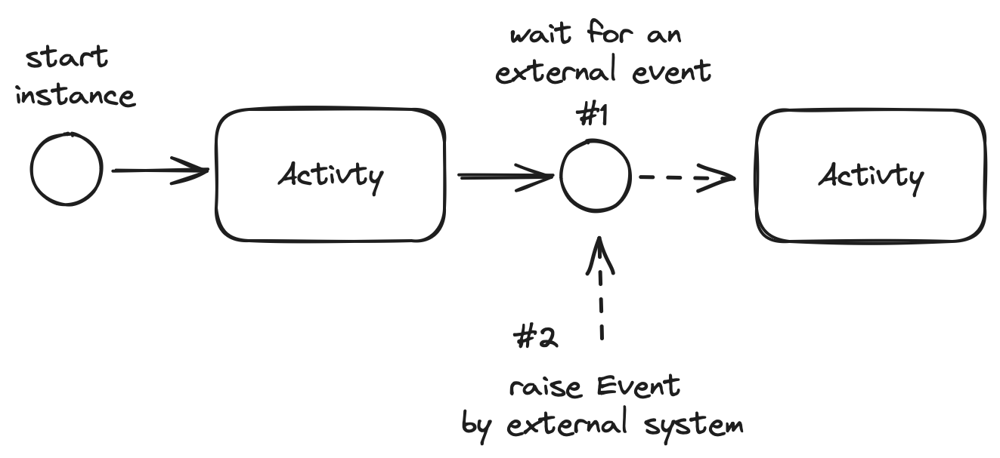

# Human Task Component / Service / APIs

* Author(s): Mauricio Salatino
* State: Ready for Implementation
* Updated: 2024/04/01

## Overview

Following the success of Dapr Workflows, this proposal introduces a set of functionalities to enable tasks created for people to interact with. While Human Tasks can be created as part of workflow instances, as part of the orchestration flow, this component also enable Dapr users to create tasks based on other interactions, for example based on subscriptions.



Workflows enable asynchronous interactions by using the `waitForExternalEvent` semantic. This is extremely flexible as the workflow instance will wait for an event to be `raised` to continue the execution. While this approach provide the ultimate flexiblity, it pushes developers to build a lot of functionalities required when that event is produced as a result of a human interaction. This proposal aims to enable workflows to define human interactions as part of the workflow definition, but still reusing the `waitForExternalEvent` and `raiseEvent` mechanisms under the hood. 

To make the life of developers easy new APIs can be added to the existing workflow client APIs: 

```java
public class ExampleWorkflow extends Workflow{
  
  @Override
  public WorkflowStub create() {

    ctx.callActivity(CreateCustomerOrderActivity.class.getName(), workflowPayload).await();
    ..
    var order = ctx.waitForExternalEvent("WarehouseValidOrder", Duration.ofMinutes(5), OrderPayload.class).await();
    ..
    if( order.getValue() > 5000){
        ...
        **ctx.createHumanTask("Call Customer and Validate Order", workflowPayload).await();**
    }
    ...
    ctx.callActivity(ShipOrderActivity.class.getName(), workflowPayload).await();

  }
}
```


By calling this new API, a new Task will be created for a human to interact with and APIs will be provided for those interactions.

This proposal is divided into two sections:
- APIs exposed by the service
- Architectural options


## Background

Human Task-based systems, in other words, systems where the main users are people (humans), in contrast with systems, usually implements an inbox-like interaction pattern to organise work that people needs to do. Tools like [GitHub issues](https://github.com/features/issues), [Jira](https://www.atlassian.com/software/jira/guides/issues/overview#what-is-an-issue) and even team coordination tools like [Asana](https://asana.com/) or [Monday](onday.com) all follow the same approach. 


Following the Dapr building blocks concept, this proposal describe the APIs that Dapr can expose to provide these features that can then be implemented by different providers. The APIs described in this proposal aim to reduce the work needed by developers (with a heavy focus on workflow developers) to building cloud native applications where human interactions are organised around tasks.


## Implementation Details

### Design

A set of new APIs are introduced to provide basic functionality to implement Human Task systems. All the APIs work around the `Task` entity which stores the task metadata and status. The following APIs should be provided to implement basic task management features:

- **POST `/tasks/`**: Create a new Task, by default the tasks is unassigned.
- **GET `/tasks/`**: Get All Tasks, this allow filters, for example, getting all the tasks for the logged in user, get all the tasks associated to a workflow instance, or get all the assigned tasks that are not completed yet. 
- **PUT `/tasks/<id>`**: Modify task information
- **POST `/tasks/<id>/assign`**: Assign the task to an individual or to a group. Assinging the task to an empty group or user makes the task unassigned
- **POST `/tasks/<id>/start`**: Mark the task as started
- **POST `/tasks/<id>/complete`**: Mark the task as completed

The `Task entity` includes the following information: 
- **Task Id**: an unique identifier for the task
- **Task Name**: the name of the task
- **Task Data/Payload**: custom data that is associated with the task. This is usually used to correlated with data stored in external systems. For example, this payload can contain a link to a document that is stored on an external system, or the Customer Id that is associated with this task.
- **(Optional) Workflow Instance Id**: if the task belongs to a workflow instance, the task needs to include a reference to the Workflow Instance Id.
- **(Optional) App Id**: To further improve filtering, including the application id that created the task can be useful.
- **Assignee**: this can be the id of an individual or a group of people. If this property is empty, the task is considered unassigned.
- **Status**: [Created, Assigned, Started, Completed], this list can me made extensible in future interations.

For the service to be useful, all tasks must be stored in a persistent storage. The Statestore building block can be used here, but advanced query capabilities are required for this to work. 


Tasks, because they have status associated to them, implement a simple lifecycle: 
- **Created**: this is the initial status of a task when it gets created. 
- **Assigned**: tasks needs to be assigned before they can be worked on. Assigning a task to an empty group/user will set the task back to Created status.
- **Started**: A task must be started, before it is completed. Once the task is started, its payload can change.
- **Completed**: A completed task cannot change it's payload.

### Behavior and expected APIs for developers

As shown in the following example, tasks can be created by our workflow definitions. In this case we want to validate orders that are exceeding values of $5000. When an order that matches this criteria is found a new human task is created for the fraud team to check its details.  

```java
public class ExampleWorkflow extends Workflow{
  
  @Override
  public WorkflowStub create() {

    ctx.callActivity(CreateCustomerOrderActivity.class.getName(), workflowPayload).await();
    ..
    var order = ctx.waitForExternalEvent("WarehouseValidOrder", Duration.ofMinutes(5), OrderPayload.class).await();
    ..
    if( order.getValue() > 5000){
        ...
        **boolean valid = ctx.createHumanTask("Call Customer and Validate Order", "fraud team", workflowPayload).await();**
        
        if(valid){
            ...
            ctx.callActivity(ShipOrderActivity.class.getName(), workflowPayload).await();
        }
    }
    

  }
}
```


Under the covers, the `ctx.createHumanTask` operation can be implemented by having a workflow Activity (`HumanTaskActivity`) that implements the functionality to create a new Task. I mention this here, to make sure that the inclusion of the new `createHumanTask()` API doesn't involve any change in the underlaying mechanisms that Dapr workflows already have.

Once the task is created, developers will need separate APIs to interact with the Task instance. Similarly to raising events for workflows (`workflowClient.raiseEvent(workflowId, "WarehouseValidOrder", customerEvent.order())`) helper APIs can be provided to interact with the created tasks. This can be provided by the workflowClient or a separate `tasksClient`:  

```java
List<Task> tasks = workflowClient.getAllTasks();
...
// assigning or claiming tasks mechanisms can be provided here
workflowClient.assignTask(taskId, "salaboy");
...

// depending on the identity management integration, this needs to validate that "salaboy" is executing the following operations
workflowClient.startTask(taskId);
...
workflowClient.updateTask(taskId, payload);

...
workflowClient.completeTask(taskId, payload);

```

Under the covers, calling the `completeTask(taskId, payload)` API will perform two operations: 
- Mark the tasks as completed and update the payload with its final version
- Raise an event so the workflow instance can continue

Going back to the proposed `HumanTaskActivity` internal implementation, it can use the waitForExternalEvent existing functionalty to wait for "HumanTaskCompleted" events.

```java
public class HumanTaskActivity implements WorkflowActivity {

    @Override
    public Object run(WorkflowActivityContext ctx) {
        // First, create a Task by calling the Task APIs
        taskClient.createTask("Task Name", taskPayload)
        ...
        ctx.waitForExternalEvent("HumanTaskCompleted",  TaskPayload.class).await();

    }
}
```


## Different Architectural options

I can see two completely different architectures for this proposal to be implemented. I will be asking the Dapr community for input here, as each option has its own drawbacks too. 

### Human Tasks APIs included as other Building Blocks and hosted in the Dapr sidecar

The Human Tasks APIs can be created as a new Building Block that can be configured using Components as the Statestore or PubSub Components. 

The component definition should allow the configuration of 3rd party services such as GitHub Issues, Jira or using the Statestore building block to store the tasks data.

Pros: 
- This approach follows the same principles already used by other Dapr Building Blocks

Cons: 
- It adds up to the Dapr Sidecar complexity
- It requires the service to implement HTTP and GRPC endpoitns
- It requires to have SDK support
- There is no need to have a strong relationship with the application (identity)


### Standalone Service that can be installed as part of the Dapr Control Plane

Creating a Standalone service that can be installed when installing Dapr, enables a separate lifecycle and different scalability approaches to be implemented. 

When working with Tasks, it is expected to work with Tasks created by different applications, hence there is no need of an application specific "instance" of the service. 

Pros: 
- Simple service that can run standalone and can be scaled up independently of the Dapr Sidecars.
- There is one global configuration for the service, each sidecar doesn't need to access those configurations
- A simple version can be implemented using only HTTP to validate the service features

Cons: 
- Introduces a new service, with a completely new lifecycle. This service is user facing so it is not part of the Dapr Control Plane component.


## Provider Implementations

Initially, if the Query APIs from the Statestore offer enough functionality to start, I would suggest to implement a simple version of the service using a Statestore as persistent storage. If Query support is added to the `in-memory` Statestore, this would make an in-memory Human Task service possible. 

To improve and prove the value of the APIs suggested in this proposal, a second implementation using GitHub issues can be implemented. 


## Related Items

Human Tasks systems, because they involve people doing work, most of the time require integration points with:
- **Identity management solutions**:  tasks needs to be assigned to people and then filtered by those assignments, integrations with tools like [Keycloak](https://www.keycloak.org/), [Zitadel](https://zitadel.com/) or other identity managers is key to provide the flexiblity needed by the applications consuming these APIs. 
- **Scheduled Jobs/Tasks, Alerts and time-based reminders**: there are very common business scenarios where tasks need to be automatically cancelled or reminders needs to be sent if a task hasn't been completed in a fixed amount of time. For such scenarios, integrations with the Dapr scheduler service are extremely good to have.
- **Notifications, Emails**: there are well-known patterns to communicate with people, sending notifications (in app, SMS, or emails) are quite common requirements for the kind of functionalities described in this proposal. This highlight the need for what might become another Dapr building block to provide such functionality as APIs for developers to use. 

### Acceptance Criteria

How will success be measured? 

A new set of APIs are available and developers can use the Human Task Service APIs (HTTP) to interact with Task Instances. 

Followed by the first iteration, GRPC endpoints can be implemented and support for SDKs can be added.


## Completion Checklist

What changes or actions are required to make this proposal complete? 
* Code changes
* Tests added (e2e, unit)
* Documentation

