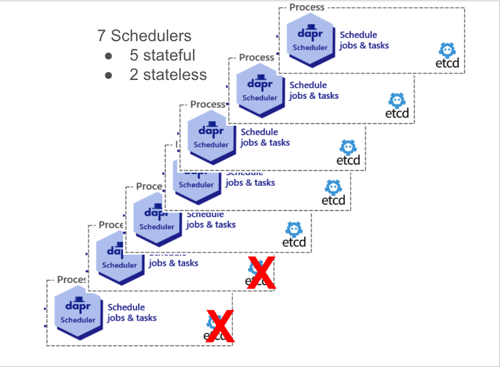

# Auto-Scale the Scheduler service

* Author(s): Cassie Coyle (@cicoyle)
* State: Review
* Updated: 2024-09-12

## Overview

This proposal outlines a design for auto-scaling the Schedulers, which is needed for the Scheduler service to be Stable.
The Scheduler's internal cron scheduler library code will need to be refactored to be dynamic. Runtime will need to be
updated to also account for dynamically connecting to Schedulers when they are scaled up or down. The Scheduler server
code will need to be updated such that it optionally runs embedded etcd on different Scheduler instances.


## Background

In Dapr v1.14 we introduced the Scheduler control plane service to support the Jobs API along with scaling the Actor
reminder system and the Workflow API (since it uses Actor reminders under the hood). The Scheduler encompasses running
itself as a new process, an embedded etcd instance, and an internal cron scheduler. This proposal will be detailing how 
to support the auto-scaling of Schedulers and secondly enhancing the Schedulers such that we optionally run etcd 
instances in the Schedulers under certain circumstances that make sense. When scaling beyond 3 etcd instances, there is
little performance improvement, so it makes sense for Schedulers to become stateless at this point. For example, we 
could have 20 Schedulers, but only 3 of them would contain the embedded etcd.

## Related Items

### Related issues

[Tracking Issue: Scheduler Stable](https://github.com/dapr/dapr/issues/7796) &&
[Auto Scale Scheduler Issue](https://github.com/dapr/dapr/issues/7912).

## Expectations and alternatives

There will be 3 changes needed for this feature to be complete. 

1. **New control loop** for the [go-etcd-cron library](https://github.com/diagridio/go-etcd-cron), such that the leadership table is able to be dynamic. This 
means we need to watch the leadership table to observe a new Scheduler starting up or going down, stopping all Schedulers 
job triggers for that moment until the leadership table is updated and synchronized. We will need to stop the job queue 
and rebuild it again by reshuffling all the jobs to evenly split up the job ownership amongst Schedulers. Refactoring is
needed here such that the queue logic can be stopped and restarted. The leadership table will be updated to additionally
include the host address as the data such that the key in the table remains the id, but the value becomes the proposed
protobuf below, including the observed total replicas, host address, and port.

Leadership in this case refers to partition leadership, which is responsible for evenly dividing up the jobs amongst the 
available Schedulers. It's unrelated to etcd clustering or consensus. The Schedulers share job triggering responsibilities 
across the replicaset, based on the partition ID relative to the total number of total partitions. Partition leadership 
ensures that no 2 Schedulers are working on the same nth partition, and that partitions are non-overlapping because they
agree on the same observed total partition count.

In a new `leadership.proto` file in the `go-etcd-cron` library we will have the following to dynamically track hosts 
available for job ownership distribution.
```protobuf
// Leadership is the message written to the leadership table when the replica
// gains ownership of the leader key.
message Leadership {
  // total is this replicas understanding of the total number of partition
  // replicas.
  uint32 total = 1;

  // leader_data is custom data that is associated with this leader. All leader
  // data will be sent to library consumer on leadership table updates.
  optional google.protobuf.Any leader_data = 2;
}
```

Initially we were storing the partition total as a string in etcd, but with this design we will store the above protobuf,
in string form due to an etcd requirement. This approach will **not** break users since we are doing a string comparison
in the library, we don't panic, and this data in particular is ephemeral anyways.

By introducing this optional field, we make the library extensible and useful for other use cases beyond of the 
Scheduler, while ensuring a non-breaking, backwards-compatible change. 

On the Scheduler side, we’ll implement the following change in a new `dapr/proto/internals/scheduler.proto`:
```protobuf
// SchedulerPartitionOwner is the data which is written to the cron leadership
// table.
message SchedulerPartitionOwner {
  // host is the host address of this partition owner.
  string host = 1;

  // port is the port of this partition owner.
  uint32 port = 2;
}
```

Upon startup, each Scheduler will retrieve its own host and port, and pass that into to the cron library via the cron
library `Options` here: https://github.com/dapr/dapr/blob/master/pkg/scheduler/server/server.go#L193. This information  
will feed into the new proposed control loop in the cron library ensuring that as Schedulers scale up or down, the 
job triggering load is evenly distributed among them.

- An optimization we can do after the initial work is done, is to keep all jobs in memory. Having a local cache 
would optimize building the queue faster, since we are using etcd this should be feasible. 

2. **A new WatchHosts RPC** is added to `scheduler.proto`, allowing the dapr sidecar to connect to any available Scheduler 
instance via a ClusterIP service, rather than needing to manually track and connect to each instance as in the current 
headless service model. This `WatchHosts` RPC dynamically provides the current set of active Scheduler instances to the 
sidecar, keeping it updated as Schedulers scale up or down.

- For **backward compatibility**, we will check to determine whether the `WatchHosts` RPC is available or not. If it 
exists, Dapr will use it to manage Scheduler connections dynamically. If not, Dapr will continue using the existing 
static connection logic, maintaining compatibility with earlier versions by sending the full list back of available 
Schedulers.

```protobuf
service Scheduler {
  ...
  rpc WatchHosts(WatchHostsRequest) returns (stream WatchHostsResponse) {}
}

message HostPort {
  string host = 1;
  uint32 port = 2;
}

message WatchHostsResponse {
  repeated HostPort hosts = 1;
}

message WatchHostsRequest {}

```

3. **1 or 3 Schedulers with respective embedded etcd instances, beyond 3 instances run Schedulers stateless**. We want to
optionally run embedded etcd in Scheduler for cases where it makes sense. Cases to consider:
- running 1 Scheduler means running it with embedded etcd
- running 2 Schedulers means running the first with embedded etcd, the second Scheduler will be stateless and connect to
the existing etcd
- running 3 Schedulers means running all with embedded etcd
- running 4 Schedulers means running 3 Schedulers with embedded etcd, and the last one will be stateless and connect to
an existing etcd. Note, here there is no gain to round-robin-ing between the existing etcd instances due to the way 
etcd works with raft under the hood.
- running 5 Schedulers means running 3 Schedulers with embedded etcd, the last two Scheduler instances will be stateless.
- running beyond 5 Schedulers means running 3 Schedulers with embedded etcd, and any Scheduler beyond 3 will be 
stateless and connect to an existing etcd instance.



etcd must run with an odd number of replicas. In dapr, 3 will be our practical limit while running inside Schedulers. 
With the cron scheduler library and embedded etcd already separate processes in Scheduler, we just need to optionally 
run the embedded etcd.

Regarding [etcd's cluster reconfiguration operations guide](https://etcd.io/docs/v3.3/op-guide/runtime-configuration/#cluster-reconfiguration-operations),
for adding members, or etcd instances, we will need to set the `initial-cluster-state` to be existing for the new 
instances. We do not need to update the configuration of existing members manually, as once the new members join the 
cluster, it will automatically be integrated into the consensus and the cluster's state will include the new member. 

As noted in their documentation, we _**should**_ set the `strict-reconfig-check` flag on etcd such that we reject
reconfiguration requests if the number of started members will be less than a quorum. This flag will ensure we avoid
quorum loss as we dynamically add or remove stateful Schedulers.

## Completion Checklist

- [ ] Write the new control loop for the go-etcd-cron library to make the leadership table & job queue dynamic
- [ ] Add WatchHosts to scheduler.proto & update code to use it while ensuring backwards compatibility
- [ ] 1 or 3 Scheduler etcd problem where Schedulers might be stateless
- [ ] Tests
- [ ] Document that some Schedulers might be stateless