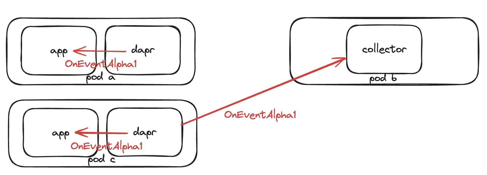

# Event Streaming

* Author(s): Cassie Coyle (@cicoyle)
* State: Ready for review
* Updated: 03-14-2025

## Overview

This proposal introduces event push-based capabilities into Dapr enabling system-wide event collection and monitoring.
The primary goal is to provide workflow and actor visualizations by sending events directly from Dapr sidecar instances to configured endpoints.
Unlike traditional Dapr patterns, we simply need a URL and can send events to that address with SPIFFE identity verification.
Similar to how OpenTelemetry tracing sends data directly to the collector, this design sends events directly to the configured sink address.

There is no component required for this feature, and no preview feature flag - it's simply a matter of whether the config is present or not.
If configuration is provided, Dapr will send events to the configured sinks.
Applications and collectors can receive events by implementing the `OnEventAlpha1` endpoint, which can be configured
for both local development and system-wide event collection.

This design proposes:
- Enables streaming of system-events to configured endpoints (sinks)
- Configurable event filtering capabilities
- Integration with Dapr's existing security model (mTLS)

What this means at a high level:
- Add Events to Application Configuration (supported for both kubernetes via crds & standalone mode via config files)
- Sinks implement the `OnEventAlpha1` endpoint to receive events
- Events can be sent locally or to remote collectors (with mTLS)

This feature enables:
- System-wide collection of events where collectors will capture events from configured Dapr instances used for:
  - Monitoring
  - Audit logs
  - Analytics
  - Workflow and actor visualizations

Whereby this use case is for overall system-wide monitoring, performance validation, scale testing of say 10,000 workflows.

Local event collection where applications may use the event information for:
- Re-running failed workflows
- Tracking workflow completions
- Custom business logic

Whereby this use case is for local development reacting to failures, purging completed instances, building indexes of instance IDs, and detecting deprecated workflows.

While Dapr has strong integration with OpenTelemetry and other telemetry solutions, they don't fully address our needs:
- OpenTelemetry focuses on metrics, traces, and logs, but doesn't have a standardized way to handle Dapr-specific events like workflow state changes or actor lifecycle events
- Existing PubSub solutions require additional components and don't provide the direct, secure event streaming we need
- We need a solution that's specifically designed for Dapr's event model and can handle both local development and system-wide monitoring without additional infrastructure

## Background

Currently, Dapr lacks a unified way to collect and monitor system events across all APIs (workflows, actors, jobs, etc.). There's no standardized way to:

* Collect events across multiple Dapr instances
* Filter specific event types
* Monitor system behavior at scale
* Visualize workflow and actor states

This proposal solves these problems by introducing a simple, scalable event streaming system that allows Dapr users to collect and process Dapr events through
configurable endpoints. This design enables both event handling locally for development and testing while also enabling production monitoring by sending events to
a centralized event collection instance. Events can be sent to local applications or remote collectors via the `OnEventAlpha1` endpoint, with configuration determining
the destination and security requirements.

## Related Items

### Related issues

This [dapr/issue is related ([workflow] introduce workflow lifecycle events firehose)](https://github.com/dapr/dapr/issues/6072), but is captured as a subset of what this general proposal will solve.

## Expectations and alternatives

* What is in scope for this proposal?
  * Configurable event endpoints with filtering via Configuration
  * mTLS support for secure communication with remote collectors
  * Event type filtering per API
  * Sending events to the `OnEventAlpha1` endpoint for both:
    * Local application event handling
    * Remote system-wide event collection
  * Initial implementation in Dapr v1.16 will focus on:
    * Workflow API events
    * Actor API events (if time permits)
    
* What alternatives have been considered, and why do they not solve the problem?
  * We considered two main approaches for event delivery:

  1. Direct gRPC (Chosen)
     - Simpler implementation: Direct point-to-point communication without additional infrastructure
     - Lower latency: No intermediate message broker
     - No additional dependencies: Uses existing gRPC infrastructure
     - Cost-effective: No additional infrastructure costs (message broker, storage, etc.)
     - Drawbacks: No built-in guaranteed delivery or dead letter queue

  2. PubSub Component
     - Benefits: Built-in guaranteed delivery, sequencing, and dead letter queue
     - Drawbacks:
       - Additional infrastructure dependency
       - Higher latency due to additional message broker hop
       - More configuration and setup
       - Potential performance overhead
       - Additional costs: Message broker, storage, and operational costs

  While PubSub would provide additional features, the direct gRPC approach was chosen for simplicity, performance, and cost-effectiveness. A future enhancement could add PubSub as an optional component, allowing users to configure a Dapr PubSub component to receive events for guaranteed delivery when needed.

### Considerations

#### Delivery Model
Transactional delivery was considered, but given the additional complexity and blocking nature of implementing acknowledgements and retries, best-effort delivery was chosen. If there is a strong need for guaranteed delivery, this can be added later with retry logic and acknowledgements, but would introduce latency and potential blocking in the event processing pipeline.

#### Event Structure
The event was initially considered as a `google.protobuf.Any` type to provide maximum flexibility for future event types. However, using a `oneof` structure was chosen instead because it:
- Provides better type safety and compile-time validation
- Eliminates the need for consumers to deserialize the `Any` field
- Makes the API contract explicit about available event types

The `oneof` structure contains event types specific to each API, for example:
```protobuf
message Event {
  oneof type {
    WorkflowsEvent workflow = 1;      // From workflows.dapr.io/v1
    ActorsEvent actor = 2;            // From actors.dapr.io/v1
    JobsEvent job = 3;                // From jobs.dapr.io/v1
    // add more below
  }
}
```

Each category (WorkflowsEvent, ActorsEvent, etc.) contains its own `oneof` with specific event types. For example:
```protobuf
message WorkflowsEvent {
  oneof event_type {
    // different workflow event types (see below)
  }
}
```

This nested `oneof` structure allows us to:
- Group related events together (e.g., all workflow events)
- Add new event types within each category
- Maintain backward compatibility
- Provide clear documentation of available events

Please note that the event types within each category will grow as we add more events in Dapr.

#### Future Considerations
- For the scope of this proposal, events are currently organized by API domain:
  - `workflows.dapr.io/v1` (e.g., WorkflowsEvent)
  - `actors.dapr.io/v1` (e.g., ActorsEvent)
  - `jobs.dapr.io/v1` (e.g., JobsEvent)
  - etc
- Future expansion to:
  - Filter by specific event types within an API domain, example of how this could be done:
    - `workflows.failed.dapr.io/v1`          // Only workflow failure events
    - `workflows.completed.dapr.io/v1`       // Only workflow completion events
    - `actors.activated.dapr.io/v1`          // Only actor activation events
    - `components.initialized`               // Only component initialization events
  - Component-related events (`components`) for monitoring component health and state
    - Can start with (`components`) then further specify by component type (`components.<type>`)
  - Control plane service events (would require control plane services to stream events to sidecars)
    - Can add something like: `service.scheduler`, `service.placement`
  - Health related events (`health`) for: dapr sidecar, control plane service, and component health related events
  - Dapr related events (`dapr`) for: runtime config changes or application discovered events, etc 
- A PubSub implementation could be added later if there's a strong need for guaranteed delivery, where users can configure a PubSub to be the event sink
  - Where a new optional `type` field could be added where a user could put something like the following:
    ```yaml
    # PubSub sink type
    - type: pubsub
      component: "cassie's-pubsub"  # Reference to PubSub component
      topic: "dapr-events"
      metadata:  # Optional PubSub-specific configuration
        partitionKey: "workflows.dapr.io/v1"  # Example: partition by event type
      filters:
        include: ["workflows.dapr.io/v1"]
    ```
- The current design allows for easy addition of new event types while maintaining type safety
- Delivery options could be added to support both `best-effort` and `transactional` delivery by adding a `delivery` field, configurable per sink:
  ```yaml
  spec:
    events:
      sinks:
      - address: "audit-collector:8080"
        delivery: "transactional"  # or "best-effort" (default)
        security:
          mtls: true
          identity: "spiffe://cluster.local/ns/cassie-app/sa/collector"
  ```
- A `GetEventsAlpha1` endpoint could be added to `dapr.proto` (user facing) for development and testing purposes:
  - The following is an **example** of how it _could_ look, keeping in mind pagination: 
  ```protobuf
  ...
  // Dapr service provides APIs to user application to access Dapr building blocks.
  service Dapr {
    // GetEventsAlpha1 returns collected events from the in-memory collector.
    // This endpoint is intended for development and testing purposes only.
    rpc GetEventsAlpha1(GetEventsRequest) returns (GetEventsResponse) {}
  }
  
  // EventFilters defines filtering options for event retrieval
  message EventFilters {
    // Filter by event type 
    // (e.g., "workflows.dapr.io/v1", "actors.dapr.io/v1")
    optional string event_type = 1;
    // Filter by time range
    optional google.protobuf.Timestamp start_time = 2;
    optional google.protobuf.Timestamp end_time = 3;
    // Maximum number of events to return
    optional int64 limit = 4;
  }
  
  message GetEventsRequest {
    // Optional filters to narrow down the events returned
    optional EventFilters filters = 1;
  }
  
  message GetEventsResponse {
    // List of collected events
    repeated EventRequest events = 1;
    // Token for pagination if there are more events
    optional string next_page_token = 2;
  }
  ```

## Implementation Details

### Design

The proposed event streaming architecture introduces the `OnEventAlpha1` endpoint which can be used for both:
- Local application event handling (within the same pod)
- Remote system-wide event collection (across pods)

Here's a high-level overview of the architecture:



The diagram shows:
1. Pod A/C contain Dapr sidecars that:
- Send events to their local apps through `OnEventAlpha1` (configured with localhost)
- Send events directly to the collector-app through `OnEventAlpha1`
2. Pod B contains:
- Only a collector-app (no Dapr sidecar needed)
- Serves `OnEventAlpha1` endpoint with mTLS using Sentry certificate
3. Events flow:
- From Dapr sidecars to their local apps via `OnEventAlpha1`
- From Dapr sidecars to the collector-app via `OnEventAlpha1`
- Secured via mTLS using Sentry certificates
- No service invocation needed since collector-app is not Dapr-enabled

#### Sidecar Event Capability
When configuration is provided:
- Events are sent to configured sinks (requires explicit configuration)

#### Event Handling Behavior
###### Sink Processing & Delivery
- Must be explicitly configured with at least one sink (local or remote)
- Configuration requires:
  - `events.enabled: true` to enable the feature
  - `events.sinks` array with at least one endpoint
- Each endpoint requires:
  - `address`: Endpoint address
    - For local app: Use localhost with port (e.g., `localhost:9090`)
    - For remote collector: Use the collector's address (e.g., `audit-collector:8080`)
  - `security`: Security configuration
    - For remote collectors: `mtls: true` and `identity` with SPIFFE ID
    - For local apps: `mtls: false`
  - `filters`: Optional event filtering configuration
- When configured, events are sent to:
  - `OnEventAlpha1` endpoint for gRPC
  - HTTP is not supported

###### Collector Configuration
- Collectors can be Dapr-enabled applications, but they don't have to be
- To prevent recursive event collection:
  - Runtime validation prevents a Dapr sidecar from being configured to send events to its own address

#### Event Filtering
- Can be configured per API using fully qualified API names:
  - `invoke.dapr.io/v1`
  - `state.dapr.io/v1`
  - `publish.dapr.io/v1`
  - `bindings.dapr.io/v1`
  - `actors.dapr.io/v1`
  - `secrets.dapr.io/v1`
  - `configuration.dapr.io/v1`
  - `metadata.dapr.io/v1`
  - `workflows.dapr.io/v1`
  - `lock.dapr.io/v1alpha1`
  - `unlock.dapr.io/v1alpha1`
  - `crypto.dapr.io/v1alpha1`
  - `subtlecrypto.dapr.io/v1alpha1`
  - `jobs.dapr.io/v1alpha1`
  - `conversation.dapr.io/v1alpha1`
  - `shutdown.dapr.io/v1` 
- Can use `exclude` to exclude specific APIs when `*` is used for the `include`
- When no filtering is specified, defaults to include `*` (all APIs)
- Filtering can be applied to all sinks
- Filtering can be configured either:
  - Globally at the spec level (applies to all sinks)
  - Per-sink (overrides global filters if present)

#### Delivery Characteristics
- Best-effort delivery (fire and forget)
- Designed for high-volume event scenarios
- No guaranteed delivery or acknowledgment
- Ordering is not guaranteed, but timestamps can be used to infer timelines
- After initial MVP, we can implement goroutines per filtered API type to send events to better guarantee ordering within filters for scale

#### Code Changes

##### Configuration:
```yaml
apiVersion: dapr.io/v1alpha1
kind: Configuration
spec:
  events:
    enabled: true  # Enable/disable all sinks
    # Global filters (optional)
    filters:
      include: ["jobs.dapr.io/v1"]
    sinks:
    - address: "audit-collector:8080" # Actual network address
      delivery: "transactional"  # or "best-effort" (default)
      security: # required
        mtls: true # default
        identity: "spiffe://cluster.local/ns/cassie-app/sa/collector" # required if `mtls = true`
      filters: # Overrides global filters
        include: ["workflow.dapr.io/v1", "actors.dapr.io/v1"]
    - address: "localhost:9090"
      security:
        mtls: false # optionally disable mtls
        # identity can be nil if `mtls = false`
      filters: # Overrides global filters
        include: ["*"]
```

##### Configuration Validation:
```go
// Prevent self-referential event configurations
if sinkAddress == ownAddress {
    return fmt.Errorf("sink address cannot be the same as the Dapr sidecar's own address")
}
```

##### Protos
`OnEventAlpha1` is added to `SinkEventsAlpha` service inside a new `dapr/proto/events/v1alpha1/events.proto` with the following events:

```protobuf
syntax = "proto3";

package dapr.proto.events.v1alpha1;

import "google/protobuf/any.proto";
import "google/protobuf/timestamp.proto";
import "dapr/proto/events/v1alpha1/workflows.proto";
import "dapr/proto/events/v1alpha1/actors.proto";
import "dapr/proto/events/v1alpha1/jobs.proto";

// SinkEventsAlpha is the service non-Dapr applications implement to receive events from Dapr instances
service SinkEventsAlpha {
  // OnEventAlpha1 receives events from Dapr instances. The application must serve this endpoint with mTLS using a Sentry-issued certificate.
  rpc OnEventAlpha1(stream EventRequest) returns (EventResponse);
}

message EventRequest {
  google.protobuf.Timestamp time = 1;
  Event event = 2;
}

message Event {
  oneof type {
    WorkflowsEvent workflow = 1;      // From workflows.dapr.io/v1
    ActorsEvent actor = 2;            // From actors.dapr.io/v1
    // JobsEvent job = 3;             // From jobs.dapr.io/v1
    // add more below
  }
}

message EventResponse {}
```

Inside `dapr/dapr/proto/events/v1alpha1` the following files and contents will be added. For workflows, we'll leverage the existing event definitions from `dapr/durabletask-protobuf` as they are well-defined, and already in use within our workflow implementation. We'll supplement these with additional Dapr-specific events as needed (like `ExecutionFailedEvent` and `ExecutionCanceledEvent`).

`Workflows` and `Actors` events will be implemented first, with other APIs to follow. While additional proto definitions for other APIs (jobs, components, health, dapr, etc.) have been drafted, they are **not** part of this initial implementation. You can find these draft definitions in [my cicoyle/preview-event-streaming-protos branch](https://github.com/dapr/dapr/compare/master...cicoyle:dapr:preview-event-streaming-protos) for reference and future discussion. Please note that the additional protos are not a final state and were just an initial draft for future reference and discussion.

Inside `workflows.proto`:
```protobuf
syntax = "proto3";

package dapr.proto.events.v1alpha1;

import "google/protobuf/any.proto";
import "google/protobuf/timestamp.proto";
import "google/protobuf/wrappers.proto";
import "google/protobuf/duration.proto";

import "github.com/dapr/durabletask-go/api/protos/orchestrator_service.proto";
import "github.com/dapr/durabletask-go/api/protos/backend_service.proto";

// Main message containing all possible workflow events
message WorkflowsEvent {
  // Metadata about the workflow instance
  durabletask.protos.backend.v1.OrchestrationMetadata metadata = 1;

  oneof event_type {
    // Workflow Execution events from durabletask-protobuf
    durabletask.protos.orchestrator.v1.ExecutionStartedEvent execution_started = 2;
    durabletask.protos.orchestrator.v1.ExecutionCompletedEvent execution_completed = 3;
    durabletask.protos.orchestrator.v1.ExecutionTerminatedEvent execution_terminated = 4;
    durabletask.protos.orchestrator.v1.ExecutionSuspendedEvent execution_suspended = 5;
    durabletask.protos.orchestrator.v1.ExecutionResumedEvent execution_resumed = 6;
    ExecutionFailedEvent execution_failed = 7; // Dapr-specific event not in durabletask-protobuf
    ExecutionCanceledEvent execution_canceled = 8; // Dapr-specific event not in durabletask-protobuf

    // Task events (AKA Workflow Activities) from durabletask-protobuf
    durabletask.protos.orchestrator.v1.TaskScheduledEvent task_scheduled = 9;
    durabletask.protos.orchestrator.v1.TaskCompletedEvent task_completed = 10;
    durabletask.protos.orchestrator.v1.TaskFailedEvent task_failed = 11;

    // Timer events from durabletask-protobuf
    durabletask.protos.orchestrator.v1.TimerCreatedEvent timer_created = 12;
    durabletask.protos.orchestrator.v1.TimerFiredEvent timer_fired = 13;

    // Sub-orchestration events (AKA Child Workflows) from durabletask-protobuf
    durabletask.protos.orchestrator.v1.SubOrchestrationInstanceCreatedEvent sub_orchestration_created = 14;
    durabletask.protos.orchestrator.v1.SubOrchestrationInstanceCompletedEvent sub_orchestration_completed = 15;
    durabletask.protos.orchestrator.v1.SubOrchestrationInstanceFailedEvent sub_orchestration_failed = 16;

    // Event handling events from durabletask-protobuf
    durabletask.protos.orchestrator.v1.EventRaisedEvent event_raised = 17;
  }
}

// Dapr-specific event not in durabletask-protobuf
message ExecutionFailedEvent {
  durabletask.protos.orchestrator.v1.OrchestrationInstance orchestration_instance = 1;
  FailureDetails failure_details = 2;
  string reason = 3;
}

// Dapr-specific event not in durabletask-protobuf
message ExecutionCanceledEvent {
  durabletask.protos.orchestrator.v1.OrchestrationInstance orchestration_instance = 1;
  string reason = 2;
}

message FailureDetails {
  string error_type = 1;
  string error_message = 2;
  bool is_transient = 3;
  map<string, string> details = 4;
}
```

Making consumer code look like:
```go
func handleEvent(request *pb.EventRequest) error {
    switch event := request.Event.Type.(type) {
    case *pb.WorkflowsEvent:
        switch eventType := event.EventType.(type) {
        case *pb.WorkflowsEvent_ExecutionStarted:
            // Handle workflow started
            metadata := event.Metadata
            log.Printf("Workflow started: %s (instance: %s/%s)", 
                metadata.Name,
                metadata.InstanceId,
                metadata.ExecutionId)
            
        case *pb.WorkflowsEvent_ExecutionFailed:
            // Handle workflow failed
            metadata := event.Metadata
            details := eventType.ExecutionFailed.FailureDetails
            log.Printf("Workflow failed: %s (instance: %s/%s) - %s (%s)", 
                metadata.Name,
                metadata.InstanceId,
                metadata.ExecutionId,
                details.ErrorMessage,
                details.ErrorType)
            
        case *pb.WorkflowsEvent_TaskScheduled:
            // Handle task scheduled
            metadata := event.Metadata
            task := eventType.TaskScheduled
            log.Printf("Task %s scheduled in workflow: %s (instance: %s/%s)",
                task.Name,
                metadata.Name,
                metadata.InstanceId,
                metadata.ExecutionId)
            
        case *pb.WorkflowsEvent_TaskCompleted:
            // Handle task completed
            metadata := event.Metadata
            task := eventType.TaskCompleted
            log.Printf("Task %s completed in workflow: %s (instance: %s/%s)",
                task.TaskScheduledId,
                metadata.Name,
                metadata.InstanceId,
                metadata.ExecutionId)
            
        case *pb.WorkflowsEvent_TaskFailed:
            // Handle task failed
            metadata := event.Metadata
            task := eventType.TaskFailed
            log.Printf("Task %s failed in workflow: %s (instance: %s/%s) - error: %s",
                task.TaskScheduledId,
                metadata.Name,
                metadata.InstanceId,
                metadata.ExecutionId,
                task.FailureDetails.ErrorMessage)
            
        case *pb.WorkflowsEvent_SubOrchestrationCreated:
            // Handle child workflow created
            metadata := event.Metadata
            sub := eventType.SubOrchestrationCreated
            log.Printf("Child workflow %s created in workflow: %s (instance: %s/%s)",
                sub.Name,
                metadata.Name,
                metadata.InstanceId,
                metadata.ExecutionId)
        }
        
    // Handle other event types (Actors, Jobs, etc.)
    }
    return nil
}

// Helper function to handle workflow failures
func handleWorkflowFailure(event *pb.WorkflowsEvent, failed *pb.ExecutionFailedEvent) error {
    metadata := event.Metadata
    details := failed.FailureDetails
    
    log.Printf("Workflow failure details:")
    log.Printf("Name: %s", metadata.Name)
    log.Printf("Instance: %s/%s", metadata.InstanceId, metadata.ExecutionId)
    log.Printf("Error type: %s", details.ErrorType)
    log.Printf("Error message: %s", details.ErrorMessage)
    log.Printf("Is transient: %v", details.IsTransient)
    
    // Log additional details if present
    for k, v := range details.Details {
        log.Printf("  Detail %s: %s", k, v)
    }
    
    return nil
}
```

Inside `actors.proto`:
```protobuf
syntax = "proto3";

package dapr.proto.events.v1alpha1;

import "google/protobuf/any.proto";
import "google/protobuf/timestamp.proto";

// Actor is the base message containing common fields for all actor events
message Actor {
  string type = 1;
  string id = 2;
}

// Main message containing all possible actors events
message ActorsEvent {
  oneof event_type {
    Activated activated = 1;
    Deactivated deactivated = 2;
    ReminderTriggered reminder_triggered = 3;
    TimerTriggered timer_triggered = 4;
    Invoked invoked = 5;
  }
}

message Activated {
  Actor actor = 1;
}

message Deactivated {
  Actor actor = 1;
}

message ReminderTriggered {
  Actor actor = 1;
  string name = 2;
}

message TimerTriggered {
  Actor actor = 1;
  string name = 2;
}

message Invoked {
  Actor actor = 1;
  string method_name = 2;
  string caller_type = 3;
  string caller_id = 4;
}
```

Making consumer code look like:
```go
func handleEvent(request *pb.EventRequest) error {
    switch event := request.Event.Type.(type) {
    case *pb.ActorsEvent:
        switch eventType := event.EventType.(type) {
        case *pb.ActorsEvent_Activated:
            // Handle actor activation
            log.Printf("Actor activated - type: %s, id: %s", 
                eventType.Activated.Actor.Type,
                eventType.Activated.Actor.Id)
            
        case *pb.ActorsEvent_Deactivated:
            // Handle actor deactivation
            log.Printf("Actor deactivated - type: %s, id: %s", 
                eventType.Deactivated.Actor.Type,
                eventType.Deactivated.Actor.Id)
            
        case *pb.ActorsEvent_ReminderTriggered:
            // Handle reminder trigger
            log.Printf("Actor reminder '%s' triggered - type: %s, id: %s", 
                eventType.ReminderTriggered.Name,
                eventType.ReminderTriggered.Actor.Type,
                eventType.ReminderTriggered.Actor.Id)
            
        case *pb.ActorsEvent_TimerTriggered:
            // Handle timer trigger
            log.Printf("Actor timer '%s' triggered - type: %s, id: %s", 
                eventType.TimerTriggered.Name,
                eventType.TimerTriggered.Actor.Type,
                eventType.TimerTriggered.Actor.Id)
            
        case *pb.ActorsEvent_Invoked:
            // Handle actor invocation
            log.Printf("Actor method '%s' invoked - type: %s, id: %s, caller: %s/%s",
                eventType.Invoked.MethodName,
                eventType.Invoked.Actor.Type,
                eventType.Invoked.Actor.Id,
                eventType.Invoked.CallerType,
                eventType.Invoked.CallerId)
        }
    }
    return nil
}
```

The `oneof` typed events enables consumer code (sinks) to do direct switching of events and drop events it does not understand:
```go
func handleEvent(request *pb.EventRequest) error {
  switch event := request.Event.Type.(type) {
  case *pb.WorkflowsEvent:
    // Handle workflow event
    handleWorkflowEvent(event)
  case *pb.ActorsEvent:
    // Handle actor event
    handleActorEvent(event)
  case *pb.JobsEvent:
    // Handle job event
    handleJobEvent(event)
  }
  return nil
}
```

### Feature lifecycle outline

### Feature lifecycle outline

* Expectations
  * Initial release will **only** include:
    * Workflow API events (primary focus)
    * Actor API events (if time permits)
  * Future releases will:
    * Add support for remaining APIs
    * PubSub support if requested & valuable
  * Each API that is not _already_ stable, before proceeding to stable _should_ add events in order to become stable

## Completion Checklist

* Code changes
  * Support configuration CRD for both kubernetes & standalone mode
  * Support sending events to the `OnEventAlpha1` endpoint
  * Protos for events
    * Workflow events will be done first, then Actors, then the rest of the APIs
* Tests added (e2e, unit)
* SDK changes to support `OnEventAlpha1` endpoint
* Documentation
* Metrics should be added after dapr v1.16:
  - Track event counts by API type and scope (local/remote)
  - Monitor event processing latency
  - Track failed event deliveries

## References

1. [OpenTelemetry Events Specification Discussion](https://github.com/open-telemetry/opentelemetry-specification/issues/4045) - Shows OpenTelemetry's approach to events as "semantically rigorous logs" and their ongoing work to define event standards.

2. [OpenTelemetry Events vs Logs](https://signoz.io/comparisons/opentelemetry-events-vs-logs/) - Explains the distinction between events and logs in OpenTelemetry's context.

3. [Dapr Configuration Reference](https://docs.dapr.io/reference/resource-specs/configuration-schema/) - Shows existing configuration to showcase where we will support event sinks.