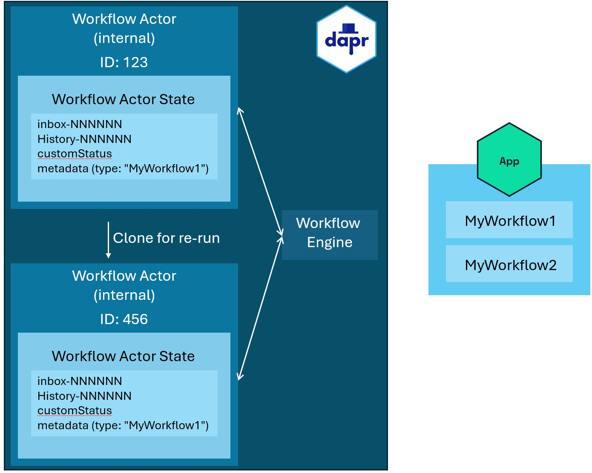
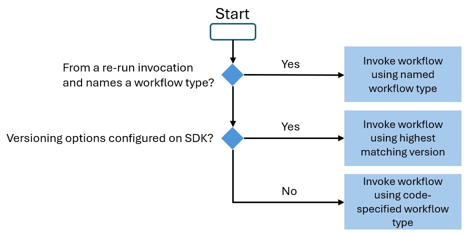

# Workflow Versioning
- Author: Whit Waldo (@whitwaldo)
- Status: Proposed
- Introduced: 4/22/2025

## Overview
This proposal outlines a method for implementing workflow versioning in Dapr Workflows. While the precise implementation
details are left to the maintainers of the individual project components (e.g., SDKs, runtime), it shares a proposed
mechanism for runtime-level functionality and examples for the C# SDK. Other SDK implementation specifics will vary.

## Background
Several proposals have addressed applying changes to workflows both during execution and at terminal states. Changing
input values mid-way in a workflow transforms a deterministic workflow into a non-deterministic one by introducing values
not produced during execution - this is little different than swapping out the code to effect a change on a workflow
into the same type. It's unsafe and rife with opportunities to introduce errors into the workflow (especially if the 
newly inserted value doesn't match the signature originally expected). Although the latest version of 
[this proposal](https://github.com/dapr/proposals/pull/80) requires using a separate Workflow instance ID for re-runs,
making it deterministic post-change, this functionality might preclude adding other sought-after features like 
a generalized workflow versioning scheme because of the inconsistency introduced between how different workflow
versions might operate (actual code changes) and the types that Reruns are created from. 

To clarify this last point, imagine that as part of a re-run, one selects one of the activities mid-way through the 
workflow. They clone the event log up until that activity and assign this workflow to a new instance ID, but it's still
based on the same underlying logic from the implementing class following that activity. Now imagine that as part of a
subsequent deployment, the developer simply swaps out the logic for the implementing workflow class - while this would
incur a litany of errors for any mid-flight workflow (addressed here), presumably it would run entirely fine with a 
clean start... except that the activity flow embodied in the cloned re-run workflow is no longer necessarily consistent.
I propose that this itself should be reason to rethink running derivative workflows in a clear and versioned manner
as a first-class concept early so we can facilitate such ad-hoc re-runs.

Additionally, I subscribe to the 
[opinion described here](https://github.com/dapr/proposals/pull/80#discussion_r2034962632) that by simply changing an 
input to a workflow midway through constitutes a violation of the deterministic contract provided by the workflows, but
I think this proposal can be married to the re-run concept in a slightly re-imagined way that enables both scenarios 
while also facilitating a more elaborate patch-based versioning scheme down the road as well.

This [other proposal](https://github.com/dapr/proposals/pull/80) suggests a mechanism for versioning workflows, aiming 
to facilitate the re-run functionality in the other proposal with the slight modifications described here.
  
## Assumptions
- All actors, workflows and activities register with the sidecar at launch, allowing the runtime to store their metadata in
a placement table for scheduling future work. It 
[does not appear](https://github.com/dapr/dapr/blob/80e00a6847f26875a11d6a0eb1de4ac98c423bde/pkg/runtime/wfengine/backends/actors/actors.go#L88)
that specific type names are stored in this placement table though, meaning that there will be a reliance on the SDKs
themselves to provide "latest version" much of the implementation necessary to support this change. 
- `ContinueAsNew` offers the ability to obliterate the previous execution's event log and restarts using the
same workflow type (today).
- Versioning operations should only be performed on workflows indicated as completed and ready for purging (or starting
from scratch).
`ContinueAsNew` provides a terminal point for our purposes, preserving deterministic integrity by performing a swap to
a new type version at this point when the new workflow is started.
- This proposal addresses workflow versioning only, not activity versioning. Activities are not required to be 
deterministic and can be swapped out, although this isn't recommended. Clear documentation should advise against sharing
activities across workflows due to potential unexpected ramifications.

## Design
This proposal suggests using redirects for versioning because they:
1. Simplify the implementation required for runtime maintainers
2. Address common versioning needs
3. Does not preclude future feature flag/patching implementation including re-run support

## What Does Versioning Seek to Solve?
Imagine having the following infinitely looping workflow as implemented in C#. The workflow receives some object identifier
and runs it through an activity to check its status and if that returns a `true` result, it performs another action
to notify the customer. Then it sleeps for 15 minutes and starts again using the `ContinueAsNew` method, providing it
with the object identifier once again.

```c#
internal sealed SampleWorkflow : Workflow<string, object?>
{
    public override async Task<object?> RunAsync(WorkflowContext context, string id)
    {
        var status = await context.CallActivityAsync<bool>(nameof(CheckStatus), id);
        if (status) 
        {
            await context.CallActivityAsync(nameof(NotifyCustomer), id);
        }
        
        await context.CreateTimer(TimeSpan.FromMinutes(15));
        context.ContinueAsNew(id, false);
        
        return null;
    }
}
```

The deterministic nature of these workflows means several things:
- **One cannot simply swap out this type in a new deployment:** Swapping out the workflow type might fail catastrophically
if in-flight workflows were unable to complete, leading to developer confusion (as they might assume that a new 
deployment would mean all previous workflows were cancelled).
- **Code cannot simply be added to the workflow:** Following the reasoning of the previous point, adding new code violates 
deterministic integrity, potentially causing unexpected faults.

If the workflow were to have stopped when it was finished, it would have given the developer an opportunity to relaunch 
it using a different type and enabling a blue/green-like deployment model - that is, deploy a new "green" type until all
the existing "blue" types are known to have stopped running and have redeployed as "green" types, then delete the "blue"
type from their next deployment altogether. However, in this very likely scenario, the developer never has an opportunity
to swap out Workflow types.

Now, had the developer thought ahead about this in 1.15, they could have introduced an activity that performed some sort 
of reflective analysis of its own service or used some sort of Workflow registry to determine that there was a newer type
available to swap to, then scheduled a one-time Dapr Job with the updated Workflow type name as the payload and ended 
the current workflow in order to have the job invoke the new Workflow type, but this introduces quite a lot of complexity.
As we're trying to simplify distributed application development with Dapr, I propose that there's a simpler approach
available to us here that introduces a powerful mechanism to swap between Workflow types with minimal changes by 
developers to their existing workflows.

## Implementation Details
I propose that we make relatively small changes to Dapr Workflows APIs externally.

First, we introduce and document a new convention where workflow types are versioned by appending a numerical value to 
the end of their names. Higher numerical values represent later versions (e.g. `ExampleWorkflow100` represents a later 
version of the `ExampleWorkflow10` type).

Second, I propose that the SDKs reflect an optional `DaprVersioningOptions` configuration value during registration. 
These options provide the following properties (to start with). If the option is configured (regardless of the following
options, versioning is enabled on that app:
- `MapMultiAppTypes`: This is primarily imagined to align with the 
Multi-App Run proposal](https://github.com/dapr/proposals/pull/76) in that it would accept a `List<MultiAppWorkflowMap>` 
defined by (in .NET at least) `public sealed record MultiAppWorkflowMap(string WorkflowType, string AppId);` in which the 
`WorkflowTypeWithoutVersion`: reflects the name of the class implementing the workflow (optionally absent its version 
number) and the `AppId` contains the identifier of the application containing the type. In line with that proposal,
when the request comes into the SDK associated with that application, if it supports versioning, it is responsible
for referring to its own mapping registration to understand which type, specifically, to direct the request to.
- `ExcludeTypes`: A `IReadOnlyList<string>` containing the names of workflow types (optionally absent its version number)
that should be excluded from version routing and which should always invoke precisely the named type indicated.

Versioning should only happen on terminal and version-configured workflows meaning that only when the runtime is seeking 
to call back into the workflow SDK to run work on a specific workflow should this versioning routing operation take 
place. This means that there are only two places in which this should happen today and one in a proposed future:
1) Following a `ScheduleWorkflowAsync` call or during the same following a `ContinueAsNew` call (but only if 
`preserveUnprocessedEvents` is set to `false`) as either one will clear the state and all pending events (including 
external events) ensuring we don't end up with a workflow that does not match its preserved event history.
2) When the runtime calls into the SDK to invoke a re-run of a workflow against a specific named workflow type.

### Re-run Support
Additionally, the workflow context should be updated with a settable string property that reflects the latest type 
including version) used to run the workflow. While this wouldn't be necessary to facilitate this idea itself, it is 
necessary to support the re-run workflow proposal and its capabilities. Reason being, the concern about versioning with
ad-hoc mid-workflow runs is that the underlying logic might change and the runtime has no knowledge about the specific
type being executed (as that's entirely managed in the SDK). By naming the type in the workflow, it means we don't have 
to make any changes to the placement table or runtime routing logic. 

Rather, thinking through how a replay would work, the developer would pick a mid-workflow activity to re-run from 
within a workflow ID. The re-run API would facilitate cloning the event log and actor metadata (including this workflow 
type) for that workflow into a separate workflow ID on he new actor. When the actor calls back into the workflow SDK to 
run the work from the specified activity within that new workflow ID, it should also specify this type value so the SDK
can route to that specific type (as though it were excluded per the configuration options above) so there is no 
versioning impact to the re-run workflow itself and it always runs against a consistent type.



### SDK Example
Here's an example of what this might look like during the registration process in C#:

```c#
var builder = Host.CreateDefaultBuilder(args).ConfigureServices(services => {
    services.AddDaprWorkflow(options => {
        options.WithVersioning(); //Adding this enables versioning on this application
    
        options.RegisterWorkflow<MyWorkflow1>();
        options.RegisterWorkflow<MyWorkflow2>(); //This is the newer of the registered workflows
    });
});
```

## What needs to change?
### Protos
This requires more research into how the SDK interacts with the runtime, but I expect the necessary changes are minimal
given that the majority of what's happening in this proposal happens within each of the SDKs.

Tracing through how `ContinueAsNew` works in the .NET SDK, it relies on the `TaskOrchestrationContext` implemented
in the `DurableTask.Core` library. This kicks off a new workflow using the same instance ID and input without any of 
the corresponding artifacts (in-process tasks, events, etc.). This is primarily done in the upstream durable task 
clients themselves and not in the runtime as those clients will eventually just call `StartWorkflowAlpha1`.

To that end, `StartWorkflowRequest` allows for a map of `<string, string>` options (under the `options` property) that 
were originally intended to configure the workflow component. I propose repurposing that here to pass the payload of the 
`DaprVersioningOptions` as key/value pairs back to the runtime to provide it context whenever `ContinueAsNew` is used 
(as this isn't implemented at the runtime, but at the SDK level). This doesn't require a protos change and only 
necessitates a change to each language SDK.

Finally, the only other change to a proto necessary here might be the one proposed in the
[Multi-App Workflow]() to specify the application ID the type should be
discovered within. This can be specified in the `LimitTypesToApplicationId` property I include in the
`DaprVersioningOptions` example above and included in that mapping back to the workflow `options` property.

### SDKs
A change is necessary to the upstream durable task client and worker and how it routes inbound workflow invocations.
The following decision chart illustrates how this might change (assuming the re-run proposal as well):




### Runtime
Really the only thing required by the runtime is adding the workflow type to the workflow state metadata for
re-run purposes and changing it to reflect whenever the workflow actor is invoked again. Otherwise, apart from passing
it along into the app's SDK to start a workflow (along with whatever context is provided along with the re-run 
invocation). But I think that's it from the runtime perspective.

### Documentation
The documentation needs an update to provide as many low-level details about versioning as possible. Here, that should
specifically detail the convention previously articulated, how each of the SDKs accommodate this and how this is 
implicated across the various other emergent features of Dapr Workflows.

## Benefits
The implementation here is simple and sets up a starting point for a more elaborate versioning approach using patching
and/or feature flags. I believe it also enables Josh's proposal for workflow re-runs atop this routed solution
to solve the underlying workflow type mismatch inherent to his proposal. Finally, it also provides a solution
to a frequently raised issue by the community in a straightforward and simple way (from the developers' perspective).

It maintains the deterministic nature of the workflows themselves and doesn't introduce any elaborate routing rules or 
other complexity that might lead to this idea being underutilized in practice. Most of all, it doesn't change anything
about the fundamental nature of how the workflows themselves execute as a whole and leaves us the broadest door possible
to effectuating a point-in-time re-execution approach that builds atop this behavior and yields a consistent workflow
state while benefiting from the registry of available types already registered via the Workflow SDKs.

## Additional Considerations
- The Multi-App run proposal envisions being able to invoke workflows and activities across applications. It should be
mentioned in relevant documentation that if any of the cross-referenced applications has enabled versioning, this may 
interfere with expectations about what the workflow itself actually does (much like swapping out what activities do and
their various side effects), but the functionality is worth having in Dapr. This option should be made available to 
developers and the ramifications of using simply made clear.