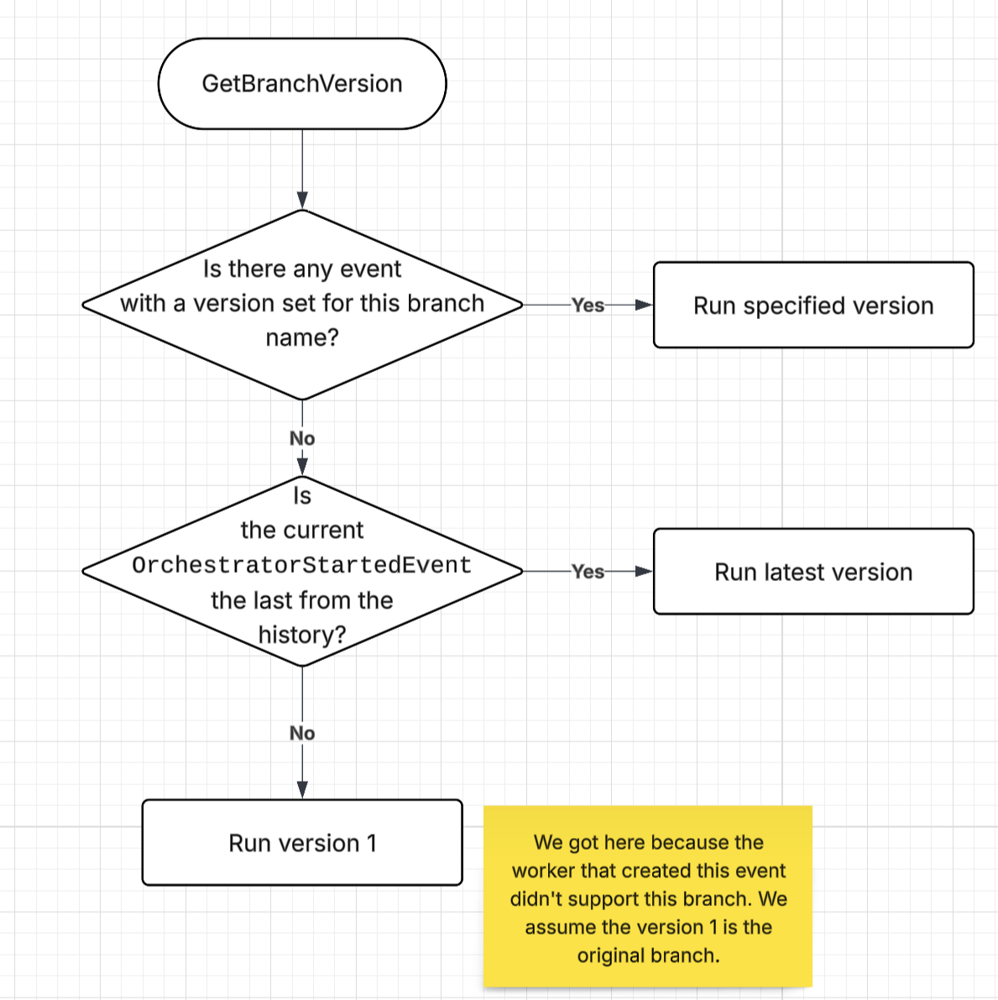
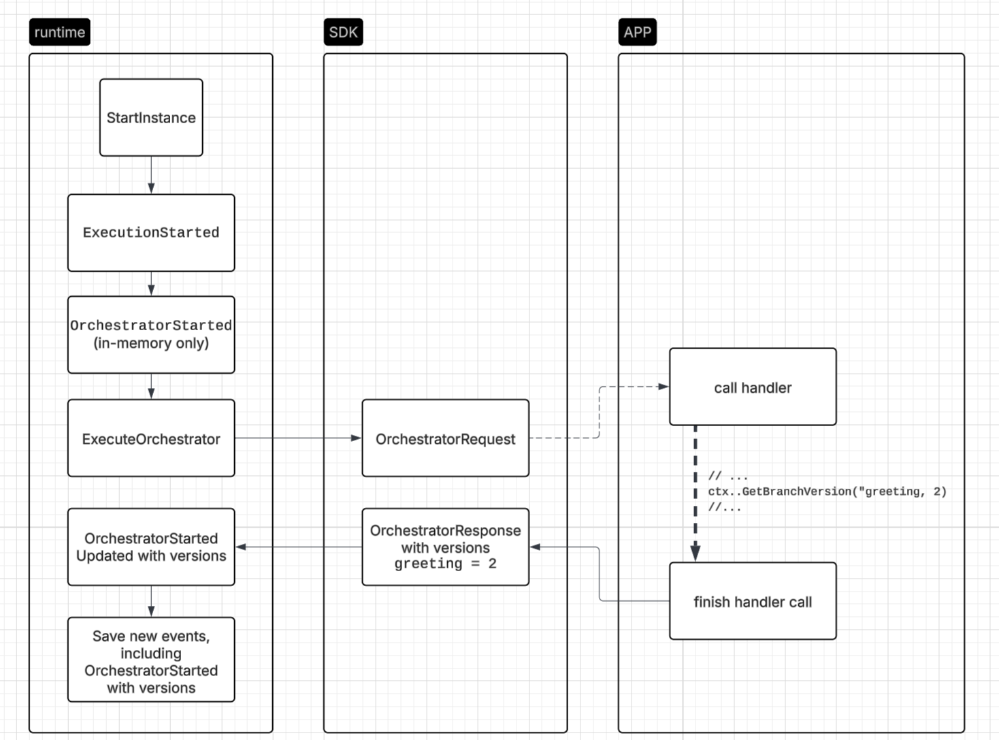

# Workflow Branch Versions

* Author(s): Albert Callarisa (@acroca)
* State: Proposed
* Updated: 2025-10-22

## Overview

This proposal tackles a solution for modifying workflows but maintaining their deterministic nature.

The approach to workflow versioning in this proposal is to support branching within the workflow code, allowing the users to version only specific parts of the workflow code.

The client code would look like the following:

```go
r := task.NewTaskRegistry()
r.AddOrchestrator(MyWorkflow)

//...

func MyWorkflow(ctx *workflow.WorkflowContext) (any, error) {
	//...

	version := ctx.GetBranchVersion("greeting", 1, 2)
	switch version {
	case 1:
		err := ctx.CallActivity(GreetUserBySMS).Await(nil)
		if err != nil {
			return nil, err
		}
	}
		switch version {
	case 2:
		err := ctx.CallActivity(GreetUserByEmail).Await(nil)
		if err != nil {
			return nil, err
		}
	}

	//...
	return nil, nil
}
```

This workflow has a step where it sends a greeting message to a user. In the example, the initial version (1) was sending an SMS, but in the latest version (2) it sends an e-mail.

In rough terms of implementation, we’d need to add this arbitrary dictionary of versions to the `OrchestratorResponse` and `OrchestratorStartedEvent`, similar to alternative 4 but with a dictionary instead of a single version value.

The version selection will be determined as soon as the code reaches the `GetBranchVersion` call. So in this example, we could have multiple `OrchestratorStartedEvent` prior the greeting, and when we reach the greeting the corresponding `OrchestratorStartedEvent` will include the `greeting` version number in it.

This approach has some benefits compared to other alternatives considered:

- Versioning can affect only specific pieces of the workflow code, meaning minimal code duplication. This is very beneficial for long workflows.
- If the user needs to version the whole workflow they can still do it by introducing a version check that wraps the whole workflow.
- All workflow features like `ContinueAsNew` and multi-app child workflows are supported out of the box because the workflow itself is the same as before.
- Supports multiple branches within a workflow, allowing different teams to work on changes independently from each other, with no coordination required. One team could be introducing a change in the greeting part of the workflow, while another team could be introducing a change in the payment.
- Since this doesn’t change any orchestrator registration code, name inference from function is still supported.

## Background

We frequently need to modify workflows for various reasons, while ensuring they remain deterministic (meaning the sequence of calls to Activities and Child Workflows must be consistent across multiple runs as required by durabletask). A straightforward approach is creating a new workflow and updating all references to it, ensuring new invocations use the updated version. However, this isn't always feasible. Two situations require keeping the same workflow name:

- When a workflow uses `ContinueAsNew`, it creates a fresh call of itself.
- When external applications reference a workflow from another application by its name, requiring to update all references across all applications and orchestrate the migration manually.

These scenarios make workflow versioning valuable, as it maintains determinism while enabling modifications.

Expectations:

- Users should be able to ship updates on their workflows without breaking ongoing running workflows.
- All existing workflow functionalities should still work.

## Related Items

### Related proposals

The main related proposal is https://github.com/dapr/proposals/pull/82. While it has a similar goal, it requires duplicating the whole workflow code for each version.


## Implementation Details

Our way to store durable information about the workflow lifecycle is by saving it into the workflow event history. The event that stores the information about a specific execution attempt of a workflow is the `OrchestratorStartedEvent`. During the life of a specific workflow execution, we will have as many of those events as times the workflow has been resumed.

This event is created when the SDK finishes executing the workflow and sends an `OrchestratorResponse` back to the runtime. At that point is where the runtime prepares the event to be stored in the state store, together with other events that could have happened during this workflow execution.

During a workflow execution, the SDK will have a way to handle branch versions and to have a different code for each version. The SDK will have to figure out which version in particular needs to be called. Later in the proposal there are some client code examples for different SDKs.

Here’s a diagram of how the version is determined:



This covers all possible scenarios when dealing with branch versions:

- For new workflows executions, the first time they hit a branch they’ll chose the latest version available because there’s nothing in the history of events preventing so. Next time this workflow instance runs, the selected version is stored in the events so it’ll run the same version on every run.
- When we deploy a new version for a branch but there were some workflows already running that have selected older versions (the latest back then), since that information is stored in the event history, the SDK will continue executing the specified version.
- When a branch is introduced for the first time in the workflow, in-flight workflow executions don’t have any versioning assigned to it. In this case, the branch version will default as 1 because it’s considered to be the original version. This only applies when the branch is introduced in a point of the workflow that was already executed previously. Or in other words, even in-flight workflows might run the new branch version if the execution reaches this point for the first time.
- When the app updates the SDK version to the new one, which now handles versioning, and at the same time introduces branches in a workflow (all in the same deployment), same rules apply. This comes with an edge case described later in this proposal.

And here’s is a top level diagram of what happens during a workflow run, and how the branch version information flows between runtime and SDK:




The protos would need to be change to represent this change:

```protobuf
message Version {
  string name = 1;
  uint32 number = 2;
}

message BranchVersions {
	repeated Version versions = 1;
}

message OrchestratorStartedEvent {
  //...
  optional BranchVersions branchVersions = N;
}

message OrchestratorResponse {
  //...
  optional BranchVersions branchVersions = N;
}
```

Those new fields are set as `optional` in existing messages because there will be a transition period where the runtime supports the field but the SDK doesn’t.

Since the workflow call isn’t affected by this feature, all existing functionalities like `ContinueAsNew` or multi-app calls would work as they work today. Each call evaluates versioning starting from an empty state, so they’ll chose the latest version possible but keep it consistent throughout the execution of the individual workflow.

Some edge cases for versioning:

- It can happen that the workflow state has a version for a branch that is not supported by the running SDK. This will happen during rollouts of the applications, where the new code introduces a new branch version, but the workflow is scheduled in an old instance of the app that doesn’t have a handle for it. In this case it’s safe to return a typed error and wait until it runs in a different instance that supports this version. When new instances of an app join the scheduler, there’s an actor dissemination event that will rerun pending reminders, so it will eventually be executed in a new instance as the rollout completes.
- If a workflow has multiple calls to child workflows, each of those calls will evaluate versioning independently from each other. If there’s a rollout happening during those multiple calls, it can potentially happen that some calls to the child workflow have a set of branch versions different than other of the calls. In the future we can think of a way to add version consistency for child workflows, but is out of the scope of this proposal.
- It’s not possible to specify a version when creating a workflow, it will always run in the latest possible version, following the rules stated earlier.

Some notes on how this feature would work with other existing workflow functionalities:

- `ContinueAsNew` will create a fresh new workflow without any versioning requirements. The new execution will run as a new call, so will run the latest available version at the time of the execution. So workflows using `ContinueAsNew` will migrate naturally to new versions.
- Multi-App child workflows don’t get affected at all, apps can still invoke workflows on other apps, and those child workflows may or may not have versioning. The parent workflow doesn’t know, and doesn’t need to know.

Here’s a brief example of how the output would look like when using the `dapr workflow history` CLI tool:

```
TYPE                 NAME            ELAPSED     STATUS     DETAILS
ExecutionStarted     records         Ago:48.28s  RUNNING
OrchestratorStarted                  3.02s       RUNNING    BranchVersions(greeting=3)
TaskScheduled        greetUser       5.8ms       RUNNING    Activity=greetUser
OrchestratorStarted                  12.4ms      RUNNING
TaskCompleted                        4.3ms       RUNNING
TaskScheduled        notifyAdmins    5.8ms       RUNNING    Activity=notifyAdmins
OrchestratorStarted                  3.02s       RUNNING    BranchVersions(payment=2)
TaskCompleted                        4.3ms       RUNNING
TaskScheduled        processPayment  5.8ms       RUNNING    Activity=processPayment
OrchestratorStarted                  3.02s       RUNNING
TaskCompleted                        4.3ms       RUNNING
ExecutionCompleted                   1.0ms       COMPLETED
```

### SDK Implementation

The SDKs will have a function to retrieve the branch version that needs to be run. This function will return the version number following the rules specified previously.

This function will be `GetBranchVersion` and will be available from the workflow context. It will receive the name of the branch version to check, as well as the minimum and maximum version that are supported. The version range is necessary so the call to this function will throw an exception if the desired version is not included in the range. For example, `.GetBranchVersion("greeting", 3, 4)` will fail if the workflow instance ran version `2` or `5` previously. This scenario was described in more detail previously.

Here are some client code examples in different languages:

Go:

```go
r := task.NewTaskRegistry()
r.AddOrchestrator(MyWorkflow)

//...

func MyWorkflow(ctx *workflow.WorkflowContext) (any, error) {
	//...

	version := ctx.GetBranchVersion("greeting", 1, 2)
	switch version {
	case 1:
		err := ctx.CallActivity(GreetUserBySMS).Await(nil)
		if err != nil {
			return nil, err
		}
	}
		switch version {
	case 2:
		err := ctx.CallActivity(GreetUserByEmail).Await(nil)
		if err != nil {
			return nil, err
		}
	}

	//...
	return nil, nil
}
```

Python

```python
@workflow_runtime.workflow
def my_workflow(ctx: DaprWorkflowContext, wf_input: str):
    # ...

    version = ctx.get_branch_version("greeting", 1, 2)
    if version == 1:
        yield ctx.call_activity("greet_user_by_sms")
    elif version == 2:
        yield ctx.call_activity("greet_user_by_email")

    # ...
    return ""
```

.NET

```csharp
internal sealed class MyWorkflow : Workflow<string, object?>
{
    public override async Task<object?> RunAsync(WorkflowContext context, string id)
    {
        // ...
        var version = context.GetBranchVersion("greeting", 1, 2);
        switch (version)
        {
            case 1:
                await context.CallActivityAsync<bool>(nameof(GreetUserBySMS), id);
            case 2:
                await context.CallActivityAsync<bool>(nameof(GreetUserByEmail), id);
        }
        // ...
        return null;
    }
}

```

Java

```java
public class MyWorkflow implements Workflow {
    @Override
    public WorkflowStub create() {
        return ctx -> {
            // ...
            Integer version = ctx.getBranchVersion("greeting", 1, 2);
            switch (version) {
            case 1:
                return ctx.callActivity("GreetUserBySMS", null, Integer.class).await();
            case 2:
                return ctx.callActivity("GreetUserByEmail", null, Integer.class).await();
            }
            // ...
            ctx.complete(null);
        };
    }
}
```


## Alternatives

For this proposal, the following alternatives were considered:

### Alternative 1

Users could create a new workflow to replace an old one by themselves. For example, they could create `MyWorkflowFix` to replace `MyWorkflow`. There’s nothing to change in dapr, users can create as many workflows as needed.

This works for some cases, but it’s inconvenient for some others:

- A workflow with a `ContinueAsNew` loop pattern will not migrate to the new workflow.
- All references to `MyWorkflow` will need to be updated and replaced with `MyWorkflowFix`. This can he specially tedious if the workflow is called from other apps.
- The whole workflow needs to be duplicated, leading to a lot of code duplication
- The two workflows are effectively different workflows, which can be a problem from observability point of view.

### Alternative 2

Another alternative that doesn’t require any runtime changes would be to check version numbers as a call to an activity that just returns the latest version. It’ll look like the following:

```go
r := task.NewTaskRegistry()
r.AddOrchestratorN("MyWorkflow", func(ctx *task.OrchestrationContext) (any, error) {
	var version int
	if err := ctx.CallActivity("GetWorkflowVersion").Await(&version); err != nil {
		return nil, err
	}
	switch version {
	case 1:
		return "I'm version 1", nil
	case 2:
		return "I'm version 2", nil
	default:
		return nil, errors.New("unknown version")
	}
})
r.AddActivityN("GetWorkflowVersion", func(ctx task.ActivityContext) (any, error) {
	return 2, nil
})
```

This action will always return the latest version. Since activity calls are persisted in the workflow state, in-flight workflows run will remain in the version they were at the time this activity was called, and new workflow calls will use the latest version.

After calling this activity, the workflow code will need to have a handle for each version number (switch/case with 1, 2, 3,4, etc).

The SDKs could make this implementation simpler for the apps, so the apps would provide a standard workflow handler for each version and the SDK would call the right handler by running the activity call behind the scenes.

This alternative would work, but some major drawbacks:

- It doesn’t support migrating a workflow from non-versioned to versioned because it breaks the determinism of a workflow. Ongoing workflow calls don’t have this activity call in their history and they will fail. It would require creating a new workflow that contains this activity call.
- It adds a synchronous activity call to all workflow runs, extending the total execution time and memory footprint, two metrics we don’t want to impact.

### Alternative 3

What is proposed in https://github.com/dapr/proposals/pull/82.

Code sample (C#) copied from the proposal:

```csharp
var builder = Host.CreateDefaultBuilder(args).ConfigureServices(services => {
    services.AddDaprWorkflow(options => {
        options.WithVersioning(); //Adding this enables versioning on this application

        options.RegisterWorkflow<MyWorkflow1>();
        options.RegisterWorkflow<MyWorkflow2>(); //This is the newer of the registered workflows

        // Allows per-type version registration (with different strategies) even if `WithVersioning` isn't specified
        options.RegisterVersionedWorkflow<MyWorkflow>(new VersionedNumericalSuffixOptions());
    });
});
```

This alternative proposes to extend the runtime to store both `MyWorkflow` (in the `name` field, as of today) and `MyWorkflow2` in the workflow metadata.

This alternative works but:

- The whole workflow needs to be duplicated, leading to a lot of code duplication
- Introduces naming restrictions for the names of the functions in the user land.

### Alternative 4

Another alternative to version the whole workflow would be to force SDKs to register all the workflow versions under the same name and provide a handler for each version.

This is how it’d look like from the app code in Go:

```go
r := task.NewTaskRegistry()
r.AddOrchestratorNVersion("MyWorkflow", 1, func(ctx *task.OrchestrationContext) (any, error) {
	return "I'm version 1", nil
})
r.AddOrchestratorNVersion("MyWorkflow", 2, func(ctx *task.OrchestrationContext) (any, error) {
	return "I'm version 2", nil
})
```

This approach is similar to Alternative 3 but without function naming restrictions.

But also some drawbacks:

- The whole workflow needs to be duplicated, leading to a lot of code duplication
- We can’t use workflow name inference from the function name like we do today in many SDKs, so the SDKs would have to change considerably.
