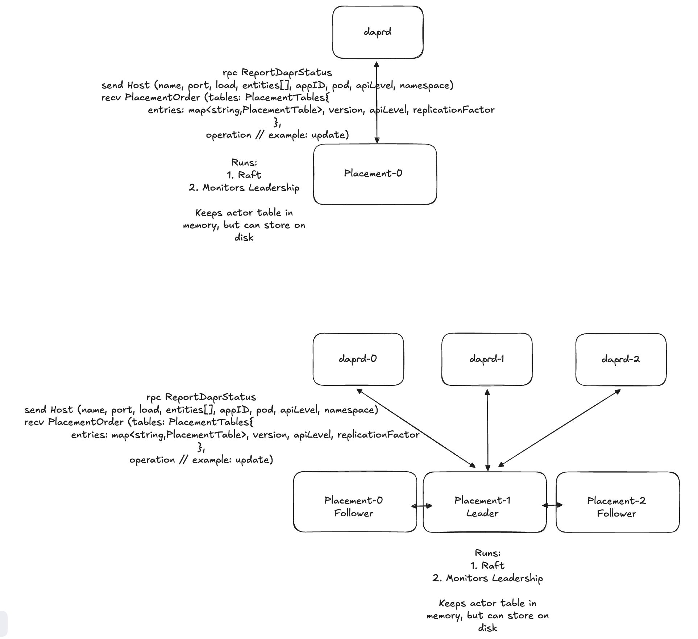
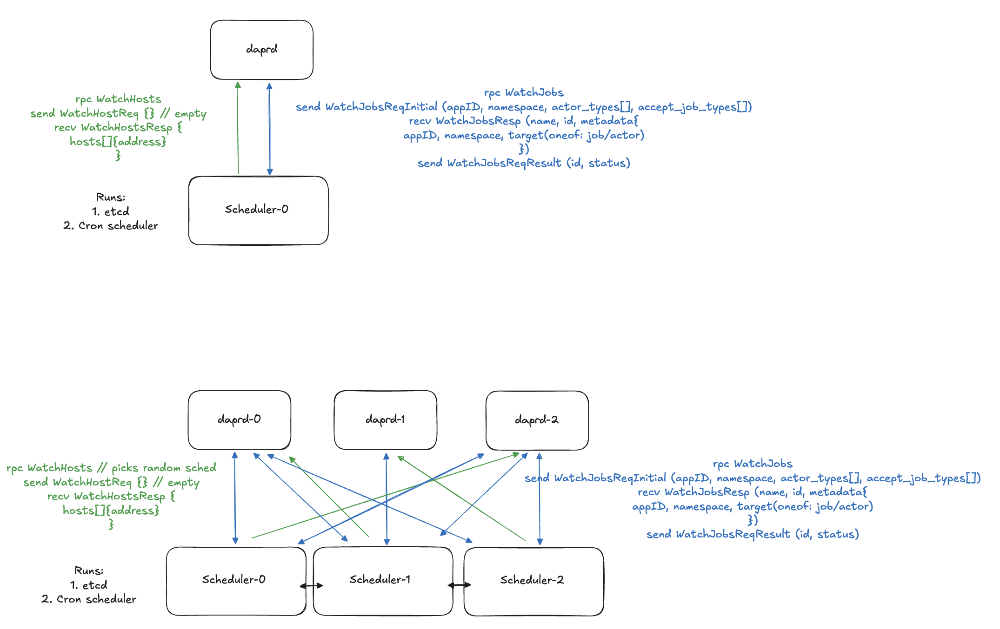
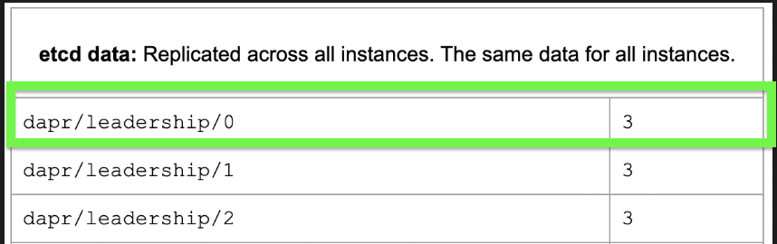
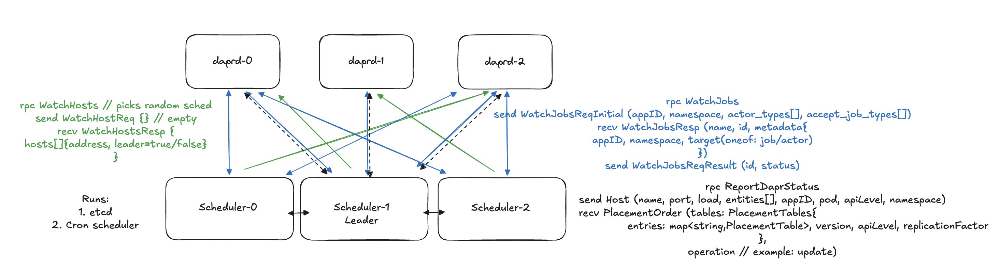
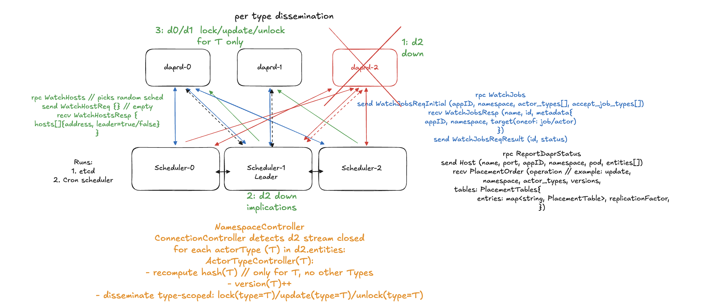
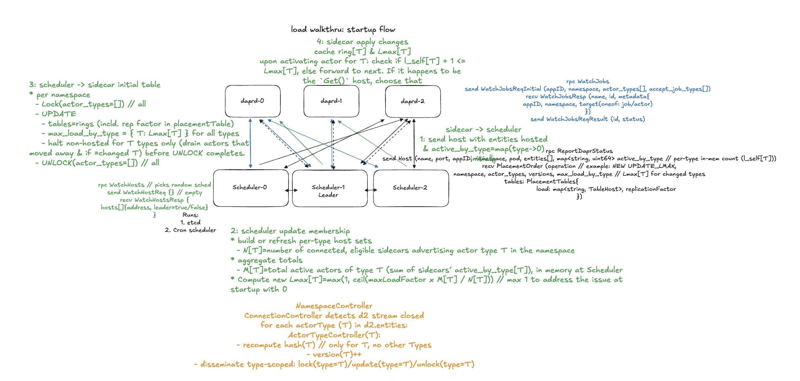
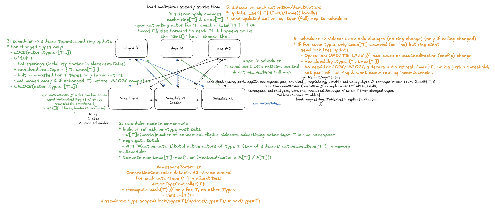
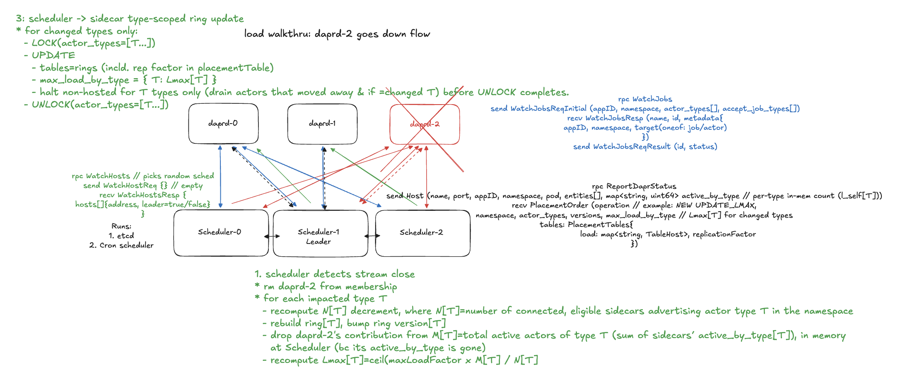

# Consolidate Placement into Scheduler for Improved Workflows Reliability and Performance

* Author(s): Cassie Coyle (cicoyle)
* State: Proposed
* Introduced: 10-31-2025

## Overview

This proposal introduces "PlacementV2", a redesign that eliminates the standalone Placement service by moving its functionality into the Scheduler control plane service.

The motivation is to increase reliability, reduce operational overhead, and simplify the control plane by unifying two stateful, 
leader-elected services (Placement and Scheduler) into one. The Scheduler already runs with embedded etcd and provides a job ownership table, 
consensus, and streaming APIs — all of which can serve actor placement without maintaining an additional custom Raft implementation.

This consolidation allows us to:
- Remove one control-plane StatefulSet and custom Raft subsystem.
- Reduce gRPC connections from Dapr sidecars (one fewer control-plane stream).
- Improve stability by removing the hard coded raft implementation for a simplified leadership algorithm.
- Enable more consistent, bounded actor distribution via the *Consistent Hashing with Bounded Loads* algorithm.
- Improve latency and reliability for both Actors and Workflows by colocating state coordination in one process.
- Remove global locking and instead have per actor per namespace type locking.
- Remove resource waste with unnecessary heartbeats.

This will be feature gated via an opt-in (new) feature flag: `SchedulerPlacement`.

## Background

### Why Placement exists

The [Placement service](https://docs.dapr.io/concepts/dapr-services/placement/) coordinates [Dapr Actors](https://docs.dapr.io/reference/api/actors_api/), 
ensuring that there is exactly one active instance of each actor ID across all dapr sidecars. It maintains cluster membership, 
computes hash tables mapping actor IDs to sidecars, and pushes versioned tables to sidecars so they can route calls correctly.

### How Placement works today

1. **Membership:** Each sidecar connects to the Placement leader via a long-lived gRPC stream (`ReportDaprStatus`), sending its `appID`, `namespace`, `actor types`, and periodic heartbeats.
2. **Table Computation:** The leader builds a hash table per `(namespace, actorType)`. Whereby `host = fn(actorType, actorID, tableVersion)`.
3. **Locking:** The leader locks while rebuilding tables to ensure atomic updates (effectively a namespace-wide “stop-the-world” window where it `locks`, `updates`, `unlocks`).
4. **Dissemination:** The leader pushes versioned placement tables to sidecars, which swap their local routing tables upon receipt.
5. **Leader Election:** Placement replicas elect a leader via HashiCorp Raft. The leader maintains all in-memory membership and placement state.
6. **Persisted:** `membership`, `apiLevel`, `tableGeneration`, and global `config` are persisted in Raft log/snapshots.
7. **Placement rings themselves are _in-memory only_ on the leader** and are rebuilt from membership on every leader election. There is no durable ring storage — this is intentional to keep the critical path fast.

Sidecars:
- Cache the latest versioned table
- Compute ownership locally via hashing
- Activate actors on-demand if they own the ID

## Motivation

### Problems with the current design

- **Two control plane StatefulSets** (Placement + Scheduler) with similar logic running that could be combined.
- **Duplicate raft implementations** (custom built Raft in Placement, embedded etcd in Scheduler).
- **Two separate gRPC connections per sidecar** — one for Scheduler (jobs/reminders), one for Placement (actors).
- **Global namespace locks** during table rebuilds.
- **Difficult to reproduce bugs** from cluster events, connection issues, network partitions, or leader churn in Placement.
- **No bounded load control** hotspots during scaling, uneven actor distribution.
- **Wasteful Heartbeats** with per second heart beat calls per sidecar

### Proposed Benefits

By merging Placement into Scheduler:

- **Reliability**: One etcd-based Raft implementation instead of custom Raft implementation
- **Latency**: Sidecars maintain only one gRPC stream (to Scheduler) instead of two, reduce hops with Actor/Workflow usage
- **Operational Overhead**: One fewer StatefulSet, less config and logs, fewer moving parts
- **Performance**: Per actor type updates and locking, no global locks
- **Maintainability**: Remove lines of legacy leadership and Raft code
- **Load Balancing**: Use “Consistent Hashing with Bounded Loads” for smoother scaling and eliminate hotspots

## Related Items

### Related issues

There have been a ton of issues in dapr/dapr over the years regarding issues with Placement and Placement's leadership algorithm, grpc connections, placement client connection errors cause issues with scheduler connections, custom raft logic, deadlocks that 
are difficult for maintainers to reproduce and nearly impossible to pin down and fix as a result of the lack of ability to reproduce.

## Expectations and alternatives

* What is in scope for this proposal?
  * Full functional parity with current Placement service with feature flag
* What will not change?
  * Actor runtime semantics: activation/state/timers/etc
  * Client-side hashing for actor routing (remains in the sidecar)
  * Placement tables (remain in-memory)
* What alternatives have been considered, and why do they not solve the problem?
  * Keep Placement and Scheduler separate and fix existing Placement issues: 
    * Hand rolled raft, means 2 leaderships to manage
    * This would maybe solve some of the Placement issues, but lack the performance improvements gained by combining the control plane services into a single process. This would also entail spending countless hours trying to reproduce very difficult to reproduce issues.
  * Gossip/peer streams among Schedulers: 
    * We don't really need this. Scheduler 'leader' will have the table and others will be notified immediately when the leader goes down to elect the new leader and rebuild the table.
  * Kubernetes leases for leadership & simple KV store for persisted state: 
    * By choosing the first element in the job 'ownership' scheduler table, we don't need a more complicated leadership election process.
    * We don't need to persist anything. Everything can be derived from the streaming connections.
  * Utilize etcd raft leadership under the hood to determine Scheduler leadership that is equivalent to the placement leader
    * Want to decouple this from etcd

## Implementation Details

### Design

#### Technical Comparison: What exists today?

##### Placement

- Leader-elected (HashiCorp Raft).
- Sidecars open one bidi stream to the leader via `ReportDaprStatus`.
- Sidecars send Host heartbeats; leader applies membership to an FSM (persisted via Raft snapshots).
- Leader computes rings per namespace/actorType in memory.
- Dissemination: lock → update(full PlacementTables snapshot, version=generation, api_level) → unlock.
- Followers replicate state.
- Full table push on every change.



##### Scheduler

- All are peers, runs embedded etcd which runs the raft consensus algorithm and leadership under the hood for us.
- There is a job ownership/"leadership" table to keep track of which scheduler owns which jobs for triggering.
- Streams: `WatchHosts` (server-stream), `WatchJobs` (bidi for triggers).
- CRUD for jobs; no actor placement.
- Not placement aware.



##### Proposed Architectural Solution

###### Phase 1: Eliminate Placement

Goal: Remove Placement Statefulset -> move to Scheduler

The goal is full **functional parity** with the existing Placement service, while delegating leadership to the Scheduler’s existing persisted job ownership table.
There will be no placement persisted data otherwise, meaning no utilizing extra etcd capacity, and no additional state store dependency.

We should tweak the `WatchHosts` Scheduler rpc to include a simple flag: `leader=true/false` and the sidecars will reuse the same connection to the leader for the `ReportDaprStatus` rpc.
We can utilize the existing Scheduler partition ownership table that is persisted in etcd to determine a 'scheduler leader' equivalent to the placement leader. Even though all Schedulers 
are peers, and there is no "leader" concept (aside from job ownership) since all schedulers receive jobs and all trigger jobs. All sidecars connect to all scheduler because we don't know 
which scheduler owns which jobs and this is how we can reuse the same connection for the `ReportDaprStatus` rpc where this will only be established based on the `leader=true/false` from 
`WatchHosts`. The placement leadership equivalent in scheduler is calculated in the schedulers via the partition ownership table. To decouple etcd from the solution to attain a scheduler leader,
we can simply use the first scheduler instance from the 'leadership'/ownership table once schedulers are in quorum.



While placement persists some data, like membership, with scheduler we should not persist data, nor do we need a migration path, as we will keep all data in memory and everything can be
determined dynamically by the streaming connections. We should remove the `api_level` entirely, the `raft` pkg, and the heartbeat logic and base this off stream connections. We can 
rebuild the placement table entirely in-memory and not store anything since we have a streaming connection of all sidecars to all schedulers. The `table_generation` is fine to be kept in 
memory, as we can track it in-memory. The table is versioned, when a new host is added we update the table version for all streaming connections for that namespace open ensuring they all 
get the new table version and they all need to respond by saying they are on that same table generation version. 

If the leader or all scheduler instances go down, the system can simply start over at table version `0`. Because everything is derived dynamically from active streaming connections, the 
placement table can be rebuilt immediately without data migration or persistence.

Dissemination will remain namespace batched, same as before for this phase where the Scheduler 'leader' will push the table to the sidecars. 

We don't need to migrate or to change rpcs a bunch. Scheduler has a streaming connection to every dapr sidecar. We will be reusing the same rpcs available on the Scheduler: 
`ReportDaprStatus`, `WatchHosts`, and `WatchJobs`. We will just reuse the streaming connection if the scheduler is the leader based on the partition ownership table
persisted in etcd. 

The current Placement service exposes a [State API](https://docs.dapr.io/reference/api/placement_api/) for debugging, but it is disabled by default.  
With the new actor placement metrics (detailed near the end of the proposal), we will have full observability into membership changes, table versions, and ring rebuilds.  
Therefore, we will **not** expose the Placement State API from the Scheduler — reducing complexity without sacrificing debuggability.



###### Phase 2: Per-Type Dissemination & Locking, Better rehydration

Goal: Eliminate namespace-wide batching and global activation pauses

Rebuild and disseminate only the actor types whose eligible hosts changed, with per‑type lock/update/unlock. Other types continue serving traffic uninterrupted.

Some definitions:
- Actor Types: the actor types a sidecar hosts. They come from the app/SDK registering actors; daprd’s actor subsystem exposes this, and daprd reports it.
- Ring: the per‑actor‑type consistent hashing structure that maps (actorType, actorID) → host, aka the “consistent hash”.
- Placement table: a namespace snapshot containing a map of actorType → ring plus metadata. In Phase 2 we send partial updates (only the changed types).

**Previously**, Placement would perform a namespace‑scoped full‑table swap, like the following example explains:

```text
Event: dapr-2 disconnects (it hosted T1 and T2)
1) Placement Leader applies MemberRemove(dapr-2) to its state/FSM (rings are per type internally).
2) Placement Leader disseminates namespace‑wide:
   Lock(ns) → dapr-0, dapr-1
   Update(full snapshot: all types) → dapr-0, dapr-1
   Unlock(ns) → dapr-0, dapr-1
   Sidecars: clear all entries on Lock; rebuild all rings on Update; resume on Unlock.
Implications:
   - Brief global pause for all actor types in the namespace.
   - Sends full table even if one type changed.
```

**Proposed phase 2 solution**, type-scoped partial update:

```text
Event: dapr-2 disconnects (it hosted only T2)
1) Scheduler notes Actor_Types(dapr-2) included T2 → EligibleHosts[T2] changed.
2) NamespaceController:
   Routes events to ActorTypeController, for namespaced operations
3) ActorTypeController[T2]:
   Recompute Ring[T2], bump Version[T2].
   Disseminate to dapr-0, dapr-1:
   Lock(types=[T2])
   Update(Entries={T2}, Versions={T2})
   Unlock(types=[T2])
Sidecars: pause lookups only for T2, merge T2’s ring, resume T2. T1 unaffected.
```
T1, T2 come from actor types registered in the SDK via [RegisterActorImplFactoryContext](https://github.com/cicoyle/test-apps/blob/main/scheduler-actor-reminders/server/player-actor.go#L35).
`daprd` detects them using [actorTable.SubscribeToTypeUpdates(...)](https://github.com/dapr/dapr/blob/master/pkg/actors/table/table.go#L216) and reports them as `actor_types` in `ReportDaprStatus`.

**High Level Controllers for how this will work:**
Controllers will live in Scheduler, essentially logical processes or go routines for example:
- NamespaceController
  - Scopes state and streams by namespace
- ConnectionController
  - Watches sidecar streams, tracks actor_types per sidecar, emits SidecarAdded/Removed/Updated events by namespace.
- ActorTypeController[T]
  - On events that affect T: recompute Ring[T], increment Version[T], disseminate type‑scoped Lock/Update/Unlock.
  - Retries per target, does not block other types.

What this means we need:
- Type‑scoped locking: implement a lock keyed by actor type. On Lock(types): block lookups only for those types, others run unaffected.
- Partial merge: on Update with partial Tables.Entries, rebuild/replace hashTable.Entries[T] only for provided T, do not clear the whole map.
- Targeted drain: after updating types [T...], drain only local actors of those types whose new owner is remote. Do not call a global “halt all”.
- Per‑type versioning/readiness:
  - Track versionByType[T]. No need for a global version.
  - During initial dapr sidecar startup, the sidecar shouldn’t accept actor calls until it has a ring for every actor type it locally reports (its Actor_types). 
  - After that, subsequent changes are per-type: only the affected types must pause, update, and resume.

Sidecar Startup vs steady-state
- On new stream: Scheduler sends LOCK(all) → UPDATE(full snapshot: all types, versions per type) → UNLOCK(all). 
- On changes to type T: send LOCK([T]) → UPDATE(entries={T}, versions={T}) → UNLOCK([T]).
- On new type: same as change, send only that type.
- On cold reconnect: treat as startup again (full once, then deltas).

HaltNonHosted vs HaltHosted
- HaltNonHosted([T…]): for each local actor with type in [T…], recompute owner with updated ring; if new owner is remote, deactivate/migrate it. 
If still local, leave it running.
- Do not implement HaltHosted, stopping actors that remain local causes avoidable churn. Meaning, only stop actors that the ring says moved away.
  If an actor’s ownership didn’t change, let it continue running.
- No global drain.

Virtual nodes (vnodes) remain:
Multiple virtual positions per host to smooth key distribution and reduce movement when hosts join/leave.

Improvements:
- No global pause: only the types in flight are briefly locked, others continue.
- Less network: payloads contain only the changed types.
- Less CPU: only rebuild rings for changed types.
- Better concurrency: different types can disseminate in parallel.

Protos (slightly tweaked from original from placement)
```protobuf
...
    // sidecar reports its presence and actor_types;
    // (now) scheduler sends lock/update/unlock orders
    rpc ReportDaprStatus(stream Host) returns (stream PlacementOrder) {}
...

message Host {
  string name = 1;
  int64 port = 2;
  string appID = 3;
  string namespace = 4;
  string pod = 5;
  repeated string actor_types = 6; // actor types hosted

  // below is needed for phase 3
  map<string, uint64> active_by_type = 7; // all types hosted {type -> local active count}
}

message PlacementOrder {
  enum Operation { LOCK = 1; UPDATE = 2; UNLOCK = 3; UPDATE_LMAX = 4; } // #4 is needed for phase 3
  
  Operation operation = 1;
  string namespace = 2;

  // Required for lock/unlock
  // empty for all types upon startup
  // this is not needed for update since its derived from tables
  repeated string actor_types = 3; // scope

  // Per-type versions, changed on update
  map<string, uint64> versions = 4; // for UPDATE

  // Partial tables allowed, only changed types.
  PlacementTables tables = 5; // for UPDATE

  // below is needed for phase 3
  map<string, uint64> max_load_by_type = 6; // Lmax[T] for UPDATE/UPDATE_LMAX
}

message PlacementTables {
  map<string, PlacementTable> entries = 1; // key: actor type
  // vnodes per host, for building rings (global default)
  int64 replication_factor = 2;
}

// One actor-type ring
message PlacementTable {
  map<string, TableHost> load_map = 1; // host key -> below details
  int64 replication_factor = 2;  // optional per-type override for 'hot' types, else use default above
}

message TableHost {
  string name = 1;
  int64  port = 2;
  string appID = 3;
}
```

Pseudo example for reference:

Sidecar starts up and connects to scheduler
```json
{ "operation":"LOCK", "namespace":"ns", "actor_types":[] }
{ "operation":"UPDATE", "namespace":"ns",
  "actor_types":[],
  "versions":{"T1":1,"T2":1},
  "tables":{
    "replication_factor":64,
    "entries":{
      "T1":{"load_map":{"10.0.0.1:3500":{"name":"10.0.0.1:3500","port":3500,"appID":"app"}}},
      "T2":{"load_map":{"10.0.0.3:3500":{"name":"10.0.0.3:3500","port":3500,"appID":"app"}}}
    }
  },
  "max_load_by_type":{"T1":60,"T2":42}
}
{ "operation":"UNLOCK", "namespace":"ns", "actor_types":[] }
```

Delta (T2) (ring change)
```json
{ "operation":"LOCK", "namespace":"ns", "actor_types":["T2"] }
{ "operation":"UPDATE", "namespace":"ns",
  "actor_types":["T2"],
  "versions":{"T2":7},
  "tables":{
    "entries":{
      "T2":{
        "load_map":{
          "10.0.0.1:3500":{"name":"10.0.0.1:3500","port":3500,"appID":"app"},
          "10.0.0.3:3500":{"name":"10.0.0.3:3500","port":3500,"appID":"app"}
        },
        "replication_factor":128
      }
    }
  },
  "max_load_by_type":{"T2":61}
}
{ "operation":"UNLOCK", "namespace":"ns", "actor_types":["T2"] }
```

// for phase 3:
Lmax‑only (no lock bc its a threshold vs for routing):
```json
{ "operation":"UPDATE_LMAX", "namespace":"ns",
  "actor_types":["T2"],
  "max_load_by_type":{"T2":62}
}
```



###### Phase 3: Enable Bounded Loads

Goal: Eliminate hotspots and reduce actor churn by activating Dapr’s _existing_ bounded loads algorithm.

Current state:

Dapr already implements [Consistent Hashing with Bounded Loads](https://arxiv.org/pdf/1608.01350) in [consistent_hash.go](https://github.com/dapr/dapr/blob/master/pkg/placement/hashing/consistent_hash.go) - thx yaron :)
- `GetLeast(key)` → finds first host under `MaxLoad()`
- `MaxLoad()` → returns `ceil(avg × 1.25)`
- `Inc()` / `Done()` → atomic load tracking
- `loadOK(host)` → checks if adding one actor is safe

**But it is disabled in practice**:
- Sidecars use `GetHost` → `Get` (standard hashing)
- `Inc`/`Done` are **never called**
- `load` field in `PlacementTable` is sent, but ignored

Hotspots still occur under skewed actor IDs or scaling.

We should switch the lookup to use bounded loads with:

`host, err := table.GetHost(req.ActorID)` -> `hostName, err := table.GetLeastHost(req.ActorID)`. We will need to add this func below.

```go
func (c *Consistent) GetLeastHost(key string) (*Host, error) {
  name, err := c.GetLeast(key)
  if err != nil {
    return nil, err
  }
  host, ok := c.loadMap[name]
  if !ok {
    return nil, fmt.Errorf("host %s not in loadMap", name)
  }
  return host, nil
}
```

During actor activation we should have the following:
```go
// This runs on the target sidecar that received the request
// meaning, isActorLocal(host.Address, hostname, port) == true)
...
ring := p.hashTable.Entries[actorType]
ownerHost, _ := ring.GetLeastHost(actorID)
...
if ownerHost.Name == self { // where self = hostname:port
// Safe to do the following bc GetLeastHost already checked loadOK for us
activate actor
ring.Inc(self)
}
...
```
Where [Inc](https://github.com/dapr/dapr/blob/master/pkg/placement/hashing/consistent_hash.go#L292) is defined here already.

During actor deactivation the sidecar that owned the actor will call:
```go
...
ring := p.hashTable.Entries[actorType]
ring.Done(self)
...
```
Where [Done](https://github.com/dapr/dapr/blob/master/pkg/placement/hashing/consistent_hash.go#L303) is defined here already.

We should make the [1.25](https://github.com/dapr/dapr/blob/master/pkg/placement/hashing/consistent_hash.go#L363) configurable with a Configuration CRD addition:
```yaml
apiVersion: dapr.io/v1alpha1
kind: Configuration
metadata:
  name: cassie-config
spec:
  actor:
    placement:
      boundedLoads:
        enabled: true
        maxLoadFactor: 1.25   # range=1.1–1.5, where 1.25 will be default if no val is set
```

A higher value = stability, less balance, and a lower value = balance, more churn.
Making this configurable allows users to tune the trade-off based on their workload characteristics — 
for example, preferring stability and fewer migrations in dynamic or bursty environments, or tighter 
balance and fairer distribution in steady workloads where consistent load spread matters more.

How this works in practice:
- `ring` = `hashTable.Entries[actorType]`

Actor Lookup:
- Caller sidecar: `GetLeastHost(actorID)` → returns target host (already under threshold)
- Sends request via `CallActor` to target
- Target recomputes `GetLeastHost` → gets self
- Target activates actor + `Inc(self)`

There will never be double activation, as this is a deterministic ring and we still have the 3 phase lock, now per-type

When all hosts are full, `GetLeastHost` loops thru the ring and will use `Get` if all hosts are overloaded. We will never deny
service, but we will accept overload.

Simple example with **old placement algorithm** with 3 hosts, replication_factor is 3. Assume actorIDs hash to positions in a ring.
```text
Ring Setup (Virtual Nodes):
- Host1: Hashes at 10, 20, 30
- Host2: Hashes at 40, 50, 60
- Host3: Hashes at 70, 80, 90

Sorted Set: [10,20,30,40,50,60,70,80,90]
Standard `Get` (No Bounds):
- Actor "A" hashes to 25 → next >= is 30 (Host1)
- Actor "B" hashes to 35 → 40 (Host2)
- Actor "C" hashes to 45 → 50 (Host2)
- Actor "D" hashes to 55 → 60 (Host2)

Loads: Host1=1, Host2=3, Host3=0 (hotspot on Host2)
```

Using the **Bounded loads algorithm**:
```text
Bounded `GetLeast` (With Loads, maxLoadFactor=1.25, MaxLoad() = ceil(avgLoadPerNode × 1.25)):
Initial loads: All 0. Avg=0. Threshold=1 (ceil(1.25*avg)).
- Actor "A" (hash = 25) → 30 (Host1, loadOK? Yes) → Assign Host1, `Inc` → Host1=1 (load) (so... assign to Host1 && Inc(Host1))
  - totalLoad = 1, avg = 1/3 ~= 0.33, `MaxLoad` = ceil(0.33×1.25) = 1
- Actor "B" (hash = 35) → 40 (Host2, load = 0 < MaxLoad=1, yes) → Host2=1  (so... assign to Host2 && Inc(Host2))
  - totalLoad = 2, avg ≈ 0.67, MaxLoad = ceil(0.67×1.25) = 1
- Actor "C" (hash = 45) → 50 (Host2, MaxLoad = 1 → 1 == 1 → NOT OK) → Skip to 60 (Host2, still NOT OK, next...) → 70 (Host3, load = 0 < 1, yes) → Host3=1 (so... assign to Host3 && Inc(Host3))
  - totalLoad = 3, avg = 1, MaxLoad = ceil(1×1.25) = 2
- Actor "D" (hash = 55) → 60 (Host2, load=1, MaxLoad = 2 → 1 < 2 Yes) → Host2=2 (so... assign to Host2 && Inc(Host2))
  - totalLoad = 4, avg ≈ 1.33, MaxLoad = ceil(1.33×1.25) = 2

Loads: Host1=1, Host2=2, Host3=1 (balanced, skipped Host2 when full)
```

Ring Positions in `sorted_set`:  
```text
10(H1) -- 20(H1) -- 30(H1) -- 40(H2) -- 50(H2) -- 60(H2) -- 70(H3) -- 80(H3) -- 90(H3)

Actor "C" hash=45:  
Start at 50(H2, full) → skip → 60(H2, full) → skip → 70(H3, ok) → assign H3
```
This enables essentially a sequential skip in the `sorted_set` until ok.

Benefits: standard hashing vs bounded loads:
- Standard hashing:
  - max load: unbounded
  - churn on scale: ~1/n actors move
  - stickiness: low
- Bounded loads:
  - max load: <= 1.25 * avg
  - churn on scale: O(1) actors move
  - stickiness: high, actors stay unless forced to move
  - skip chain length: O(log n) expected with the algorithm

Big idea: Actors are stickier and only move if their current host is full and a better one exists. There is still **NO**
double activation due to the 3 phase (now, per-type) lock and deterministic ring.

Essentially, there is just a ring walk now to ensure load balance.

Flow of load in the system and how its used via a Diagram





### Feature lifecycle outline

* Compatibility guarantees
  * No need for placement -> scheduler migration
  * No regressions
* Deprecation
  * Placement Service after the feature flag process, it becomes default, after 2 releases
* Feature flags
  * `SchedulerPlacement`

### Acceptance Criteria

How will success be measured?

* Performance targets
  * Performance improvements when combined into a single process, to be validated with perf tests
  * Hash algo + sending type deltas is more performant at higher load, lowers heat spots
* Compatibility requirements
  *   No regressions
* Add Metrics
  * more should be added in general, things like the following would be useful:
    * scheduler metrics
      * ring version by namespace, actor type
      * table rebuilds total by namespace, actor type, reason
      * table rebuild duration by namespace, actor type
      * dissemination total count by namespace, actor type, operation
      * dissemination latency by namespace, actor type
      * in-flight locks by namespace, actor type
    * dapr sidecar metrics
      * actor ring version by namespace, actor type
      * update apply duration by actor type
      * lock duration by actor type
      * halt non-hosted updates total count by actor type
      * halt non-hosted actors per update by actor type
      * actor activations total count by actor type
      * actor deactivations total count with reason by actor type
      * active actors by actor type
      * actor routing visibility: local/remote by actor type
      * dissemination total count by type of operation: lock/update/unlock by actor type
      * update acked total by namespace, actor type
      * actor activation latency by actor type
      * bounded loads skip steps total count by actor type
      * inc/done calls count by actor type
      * number of actors drained per update with reason by namespace, actor type
      * numbers of actors drained total by namespace, actor type

## Completion Checklist

* Above proposed code changes
* Tests added
* Documentation