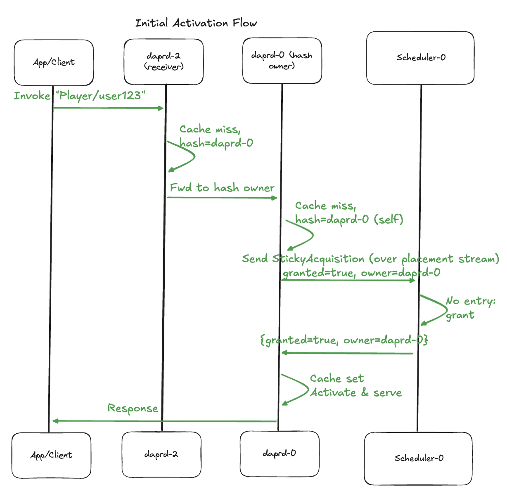
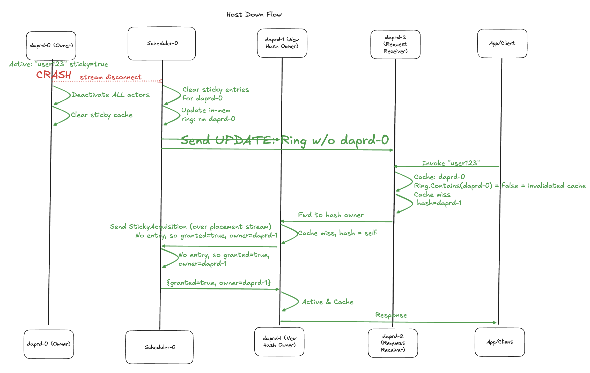
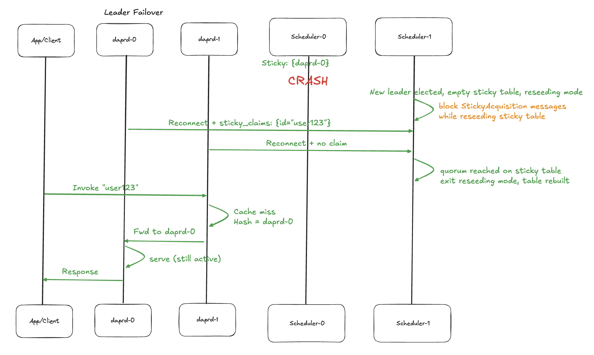

# Hard Stickiness for Actors (Non-durable)

* Author(s): Cassie Coyle (cicoyle)
* State: Proposed
* Introduced: 11-13-2025
* Binding Votes: dapr/dapr maintainers

## Overview

Provide "hard while alive" stickiness for [Dapr Actors](https://docs.dapr.io/developing-applications/building-blocks/actors/actors-overview/), 
whereby an actor stays on the same sidecar while that host is healthy. No durable per actor ID storage, the sticky table
lives only in Scheduler memory and is re-seeded on Scheduler failover by sidecars that host active sticky actors.

Stickiness is opt-in, per-type, set via configuration.

For sticky types, initial placement uses the consistent hash ring (as today), but once activated on a host, it "sticks" 
there until the host becomes unhealthy. Subsequent activations or calls route to the sticky owner. To optimize and limit
dissemination (which is expensive for full or per-type updates), we avoid broadcasting per-ID sticky mappings to all 
sidecars. Instead:
- Sidecars cache resolved sticky owners per ID locally
- Routing falls back to hash for misses in the cache
- We will extend the streaming rpc `ReportActorTypes` to allow sidecars to try to acquire sticky ownership on 
  cache miss, adding latency only to the first call per ID (or after invalidation due to host failure)
- No new dissemination events beyond PlacementV2's per-type UPDATEs (triggered by host changes). Cache invalidation is 
  implicit via ring host lists: if a cached owner is no longer in the eligible hosts for the type, treat as miss and 
  re-resolve

This ensures all sidecars operate in sync without per-ID fanout, while minimizing extra hops and preserving 
single-activation guarantees. 

The streaming connection sends back the owner host (sticky owner) for routing if it's not the requesting instance, 
allowing the sidecar to cache and forward correctly.

Each sidecar maintains its own local cache of sticky owners it has encountered. Sidecars primarily cache their own sticky
actors (from grants), but also learn others via stream responses during misses/forwards. The cache won't go stale because
invalidation occurs where the owner in ring hosts check ensures correctness. Caching others is low-cost and performant
because it reduces round trip calls to Scheduler.

To guarantee zero double activation, on stream disconnect due to sidecar/host failure, deactivate all sticky actors and
clear cache—ensuring no overlap during network glitches or failover.

On leader failover, sticky actors remain active, the new Scheduler leader blocks all sticky acquire requests until quorum
of sidecars reconnect and send claims, then rebuilds table. Only owned active actors are in `sticky_claims`. This 
guarantees zero double activation, as quorum waits for reports before allowing new grants.

## Background

Users report churn during placement updates and actor deactivation as main pain points:
- Global pauses during table rebuilds: The [PlacementV2 proposal](https://github.com/dapr/proposals/pull/96) per‑type dissemination already improves this.
- Actors still migrate on ownership changes and become deactivated after the idle timeout. Apps work around this with
  frequent reminders to keep the actors "alive" on the given host, which wastes resources.

### Goals:
- Minimize migrations: enable stickiness and keep locality when the original host is healthy (skip idle deactivation for 
  sticky actors)
- Preserve Dapr’s single‑activation guarantee
- Avoid per‑ID broadcast and durable storage

## Related Items

- [PlacementV2](https://github.com/dapr/proposals/pull/96) (consolidate into Scheduler, per‑type LOCK/UPDATE/UNLOCK).
- [Broadcast job proposal](https://github.com/dapr/proposals/pull/83) (durable fanout for actor pubsub and durable actor IDs).

## Expectations and alternatives

* What is in scope for this proposal?
  - Non-durable sticky ownership held in Scheduler memory.
  - Keep‑alive for sticky actors (skip idle deactivation).

* What is not in scope for this proposal?
  - Changing actor SDK APIs or application model.
  - Cluster‑wide persisted (durable) per‑ID broadcast for stickiness. Durable actor IDs are separate from stickiness.

* What alternatives have been considered, and why do they not solve the problem?
  - Broadcast every actor ID for durability: higher storage and fanout, unnecessary for stickiness.

* Future ideas
  - Sticky policies can be optionally added in the future, but for now we are prioritizing the actor being up all the 
    time regardless of where it lives, focusing on immediately re-acquiring it. In the future we could allow users to 
    configure how/when sticky actors are reassigned whether that is immediate (like this proposal suggests), never, or 
    after some wait TTL time.

### Trade‑offs:
- Full Scheduler outages reset the in-memory sticky table, where only idle actors lose stickiness until next activation.
- One extra round trip to Scheduler on first activation for a sticky ID.
- Keep‑alive stickiness could increase memory/CPU.
- Leader failover delays new activations until quorum (safe handoff) to avoid double activation like Dapr guarantees.

## Implementation Details

### Design

#### High-Level Flows





No persistence is involved in this design. On host disconnects, clear all entries where `owner` == `host`.
In Scheduler we will have an in-memory map, something like the following:

```go
type StickyActorKey struct {
    Namespace string
    ActorType string
    ActorID   string
}

stickyOwners := map[StickyActorKey]*HostMetadata
```

On sidecar stream disconnect due to host failure: deactivate all sticky actors + clear cache.
On Scheduler leader failover: sidecars keep actors active, but block new sticky acquisitions until quorum (where we 
completely rebuilt the sticky map because we have to ensure no double activations).

**Pseudocode** for logically on how to handle the actor request, please note this is not final or complete code, but rather used to convey the idea:

```go
// Request for (ns, T, I) arrives at sidecar
func HandleActorRequest(ns, typ, id, method, data) error {
    if !s.isStickyType(typ) {
        owner := s.ring.Get(ns, typ, id)
        if owner == s.selfHost { return s.activateAndInvoke(...) }
        return s.forwardTo(owner, ...) 
    }
	
    // Sticky path 
    cached, ok := s.stickyCache.Get(ns, typ, id)
    // so we dont forward to a dead host, check below
    if ok && s.ring.HostsContain(cached, typ) { // check: is the cached sticky owner still a valid, alive host in the current placement table for this actor type
        if cached == s.selfHost { return s.activateAndInvoke(...) }
        return s.forwardTo(cached, ...) 
    }
	
    // Cache miss: compute hash, go to owner
    hashOwner := s.ring.Get(ns, typ, id)
    if hashOwner != s.selfHost {
        return s.forwardTo(hashOwner, ...)
    }
	
    // hash owner means acquire via stream
	corrID := s.nextCorrelationID()
	s.pendingStickyRequests[corrID] = make(chan stickyResp)

	s.schedulerStream.Send(&HostReport{
        Report: &HostReport_AcquireSticky{
            AcquireSticky: &StickyAcquisition{
                CorrelationId: corrID,
                Key:           &StickyActorKey{ActorType: typ, ActorId: id},
            },
        },
	})
    resp := <-s.pendingStickyRequests[corrID]
    delete(s.pendingStickyRequests, corrID)

    s.stickyCache.Set(ns, typ, id, resp.owner)
    if resp.granted {
        return s.activateAndInvoke(...)
    } else if resp.owner != "" {
        return s.forwardTo(resp.owner, ...)
    }
    return errors.New("no owner")
}

// Stream reconnect (Scheduler failover or transient)
func onStreamDisconnect() {
    s.stickyCache.Clear()
    s.reconnect() // Send sticky_claims for currently active sticky actors
}

// When sidecar is shutting down or host is unhealthy
func onHostShutdown() {
    s.actorRuntime.DeactivateAllStickyActors()
    s.stickyCache.Clear()
}

// There will need to be sidecar logic for stream recv loop to handle scheduler responses
```

Cache hits mean 0 rpc calls and 0 hash lookups. Misses require the hash owner to try to acquire via the streaming connection. 
Invalidation occurs when the cache is not in the `ring.hosts`, so this is a miss that requires a try acquire sticky request.

```protobuf
service Scheduler {
  ...
  rpc ReportActorTypes(stream HostReport) returns (stream SchedulerResponse) {}
}

// incoming request from sidecar -> scheduler
message HostReport {
  oneof report {
    // 1. First message when stream opens
    Host host = 1;

    // 2. hosted actor types
    ActorTypesReport actor_types = 2;

    // 3. sidecar is hash owner — try to acquire sticky ownership
    StickyAcquisition acquire_sticky = 3;

    // 4. On reconnect after Scheduler leader failover: currently active sticky actors
    StickyClaimsReport sticky_claims = 4;
  }
}

// 1. Initial connection
message Host {
  string name = 1;
  string namespace = 2;
  string app_id = 3;
  int32 port = 4;
}

// 2. hosted actor types
message ActorTypesReport {
  repeated string actor_types = 1;
}

// 3. Try acquire sticky actor (comes from hashed sidecar)
message StickyAcquisition {
  int64 correlation_id = 1; // used to keep track of what we are responding to
  StickyActorKey actor_key = 2;
  // host name known from stream identity from #1
}

// 4. sticky claims of currently sticky actors when Scheduler leader goes down and a new one is elected
message StickyClaimsReport {
  repeated StickyActorKey claims = 1;
}

message StickyClaim {
  StickyActorKey actor_key = 1;
}

message StickyActorKey {
  string actor_type = 1;
  string actor_id = 2;
}


// outgoing response, new wrapper message
message SchedulerResponse {
  oneof response {
    // Existing placement messages
    PlacementOrder placement = 1;

    // Response to sticky acquisition
    StickyAcquisitionResponse sticky = 2;
  }
}

// unchanged from placementV2 proposal
message PlacementOrder{...}

// Response to StickyAcquisition request
message StickyAcquisitionResponse {
  int64 correlation_id = 1; // used to keep track of what we are responding to

  oneof result {
    bool granted = 2; // true/false, sidecar now owns this sticky actor
    Host owner_host = 3; // Another sidecar than requestor owns it. sidecar will cache this and fwd to owner
  }
}
```

The Scheduler will receive the `StickyAcquisition` request with the stickyKey, check for it in the sticky table. Check 
if there is no valid owner (no entry/owner became unhealthy), grant to the requester (who is guaranteed to be the hash 
owner via sidecar logic). There is **no** hashing done in the Scheduler. This is only called by the hash owner (daprd 
sidecar) so no races or issues will occur. If the Scheduler leader fails, a new leader will be selected per the 
PlacementV2 proposal and start again with empty tables. After figuring out which Scheduler instance is the new leader, 
the sidecars send their `sticky_claims`. The Scheduler leader will rebuild the table from the claims.

#### Leader Failover & Reseeding

New Scheduler starts with an empty sticky table. Sidecars send `sticky_claims` for their active actors only. The 
Scheduler blocks all grants until a quorum of sidecars have connected and sent their `sticky_claims`,
this is to guarantee zero double activation during Scheduler failover events.

#### Configuration
```yaml
kind: Configuration
metadata:
  name: my-config
spec:
  actor:
    placement:
      stickiness:
        enabled: false # global switch — if true and byType omitted → all types are sticky
        byType:       # optional – for specific types to be sticky only instead of all types
          - Player
          - Cart
```

### Feature lifecycle outline
* Compatibility guarantees
    * Single‑activation preserved - only one owner granted.
    * Co‑existence: Works with PlacementV2 proposal and durable actors.

### Acceptance Criteria

* Performance targets
    * Substantial reduction in drains during ring updates for sticky types.
    * Cold activation adds a Scheduler round‑trip - ensure latency doesn't spike too much here.
* Compatibility requirements
    * No regressions
    * No double activation in failure/recovery tests
* Observability:
    * Metrics for sticky_acquire/release/clears, sticky_activations, drains_by_reason, idle_deactivation_skipped(sticky=true).

### Completion Checklist

* config changes to support sticky actor types
* scheduler: sticky table + stream handling + quorum blocking
* sidecar: cache, sticky acquisition via stream, correct shutdown logic
* reseeding with sticky_claims
* IT tests
* e2e tests
* perf tests
* add metrics
* docs