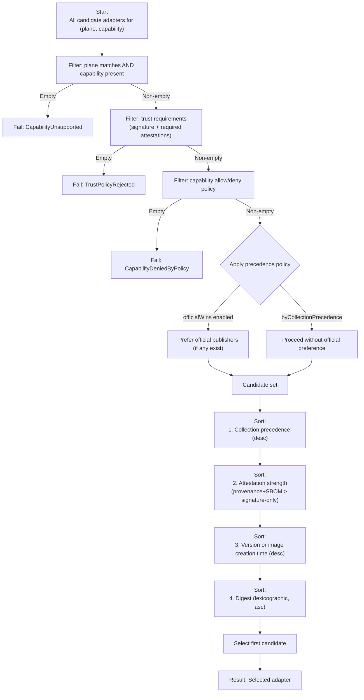

# Data Planes
- Author: Whit Waldo (@whitwaldo)
- Status: Proposed
- Introduced: 2026-03-07

## Overview
Dapr's original building blocks - state management, bindings, pub/sub - lowered the barrier to distributed systems, but they forced a "one-abstraction-fits-all" model that is increasingly brittle as data patterns, providers, and supply-chain requirements evolve. This proposal introduces a planes and capabilities model that separates common, portable semantics from provider-specific power, while moving provider logic out of the sidecar into External Provider Components (adapters). It also adds the Adapter Image Service (AIS), a small companion service that resolves, verifies, and caches adapter images and artifacts so the sidecar can remain stateless and focused.

At a glance, this proposal delivers three complementary changes:

1. **Logical model** - small, domain-specific planes (for example `store.binary, `store.keyvalue`) expose a clear, typed surface for common operations. Capabilities (generic or provider-scoped) add optional features without bloating the plane or the sidecar.
2. **Execution & distribution** - provider logic runs as adapters (process- or external-mode). The AIS handles image resolution (tag -> digest), trust verification (signatures/attestations), and caching of executables and schemas so that adapters start quickly and predictably across environments.
3. **Governance & ecosystem** - a trust/collections/precedence model lets operators declare what they trust, how to resolve conflicts across official and partner ecosystems, and how to constrain dynamic capabilities in production.

Why this helps:
- **Clarity & extensibility**: Planes keep the shared model small; capabilities give providers room to innovate without forking or over-generalizing
- Performance & scale**: Per-capability unary/streaming transports prevent large-payload buffering and enable true pass-through for blob-like workloads.
- **Operational control**: AIS centralizes verification and caching; trust policies and collections make third-party ecosystems predictable and auditable.
- **Developer experience**: Capability Packs enable strongly-typed SDKs while preserving an opaque-bytes escape hatch.

How to read this document:
- **Sections 2-6** define planes, capabilities, transports and versioning (logical model)
- **Sections 7-13** describe adapters, lifecycle and the AIS (execution and distribution). AIS is introduced conceptually here because it is core to how adapters are delivered and verified; mechanical details to follow later.
- **Sections 14-15** define trust, collections and precedence (governance & ecosystem) and how Dapr selects a single adapter deterministically when multiple candidates exist.

This design is intentionally incremental: planes change rarely, capabilities evolve independently and existing components can migrate over time without a flag delay.

Who this document is for:
Because of the impact breadth this proposal, it's written to address the perspective and needs for multiple audiences: application developers, Dapr SDK maintainers, platform operators, adapter implementers and Dapr runtime contributors. Not every section is intended to be read linearly by every persona. THe table below maps key sections to their primary audience and explains what value each group should extract.

| Persona | Primary Interests | Key Sections | What to Focus On |
|--------|-------------------|--------------|------------------|
| **Application Developers** | Clear APIs, portability, performance, large payload support | 2–6, 10, 12, 13, 16 | Mental model of planes vs capabilities, available operations, streaming support, SDK usage, ingress events, concrete examples |
| **SDK Authors / Tooling Builders** | Typed APIs, schema discovery, capability metadata, runtime validation | 4–6, 9, 10, 12 | Capability taxonomy, transports & encoding, handshake metadata, discovery payloads, schema relay, capability packs |
| **Platform Operators** | Supply-chain security, control, determinism, lifecycle behavior | 7–8, 11, 14–15, 17 | Adapter hosting modes, AIS behavior, lifecycle policies, trust & collections, precedence rules, configuration knobs |
| **Adapter Implementers (Provider Authors)** | Extensibility surface, isolation model, capability design | 2–6, 7, 9, 14.2–14.3 | How planes constrain semantics, how capabilities are named/advertised, handshake contract, attestations & collections |
| **Dapr Runtime Maintainers / Contributors** | Runtime scope reduction, supervision, determinism, evolution | 1–8, 14–15 | Why planes replace building blocks, adapter lifecycle, AIS integration, policy enforcement, conflict resolution |

Most readers should start with this Overview, Sections 1-4 and then jump to their persona-relevant sections above.

**Mental model in one minute**:
Think of Dapr as exposing planes (thin, stable APIs).
**Adapters** implement planes for specific providers.
**Capabilities** narrowly extend planes without bloating them.
**AIS** safely delivers adapters
**Trust + Precedence rules** ensures one deterministic adapter is chosen if many are a suitable fit.


## 1. Background
Dapr’s original building blocks succeeded by optimizing for approachability and portability. However, as the ecosystem has growtn, that model now produces:
- Abstractions that collapse distinct data semantics
- Runtime bloat and slowed ecosystem velocity
- Inefficient buffering-based transports
- No first-class model for trust or deterministic provider selection.

These are not isolated issues. They stem from a single root cause: the sidecar owns both shared abstractions and provider implementations. The rest of this section explains how we reached this point and why a structural change is required.

The issues motivating this proposal are not isolated bugs or missing features. They are structural outcomes of placing too much responsibility in a shared abstraction and centralizing provider behavior inside the runtime.

### 1.1 Abstractions under strain
The original building blocks were designed to present a small, uniform surface for a broad class of backend systems. This worked well when the goal was basic portability, but breaks down as soon as providers meaningfully diverge in behavior or capability.

In practice:
- Semantically different behaviors appear identical at the API level
- Capabilities exist in documentation rather than in the type system or discovery surface
- Capabilities exist in documentation rather than in the type system or discovery surface
- Provider-native features are hidden, approximated, or undocumented.

As a result, developers are often forced to reason about _what a component can really do_ from documentation and tribal knowledge rather than from the API surface itself. Portability exists in theory, but predictability does not.

Bindings illustrate the problem most clearly. They are powerful precisely because they are underspecified - but that same vagueness collapses state-like event-like and command-like interactions into a single mental bucket. Developers cannot tell what is supported without reading provider-specific documentation or inspecting runtime behavior.

### 1.2 The runtime is doing work it shouldn't own
Today, meaningful provider support still implies runtime ownership:
- Provider logic lives in daprd
- New behavior expands the runtime surface are
- Runtime maintainers implicitly own the velocity of the entire ecosystem

This does not scale. Every additional provider increases coupling, complexity, and release friction. External contributors must understand Go and some basic runtime fundamentals to ship functionality, which raises the barrier to entry and slows iteration.

The sidecar has become both the integration layer and the provider implementation host. Those are fundamentally different responsibilities - and conflating them limits potential ecosystem growth.

### 1.3 Payload Shape and Transport Mismatch
Especially with regards to state management, but generally across the board, the sidecar assumes buffered, request/response interactions as the norm. Modern workloads increasingly violate this assumption:
- Binary and media payloads are large and streaming by nature
- Some interactions are long-lived, event-driven or bidirectional
- Treating all data as buffered bytes introduces unnecessary latency, memory pressure and architectural workarounds.

When applications bypass the sidecar for efficiency, the abstraction ceases to be the default integration path - and once that happens, the value of the abstraction erodes.

### 1.4 Ecosystem growth
This model means that Dapr can no longer assume a small, curated set of "official" provider. As the ecosystem grows, operators need explicit answers to basic questiosn:
- Who published this adapter?
- What exactly am I running?
- Why was this provide chosen over another?
Today there is no first-class model for trust, provenance, or deterministic selection when multiple models overlap - this is fair because because all models assume explicit runtime support. Expansion without governance increases operational risk; governance without an extensibility model stalls growth. Both are failing conditions and both are addressed in this proposal.

### 1.5 Core Problem
These pressures share a single root cause:
> The sidecar has absorbed responsibilities that belong in provider-specifc processes, while shared abstractions have been stretched beyond what they can faithfully represent. 

Solving this requires narrowing what Dapr guarantees, moving provider behavior out of the runtime, and making trust and capability explicit rather than implied.

The remainder of this proposal describes a model that:
- Narrows that Dapr guarantees
- Moves provider behavior out of the runtime
- Makes capability, transport, and trust explicit

Planes and capabilities are the mechanism for doing this.

## 2. Introduction: Planes and Capabilities
A plane is a small, domain-specific API surfaced by Dapr for a class of storage or data interaction. Planes avoid one-size-fits-all abstractions; they model common semantics while leaving room for backend-specific power via Capabilities.

A Capability is an optional. explicitly named operation offered by a provider under a plane implemented by an adapter. 
Capabilities:
- Are named predictable (see section 4),
- May be Generic (provider-agnostic and aligned with the plane's shared semantics) or Provider (provider-scoped, with explicit `egress`/`ingress`),
- Declare supported transports (unary and/or streaming), and
- Optionally provide schemas (protobuf/JSON) for tools

Put simply, Planes define what Dapr guarantees. Capabilities define what a provider adds.

This restores clarity (state vs bindings), enables large-payload streaming where it makes sense, and makes extensibility first class without bloating the runtime.

The following documents how this proposal proposes changing the current approach and what the new nomenclature is:

| Today                                           | New Model |
|-------------------------------------------------| -- |
| State Store                                     | `store.keyvalue` plane |
| Blob State (we don't actually have this yet)    | `store.binary` plane |
| Input/Output Binding                            | Ingress/Egress Capabilities |
| Provider differences described in documentation | Explicit provider-advertised capabilities |
| Runtime implements logic                        | Adapter implements logic |

It's useful to understand what is explicitly not a plane or generic capability. For example:
- Query languages are not planes; passing a query as a string agnostically to a provider could be a capability.
- Provider-native auth configuration is not a capability; authentication would be represented in the Component via a connection string or secret reference as it is today.
- Multi-provider joins are not a plane concern; again, specifying this might be better represented as a capability providing a raw query as a string.

In this proposal, "Component" remains the configuration concept, while the executable provider logic is an Adapter.

## 3. Store Planes
Initial store planes:

| Plane    | Name             | Purpose                                           |
|----------------|------------------|---------------------------------------------------|
| Binary Plane   | `store.binary`   | Blob/file data for streaming large payloads       |
| Cache Plane    | `store.cache`    | Small, hot, ephemeral values with TTL             |
| Key/Value Plane | `store.keyvalue` | A re-imagined implementation of a key/value store |

Future store planes (non-blocking):

| Plane | Purpose | Example Providers |
| -- | -- | -- |
| Search (Non-vector) | Full-text search and document retrieval with provider-native scoring and query semantics. | ElasticSearch, OpenSearch, Azure Search |
| Documents | Interactive with native document databases with document semantics, indexing and query shapes. | MongoDB, Cosmos DB, Couchbase |
| Relational | Thin wrapper over SQL-based providers for basic operations, scheme metadata and streaming read/write, no SQL abstraction. | SQL Server, Cosmos DB | 

Plane versions change rarely (breaking changes bump the major version). Optional behavior lands instead as capabilities.

## 4. Capability Taxonomy (Generic vs Provider)
Generic Capabilities are provider-agnostic and convey plane alignments without implying a specific provider binding:
```
<plane>.<domain>.<feature>[.<qualifier>...]
```

Examples: 
`store.keyvalue.counter.increment-integer`
A generic integer-incrementing counter capability applicable across many key/value providers.

`store.binary.url.unsigned`
A generic capability to produce an unsigned URL for a binary resource across many binary store providers.

Provider Capabilities are scoped to a plane and provider and indicate an explicit flow:
```
<plane>.<domain>.<flow>.<provider>.<action>[.<qualifier>...]
```
Where `<flow>` is either `egress` or `ingress`. Ingress and egress here describe the data flow between the provider and the application, not network routing. An `egress` flow is from the application to the provider and an `ingress` flow is from the provider to the application.

Examples: 
`store.binary.egress.azure.sas-url`
An Azure-specific egress capability that produces a SAS URL for a binary resource. 
`store.binary.ingress.s3.object-created`
An AWS S3-specific ingress capability that notifies the SDK when a new object is created. 


Each capability declares `transports`: `["unary"|"stream"]` and optional `preferredTransport`, and a semantic `mode` as a usage hint - `unary`, `client-stream`, `server-stream`, `duplex-stream`

Each plane provides a single Extensions service with buffered and streaming forms. The runtime verifies capability presence and passes through content unmodified, deferring to the adapter to shape requests properly.

## 5. API Stability & Versioning
- Plane version: Major only (`v1`), breaking changes -> new plane major version (`store.keyvalue`, `v2`)
- Capability version: Major only (`v1`), breaking changes -> bump `version` or publish a new capability name (preferred for ergonomics)
- Stability labels: `experimental`, `stable`, `deprecated`
- Discovery exposes effective versions and stability for developers, operators and SDKs

## 6. Transports, encoding & errors

### 6.1 Transports
The egress transports are as follows:
- Unary profile: (`ExtensionsUnary.Invoke`) - buffered request/response.
- Streaming profile: (`ExtensionsStream.OpenStream`) - client/server/duplex.
- Capabilities list supported transports; SDKs route calls accordingly.

### 6.2 Encoding Rules
- Payloads are bytes; each invocation must specify `contentType`
- JSON payloads are UTF-8 (`application/json; charset=utf-8`)
- Protobuf payloads are `application/x-protobuf`
- When binary appears inside JSON envelopers (e.g. Discovery), it is base64 encoded.

### 6.3 Error Model
The proposal defines a set of uniform errors that are used across all planes that are used to communicate specific failures back to the SDK to better inform recovery and provide guidance to developers:

| Error Code | Description |
| -- | -- |
| 1000 | CapabilityUnsupported |
| 1001 | InvalidPortableOption |
| 1002 | ProviderOptionRejected |
| 1003 | PreconditionFailed |
| 1004 | TemporaryUnavailable |
| 1005 | PermissionDenied |
| 1006 | NotFound |
| 1007 | Conflict |
| 1008 | PayloadTooLarge |
| 1009 | StreamBroken |
| 1999 | ProviderInternal |

For example, calling `store.keyvalue.counter.increment` without provider support would result in a `1000 CapabilityUnsupported` error.

## 7. External Provider Components (Adapters)
- Implement one plane; translate plane/capability calls into backend APIs
- Hosted by daprd in either process mode (child process) or addressed in external mode (discrete service)
- Like Components today, Adapters do not provision or manage the backend; they consume credentials/URIs via Component interface

Daprd owns the lifecycle, health, supervision, telemetry and policy of adapters hosted via process mode.

### 7.1 Hosting modes supported by the sidecar
- **Process mode (default)**: The sidecar downloads the adapter image (OCI) and launches it as a child process. Health, restart, and eviction are supervised by the sidecar. This works in an environment where a writeable filesystem and `exec` are allowed.

```yaml
apiVersion: dapr.io/v1alpha1
kind: Component
metadata:
  name: azure-blob
spec:
  type: plane.binary
  version: v1
  metadata:
    - name: providerSource
      value: docker.io/daprio/providers/azure-blob-binary:v1
    # ... other provider-specific configuration...
```

- **External mode (fallback)**: The operator deploys the adapter as a separate service (like pluggable components today). The sidecar connects over TCP with mTLS. This works where `exec` or local write access is restricted.

```yaml
apiVersion: dapr.io/v1alpha1
kind: Component
metadata:
  name: azure-blob
spec:
  type: plane.binary
  version: v1
  metadata:
    - name: runtimeAddress
      value: "media-binary-adapter.default.svc.cluster.local:443"
    # ... other provider-specific configuration...
```

There may be customers that wish to run Dapr in an air-gapped environment and this is addressed in 14.6 within this proposal.

### 7.2 Eviction and lifecycle management
When the sidecar manages lifecycle, the pool policy is configurable per adapter to balance performance, availability and resource usage in coordination with the Adapter Image Service (AIS).

| Policy Pool    | Configuration Name | AIS Description                                                                                                                                 | Sidecar Description                                                                                                                          | Additional Notes                                                                                                                                                                             | 
|----------------|--------------------|-------------------------------------------------------------------------------------------------------------------------------------------------|----------------------------------------------------------------------------------------------------------------------------------------------|----------------------------------------------------------------------------------------------------------------------------------------------------------------------------------------------|
| On Demand      | on-demand          | Adapters are downloaded from the registry only when a sidecar requests the image.                                                               | The sidecar loads the image from AIS as a request comes in for the resource. The image is retained until idle eviction removes it.           | Intended for adapters that are infrequently used and for which the developer doesn't mind a delayed start.                                                                                   |
| Cold (default) | cold               | Adapters are downloaded from the registry only when the sidecar requests the image, but they're persisted for the duration of the AIS instance. | The sidecar loads the image from AIS as a request comes in for the resource. The image is retained until idle eviction removes it.           | Delayed starts the first time as the image is retrieved, but faster subsequent starts from local image in AIS cache.                                                                         |
| Warm           | warm               | Adapters are downloaded from the registry when Dapr launches and cached in the local store.                                                     | The image is loaded to the sidecar from AIS when a request comes in for the resource and persisted in-memory until idle eviction removes it. | This should always load fairly quickly as the image is already cached in AIS.                                                                                                                |
| Hot            | hot                | Adapters are downloaded from the registry when Dapr launches and persisted in AIS store.                                                        | The sidecar immediately loads the image from AIS at startup and will be persisted until idle eviction removes it.                            | This mode ensures that the adapter will be responsive immediately, but that subsequent usage might be briefly delayed while the image is retrieved from the AIS cache if it's since been unloaded. |
| Always On      | always-on          | Adapters are downloaded from the registry when Dapr launches and persisted in AIS store                                                         | The sidecar immediately loads the image from AIS at startup and will be persisted indefinitely - immune from idle eviction.                  | The adapter is always available (as it is today) at the cost of a higher resource footprint.                                                                                                 |

The External Components Supervisor in the sidecar handles liveness/readiness, restart with backoff/jitter, idle tracking and eviction, warm pools, log capture and per-adapter metric collection. Operators set defaults via Configuration including any per-adapter overrides.

Eviction and lifecycle behavior are configured in each component via the standard Dapr Configuration resource via additional optional keys:

```yaml
apiVersion: dapr.io/v1alpha1
kind: Component
metadata:
  name: azure-blob
spec:
  type: plane.binary
  version: v1
  metadata:
    - name: providerName
      value: azure.blob
    - name: runtimeTarget
      value: process
    - name: lifecyclePolicy
      value: on-demand
    # ... other provider-specific configuration...
```

## 8. Adapter Image Service (AIS) - Conceptual Overview
Once provider logic is running externally, the runtime must not own image resolution, verification or caching. AIS exists to preserve determinism, security and startup predictability without re-centralizing responsibility in daprd. 

AIS centralizes the adapter download/verification/caching keeping daprd stateless and focused. It uses a `store.binary` using the same plane model described here.

AIS is described with its steady-state responsibility in mind. Initial implementations may support only a subset (e.g., signature verification + image caching), with SBOM/provenance and schema relay added incrementally.

### 8.1 Responsibilities
- Resolve image tags -> digests given daprd's lifecycle plan
- Download, verify and cache adapter images and related artifacts:
  - Adapter executable/bundle
  - SBOM & provenance (attestations)
  - Descriptor sets for schema relay (if provided)
- Enforce trust policy (signatures, provenance) and cache policies (size, LRU, TTL).
- Expose a small API for: plan submission, status, resolve-for-launch, and schema retrieval.
- Persist artifacts in a binary store via `store.binary` using only core plane operations (and adopting official capabilities over time) when available to faciliate better garbage collection

### 8.2 Environment-agnostic
- Runs as a small service next to daprd in any environment. Not initially intended to be replicated as the only thing lost in case of restart is cache. Safe to wipe any local scratch space; durable cache lives in the configured binary and metadata store.
- No orchestration dependencies; same behavior on self-hosted, containers, Windows services, Kubernetes, edge.
- AIS caches to an embedded (pluggable) file store (content-addressable); safe to wipe; will re-pull on demand/refresh cycle.

### 8.3 Refresh model
AIS does not use Scheduler reminders mainly because it's just unnecessary. AIS instead maintains one in-memory timer (configured  via `refreshInterval`) to perform a batch refresh across all registered adapters. Lightweight tag resolution -> optional pull and verify on digest change). 

Each daprd replica sets its own Scheduler reminder at startup with `due = refreshInterval + min(5, refreshInterval)` and the same period. On reminder, it calls `GET /v1/plan/{planId}/status` or `HEAD /v1/adapters/{component}/resolve?if-none-match=<digest>:
- If changed, invalidate local cache, next use (or 'Hot') launches the new image.

```mermaid
sequenceDiagram
    autonumber
    participant D as daprd
    participant A as AIS
    participant R as Registry
    participant S as Binary Store

    D->>A: POST /v1/plan (adapters, tags, lifecycle policies)
    A->>R: Resolve tags → digests
    A->>R: Pull image + attestations (if missing)
    A->>S: Store verified artifacts (content-addressed)
    A-->>D: Plan accepted (resolvedDigests indexed)

    Note over D,A: Normal operation (adapters launched by digest)

    loop Refresh Interval
        D->>A: HEAD /adapters/{component}/resolve (If-None-Match=digest)
        A->>R: Check tag → digest
        alt Digest unchanged
            A-->>D: 304 Not Modified
        else Digest changed
            A->>R: Pull new image + attestations
            A->>S: Store new digest
            A-->>D: 200 New digest available
            D->>D: Invalidate local adapter cache
        end
    end

    Note over D: Next adapter use or hot policy causes relaunch with new digest
``

### 8.4 Lifecycle API (daprd <-> AIS)
- `POST /v1/plan` - Submit plan (adapters with images, acceptable tags, artifacts). AIS resolves, pulls (per pool policy), indexes.

```http
{
  "planId": "dapr-94b72d7",
  "adapters": [
    {
      "component": "orders-kv",
      "plane": "store.keyvalue",
      "image": "docker.io/daprio/providers/cosmos-kv:v1",
      "acceptableTags": ["dapr-1.14", "v1"],
      "lifecyclePolicy": "warm",
      "ttlSeconds": 21600,
      "runtimeTarget": "process",
      "artifacts": ["sbom", "provenance", "descriptor-set"]
    }
  ]
}
```

- `GET /v1/plan/{planId}/status` - List components, `resolvedDigest`, verification flags and `lastUpdatedAt` (time digest last changed). Intended for replica reminder checks.
```http
{ "planId": "...", "adapters": [{ "component":"orders-kv", "state":"Pulling|Ready|Error", "resolvedDigest":"sha256:...", "verified": {"signature":true, "provenance":true}, "lastChecked":"...", "nextCheck":"...", "error":"" }] }
```

- `GET /v1/adapters/{adapter}/resolve` - return store paths to verified bundle for launch; supports `If-None-Match` with digest.
```http
{
  "component": "orders-kv",
  "resolvedDigest": "sha256:abc...",
  "adapterPaths": { "executable": "/ais/cache/sha256-abc/bin/adapter", "bundleDir": "/ais/cache/sha256-abc/" },
  "verified": { "signature": true, "provenance": true },
  "artifacts": { "sbom": "/ais/cache/.../sbom.spdx.json", "provenance": "/ais/cache/.../prov.att", "descriptorSet": "/ais/cache/.../descriptors.pb" },
  "lastChecked": "2026-03-08T12:00:00Z",
  "nextCheck":  "2026-03-08T18:00:00Z"
}
```

- `GET /v1/schemas/{plane}/{capability}` - Return descriptor set/JSON schema, if cached
```http
{ "capability":"store.keyvalue.counter.increment", "protobuf": { "typeUrlRequest":"type.googleapis.com/dapr.store.keyvalue.v1.CounterRequest", "typeUrlResponse":"type.googleapis.com/dapr.store.keyvalue.v1.CounterResponse", "descriptorSetBase64":"..." }, "json": null }
```

- `GET /healthz`  → 200
- `GET /metrics`  → Prometheus/OTLP metrics

### 8.5 Placement-triggered refresh

When a daprd replica registers with placement, placement pings AIS (e.g., `POST /v1/placement/notify {planId, adapters[]}`). AIS immediately reconciles: ensures all referenced images are resolved & present in its binary store and updates its index so the next batch refresh includes them.

### 8.6 AIS storage via `store.binary` 

#### 8.6.1 Purpose & design goals
AIS persists its artifact cache in a provider-backed binary store using the `store.binary` plane. The design must:
- Avoid bootstrap loops: AIS cannot depend on itself to fetch its own storage adapter.
- Be environment-agnostic
- Minimize coupling (uses only the core `state.binary` operations initially; adopt optional capabilities later).

#### 8.6.2 Bootstrap strategy
1. Pinned storage adapter: AIS starts with app sidecars and laucnhes **one** storage adapter (for `store.binary`) using a pinned image (digest or trusted tag) declared in Dapr configuration. This adapter can run in process or external mode.
2. Minimal plane client: AIS embeds a narrow client for `store.binary` core methods only (Write/Read/Head/Delete). It does **NOT** rely on dynamic capability invocation to avoid duplicating sidecar logic.
3. Staged readiness: Once the storage plane is healthy, AIS begins serving other adapters to sidecars (resolve -> verify -> cache -> serve). If the storage adapter is unavailabile, AIS rejects resolve requests with a retriable error until storage is ready.

#### 8.6.3 Operational mechanics
- Core Operations
  - Write (streaming): storage large blobs at content-addressed keys (digest-derived)
  - Read (streaming): fetch by key for fast, zero-copy adapter launch
  - Head/Exists: short-circuit downloads when content is already present
  - Delete: garbage-collect unreferenced digests when needed
- Key layout (content-addressable)
  - Prefix configurable (e.g. `ais/`)
  - Example structure:
     ```
     ais/
       digests/
           sha256-abc.../
               manifest.json
              layers/<n>
              bin/adapter
              sbom.spdx.json
              prov.att
              descriptors.pb
              meta.json   # { lastUpdateAt, verified, size, createdAt }
          index/
            components/
              <component>.json   # { currentDigest, updatedAt }
     ```
- TTL & garbage collection
  - If the storage adapter supports `store.binary.ttl`, AIS sets TTL on content keys and relies on provider-side expiration.
  - Otherwise AIS runs periodic GC; it lists the index/components set, computes reachability from current plane state and deletes obsolete digests after a grace period.
- Failure & recovery
  - Local scratch space is safe to wipe; AIS rehydrates from the durable binary store on demand.
  - Verification results (signatures/attestations) are cached alongside artifacts and rechecked on the refresh interval or when policy changes.
  
#### 8.6.4 Security & policy hooks
AIS enforces trust policy during resolve (signature, provenance) and persists the verification outcome with the digest. Adapters are always executed by content digest, even when specified by tag, to eliminate tag-reuse risks.

## 9. Private Handshake (Adapter -> daprd)
Adapters describe the plane and list supported capabilities, including `category`, `flow`, `transports`, optional schemas, and content types. Discovery uses this info for visibility and SDK ergonomics/tooling.

```proto
service AdapterIntake {
  rpc AdapterInfo(AdapterInfoRequest) returns (AdapterInfoResponse);
  rpc GetCapabilities(GetCapabilitiesRequest) returns (GetCapabilitiesResponse);
}
message AdapterInfoResponse {
  string plane = 1;
  uint32 plane_version = 2;
  string provider_name = 3;
  string publisher_identity = 4;
  string collection_name = 5;
  string collection_identity = 6;
  bool signature_verified = 7;
  bool provenance_verified = 8;
}
message Capability {
  string name = 1;
  uint32 version = 2;
  string stability = 3;
  string category = 4;             // "generic" | "provider"
  string flow = 5;                  // "egress" | "ingress" | "none"
  string provider_name = 6;         // when category=provider
  string mode = 7;
  repeated string transports = 8;   // "unary" | "stream"
  string preferred_transport = 9;
  string request_schema = 10;       // type URL or JSON Schema URI (optional)
  string response_schema = 11;
  bytes descriptor_set_inline = 12; // OPTIONAL
  string json_schema_inline = 13;   // OPTIONAL
  repeated string content_types = 14;
}
```

## 10. Discovery (Public API)
Discovery lists components, effective configuration, image trust, and capabilities.

Discovery includes, per adapter, `image.resolvedDigest`, verification flags, and `image.lastUpdatedAt` (the time the digest changed in AIS). Capability entries include `category`, `flow`, `transports`, `preferredTransport`, and optional `schemaRelay` information for tools.

Example excerpt:
```json
{
  "componentName": "orders-kv",
  "type": "store.keyvalue",
  "image": {
    "source": "docker.io/daprio/providers/cosmos-kv:v1",
    "resolvedDigest": "sha256:...",
    "signatureVerified": true,
    "provenanceVerified": true,
    "lastChecked": "2026-03-08T12:00:00Z",
    "nextCheck":  "2026-03-08T18:00:00Z"
  },
  "capabilities": [
    {
      "name": "store.keyvalue.counter.increment",
      "category": "generic",
      "flow": "none",
      "mode": "unary",
      "transports": ["unary"],
      "preferredTransport": "unary",
      "contentTypes": ["application/x-protobuf"],
      "schema": {
        "request": "type.googleapis.com/dapr.store.keyvalue.v1.CounterRequest",
        "response": "type.googleapis.com/dapr.store.keyvalue.v1.CounterResponse",
        "schemaRelay": "/v1.0/discovery/components/orders-kv/capabilities/store.keyvalue.counter.increment/schema"
      }
    }
  ]
}
```

## 11. Configuration for Operators
Extend Dapr `Configuration` to include an `externalComponents` section with knobs for each of the capabilities:

```yaml
spec:
  externalComponents:
    artifactService:
      endpointHost: "http://127.0.0.1"  # AIS address
      endpointPort: 40123
      cacheDir: "/var/lib/dapr/adapter-cache"
      maxSize: "20Gi"
      eviction: "lru"
      ttlSeconds: 21600                     # default TTL per image
      prewarmOnPlan: true                   # prefetch on plan submit for Warm/Hot
      refreshIntervalSeconds: 21600   # AIS batch refresh across all registered images
      storage:
        component:
          name: "<name of the binary store adapter>"
      metadata:
        component:
          name: "<name of the key/value store adapter>""
      verification:
        requireSignature: true
        requireProvenance: true
        trustedIdentities:
          - "identity://sigstore/daprio-official"
          - "identity://sigstore/otherorg-adapters"
    registry:
      defaultRegistry: docker.io
      namespaces: [daprio/providers, ghcr.io/otherorg]
      allowLatest: true
      defaultTag: "v1"
    capabilities:
      allow:
        - "store.binary.url.unsigned"
        - "store.binary.egress.azure.*"
      deny:
        - "store.keyvalue.egress.*"
      denyExperimental: true
```

Each Dapr sidecar instance schedules its own Scheduler reminder with `due = refreshInterval + min(5m, refreshInterval)` and repeats with the same period.

## 12. SDK Developer Experience

### 12.1 Capability Packs
A capability pack is simply a small SDK extension package for a plane (or subset of capabilities) that includes:
- **Compiled message types** (e.g. protobuf-generated) for each capability request/response
- A minimum provider/manifest mapping capability names to lang types, transports and `contentType`
- A registration hook so the base SDK can discover the pack (via DI or registration API, as supported)

Capability Packs are plane- and capability-centric, not provider-centric; provider selection remains a runtime concern based on the planes and capabilities advertised by the providers as specified in the Components provided to the runtime.

The idea is that this allows for public or private dissemination of capabilities not just reflected in the image itself, but also so third parties can provide their own curated SDKs for these additional planes/capabilities, facilitating the same mechanism for both the official and unofficial/private ecosystems. Multiple packs can certainly coexist and precedence (official wins) and policy still apply at runtime.

For example, using C#, we would start by registering the provider with dependency injection services:
```csharp
services.AddDaprStoreKv()
    .AddCapabilityProvider<SampleKvCapabilityProvider>();
```

We'd use the unary typed invocation API:
```csharp
var kv = await KeyValueClient.BindAsync(dapr, component: "orders-kv");
var response = await kv.InvokeProtoAsync<Sample.Store.KeyValue.V1.CounterRequest, Sample.Store.KeyValue.V1.CounterResponse>("store.keyvalue.counter.increment", new Sample.Store.KeyValue.V1.CounterRequest { Key = "inventory:widget", Delta = 5});
```

### 12.2 Opaque bytes

When types are unavailable, we can always fall back to the opaque bytes API as well and specify the `contentType`:
```csharp
await kv.InvokeRawAsync(
    capabilityName: "store.keyvalue.counter.increment",
    contentType: "application/json; charset=utf-8",
    payload: JsonSerializer.SerializeToUtf8Bytes(new { key = "inventory:widget", delta = 5}));
```

### 12.3 Schema relay (runtime tooling)
The sidecar would expose a schema relay endpoint so runtime servers/agents (e.g., MCP, API explorers), can fetch capability schemas from the sidecar cache:

```
GET /v1.0/discovery/components/{component}/capabilities/{capability}/schema
```

Returns protobuf `descriptorSetBase64` and/or JSON schema when available. App SDKs may use this in a JIT environment, but it's highly recommended that the Capability Packs be used instead for the stronglytyped better dev-time experience.

### 12.4 Binding at runtime
SDKs bind a typed client to a component name at startup and use Discovery to validate the plane, capability presence, and transport support. If a required capability is missing or mismatched, it should fail fast with actionable (standardized) errors.

## 13. Ingress Events

Adapters deliver provider ingress as CloudEvents 1.0 to `AppCallback.OnPlaneEvent`:
- `type = <capability-name>`; `datacontenttype` set accordingly; `dataschema` may point to daprd’s schema relay URL (which retrieves cached schema from AIS).
- Default delivery semantics: at‑least‑once with retry/backoff; optional ordering/dead‑letter where providers support it.

## 14. Adapter Collections, Trust, Policies & Attestations
To scale beyond "official component" without sacrificing safety or predictability, Dapr formalizes how adapters are published, trusted, and selected:
- Adapters are OCI images that implement a plane and advertise capabilities at runtime. 
- Collections are signed, versioned OCI artifacts that list a publisher's adapters (and optional SBOM/provenance references) so operators can trust a catalog, not just individual images.
- Trust policies (specified in Dapr Configuration) declare to who trusted (publisher identities), what is required (signatures, SBOM, provenance, SLSA levels), and which capabilities may run (allow/deny patterns, "deny experimental").
- Precedence rules resolve conflicts deterministically when multiple trusted candidates offer the same capability:
  1. Trust & policy gates (signature/attestations + allow/deny)
  2. Official wins (globally or per-plane) or collection precedence
  3. Attestation strength, then version/creation time and finally a stable digest tie-break

The outcome is that operators get auditable supply-chain controls and predictable selection across official and partner ecosystems, developers get more capabilities without runtime sprawl; and the sidecar stays policy-driven and deterministic.

This section formalizes how third-party ecosystems can publish signed suits of adapters that operators can trust while keeping the system predictable and secure.

### 14.1 Identity, signature, and trust establishment
This section defines how Dapr recognizes who publishes an adapter, how operators express trust, and how the runtime/AIS enforce it end-to-end. It focuses on the mental model; later sections describe collections, attestations, and precedence. 

#### 14.1.1 What is an identity?
An identity represents a pbulsiher - for example, an official Dapr team or a third-party organization - and is the principal used to sign adapter images and collections. Identities are referenced in configuration as URIs (e.g. `identity://sigstore/daprio-official, `identity://sigstore/sample-adapters`). Operators do not turst images by tag; they trust publishers (identities) authorized to sign those images or their catalogs.

#### 14.1.2 What is signed, and by whom?
- **Adapter images** (OCI) are signed by the publisher identity
- **Collections** (signed OCI artifacts) list a publisher's adapters and optional references to related attestations
- **Attestations** (e.g., SBOM, provenance) are also signed and bound to the adapter's content digest (not a tag)

Publishers control their signing process; operators verify signatures against configured trusted identities.

#### 14.1.3 How does an operator establish trust?
Operators configure trust in the Dapr Configuration by declaring:
- `trustedIdentities`: which publisher identities are allowed
- Optional collections: which signed catalogs to load, with precedence and required artifacts (e.g., SBOM, provenance, SLSA level)
- Capability policy: allow/deny patterns and whther to deny experimental capabilities.

This model is opt-in - no transitive trust is inferred beyond what is explicitly configured.

#### 14.1.4 What does the system do with that trust?
- AIS resolves tags to digests, fetches referenced artifacts, and verifies signatures/attestations per policy before caching.
- daprd consumes selection (precedence rules) when multiple trusted candidates exist.
- Discovery exposes verification status (e.g., signature/provenance verified, last updated) for transparency and tooling.

All adapter executions are by content digest (after tag resolution) to avoid tag reuse risks.

### 14.2 Collection payload
A Collection is a JSON document stored as an OCI artifact and signed by the publisher identity (keyed or keyless).

```json
{
  "apiVersion": "dapr.io/adapter-collection.v1",
  "publisher": {
    "name": "Sample Adapters",
    "identity": "identity://sigstore/sample-adapters"
  },
  "policies": {
    "defaultPrecedence": 50,
    "conflictRule": "byCollectionPrecedence"
  },
  "adapters": [
    {
      "image": "ghcr.io/sample/store-binary-supersonic:v1.2.0",
      "plane": "store.binary",
      "capabilities": [
        {
          "name": "store.binary.egress.sample.sas-url-compat",
          "version": 1,
          "direction": "egress",
          "mode": "unary",
          "contentTypes": ["application/json"]
        },
        {
          "name": "store.binary.ingress.sample.object-created",
          "version": 1,
          "direction": "ingress",
          "mode": "server-stream",
          "contentTypes": ["application/cloudevents+json"]
        }
      ],
      "sbom": "oci://ghcr.io/sample/sbom/store-binary-supersonic:1.2.0",
      "provenance": "oci://ghcr.io/sample/provenance/store-binary-supersonic:1.2.0"
    }
  ],
  "signatures": [
    {
      "alg": "sigstore-keyless",
      "subject": "identity://sigstore/sample-adapters",
      "timestamp": "2026-03-07T20:10:02Z",
      "signature": "BASE64..."
    }
  ]
}
```

**Notes**
- Capability entries are advisory for discovery and planning; the adapter's handshake remains the source of truth at runtime.
- Publishers may split Collections per product line or environment (e.g. `sample-adapters:stable`, `sample-adapters:internal`).

### 14.3 Attestations: provenance, SBOM, conformance
- **SBOM**: A structured list of all the components representing the OCI image (libraries, licensors, licenses, versions, unique identifiers,).
- **Provenance**: Specifies how the image was built (builder identity, materials, source type and digest, build workflow digest, timestamps). It supports supply-chain controls such as SLSA levels and policy matching.
- SBOM inventories package contents and licenses (SPDX/CycloneDX formats recommended). The sidecar does not parse SBOMs beyond verifying presence/identity unless policy demands specific checks (e.g., disallow GPL-X).
- Conformance (optional) can be represented as an attestation with test suite version, pass/fail, and results URI. Official adapters **must** pass the relevant plane conformance.

Attestations are discovered via OCI referrers (image -> referrer graph) or through explicit URIs in the Collection. The sidecar will:
1) Resolve the adapter image by tag -> digest
2) Fetch referenced attestations (if required by policy). 
3) Verify signatures and identity binding
4) Cache verification results and surface status in Discovery

| Term | What it represents | Required? |
| -- |--------------------| -- |
| SBOM | Package inventory  | Optional/policy-driven |
| Provenance | Build details | Optiona/policy-driven |
| Signature | Publisher identity | Often required |
| Conformance | Test results | Optional |

### 14.4 Trust policy model (operator control)
Operators configure trust in the Dapr Configuration. Key dimensions:
- **Trusted identities**: A set of publisher identifies allowed to sign adapters and/or Collections.
- **Collections**: Allow-list of specific catalogs to load; each with precedence and required attestations.
- **Requirements**: Minimal attestation presence (SBOM, provenance) and optional SLSA thresholds.
- **Conflict rules**: `officialWins` globally or per-plane; fallback to collection precedence.
- **Capability policy**: Allow/deny patterns and `denyExperimental` to constrain dynamic long-tail use.

### 14.5 Verification pipeline (sidecar)
1. **Source selection**: choose image from Component metadata or resolve via trusted Collections and registry manifest
2. **Signature check** (adapter image): verify against trustedIdentities. If required and missing -> hard fail. 
3. **Attestation checks**: If policy requires SBOM/provenance:
   - Resolve references (OCI referrers or URIs in Collections)
   - Verify signatures and bind attestation to the image digest (no tag-based trust)
4. **Collection trust** (if used): verify Collection signature; record collectionIdentity and precedence.
5. **Cache** results (digest -> verification outcome) with TTL; include in Discovery.
6. **Precedence resolution**: when multiple candidates exist

### 14.6 Offline/air-gapped environments
- Mirror images, Collections and attestations into an internal registry.
- Configure `registry.namespaces` and `trustedIdentities to internal issuers
- Disable transparency-log requirements if applicable; rely on pinned keys or internal CA identities
- Prefer digest pinning in Components for deterministic behavior

### 14.7 Failure modes and diagnostics
- **Signature failure** -> Component not loaded; Discovery shows `signatureVerifed=false` and last error.
- **Attestation missing** (required=true) -> not loaded; error includes missing artifact URI.
- **Identity mismatch** (attestation not bound to image digest) -> not loaded
- **Collection untrusted** -> ignored unless image is otherwise trusted
- All failures are emitted as structured events with remediation hints.

### 14.8 Security considerations
- Identity rotation: support multiple concurrent trusted identities; roll keys gradually
- Minimize trust surface: prefer Collections to ad-hoc images for partners
- Prefer short-lived tokens/workload identity for backend credentials; adapters should avoid long-lived secrets
- Enforce content-addressable pulls (digest) after tag resolution to mitigate tag re-use risks.

## 15. Precedence (Official vs Community)
This section defines deterministic rules for selecting an adapter when multiple candidates overlap on plane or capability names.

### 15.1 Inputs
- **Candidates**: set of (adapter image digest, publisher identity, optional Collection, precedence, capability set).
- **Policies**: `officialWins` (bool), `perPlane` overrides, capability allow/deny, and trust requirements.
- **Evidence**: signature/attestation verification outcomes.

### 15.2 Resolution algorithm (deterministic)

When multiple adapters are possible, Dapr resolves them in four stages:
1. Trust - Is it signed by someone I trust?
2. Policy - Is this capability allowed?
3. Precedence - Official versus third-party collection ranking
4. Determinism - Stable tie-breaking

Here's a workflow that demonstrates the algorithm (but excludes retries or discovery loops). This algorithm runs whenever multiple adapters claim the same capability.

_Note: Filtering steps reduce the candidate set; sorting steps are deterministic tie-breakers applied to the remaining trusted candidates._

Pseudocode:
```text
function selectAdapter(candidates, plane, capabilityName):
  C = filter candidates where capabilityName ∈ capabilities and plane matches
  C = filter C where signatures verified per policy and (attestations present if required)
  if C is empty: return error CapabilityUnsupported

  # Step 1: apply capability allow/deny
  C = filter C where capabilityName matches allow and not deny
  if C is empty: return error CapabilityDeniedByPolicy

  # Step 2: official wins
  if policy.officialWins:
    C_official = { c ∈ C | c.publisherIdentity ∈ OFFICIAL_SET }
    if C_official not empty:
      C = C_official

  # Step 3: per-plane override
  rule = policy.perPlane.get(plane)
  if rule == 'officialWins':
    C_official = { c ∈ C | c.publisherIdentity ∈ OFFICIAL_SET }
    if C_official not empty: C = C_official
  elif rule == 'byCollectionPrecedence':
    C = sortBy(C, collectionPrecedence desc)

  # Step 4: tie-breakers
  # a) collection precedence (if multiple collections remain)
  C = sortBy(C, collectionPrecedence desc)
  # b) attestation strength: (provenance+sbom) > (signature-only)
  C = sortBy(C, attestationStrength desc)
  # c) semantic version (if tags comparable) OR image creation time
  C = sortBy(C, versionOrCreated desc)
  # d) lexicographic digest (final stable tiebreak)
  C = sortBy(C, digest asc)

  return head(C)
```

### 15.3 Conflict matrix (illustrative)
| Scenario | Outcome |
|---|---|
| Official vs Third‑party, same capability | Official wins (unless per‑plane overrides disable) |
| Two third‑parties, both trusted | Higher collection precedence wins |
| Same collection, two versions | Higher semver (or newer creation time) wins |
| One signed‑only vs one with provenance+SBOM | One with provenance+SBOM wins (if policy weights attestations) |
| Both equal after all checks | Stable digest tiebreak (deterministic) |

### 15.4 Operator guidance
- Prefer enabling `officialWins=true` globally and relaxing per‑plane if you must.
- Use Collections for partners; set explicit precedence and requirements.
- Keep capability allow/deny lists tight in production; allow experimental only in non‑prod.

### 15.5 Community author guidance
- Use org‑scoped provider names to reduce collisions (e.g., `contoso.supersonic`).
- Avoid reusing names from official adapters.
- Provide schema references and conformance results to help SDKs and ops tooling.

## 16. Concrete Example `store.keyvalue` plane and Generic Counter capability

### 16.1 Plane protos (typed, unary)
```proto
syntax = "proto3";
package dapr.store.keyvalue.v1;
message SetRequest { string key = 1; bytes value = 2; uint32 ttl_seconds = 3; string etag = 4; }
message SetResponse { string etag = 1; }
message GetRequest { string key = 1; }
message GetResponse { bytes value = 1; string etag = 2; bool found = 3; }
message DeleteRequest { string key = 1; string etag = 2; }
message DeleteResponse {}
service KeyValue {
  rpc Set(SetRequest) returns (SetResponse);
  rpc Get(GetRequest) returns (GetResponse);
  rpc Delete(DeleteRequest) returns (DeleteResponse);
}
```

### 16.2 Generic Counter capability

First, the capability types themselves:
```proto
syntax = "proto3";
package dapr.store.keyvalue.v1;  // Identifies which plane version this is associated with
message CounterRequest { string key = 1; sint64 delta = 2; bool create_if_missing = 3; }
message CounterResponse { sint64 new_value = 1; string etag = 2; }
```

For completeness, the messages providing the common egress unary profile:
```proto
syntax = "proto3";
package dapr.store.common.v1;
message CapabilityRef { string name = 1; uint32 version = 2; }
message ContentDescriptor { string content_type = 1; string schema_ref = 2; }
message InvokeRequest { CapabilityRef capability = 1; ContentDescriptor input = 2; bytes payload = 3; map<string,string> options = 4; string correlation_id = 5; }
message InvokeResponse { ContentDescriptor output = 1; bytes payload = 2; string correlation_id = 3; }
service ExtensionsUnary { rpc Invoke(InvokeRequest) returns (InvokeResponse); }
```

### 16.3 Handshake advertisement
When the sidecar loads the generic counter adapter, the adapter proceeds with the handshake to advertise its named capabilities:

```json
{
  "capabilities": [
    {
      "name": "store.keyvalue.counter.increment",
      "version": 1,
      "stability": "stable",
      "category": "generic",
      "flow": "none",
      "mode": "unary",
      "transports": ["unary"],
      "preferredTransport": "unary",
      "requestSchema": "type.googleapis.com/dapr.store.keyvalue.v1.CounterRequest",
      "responseSchema": "type.googleapis.com/dapr.store.keyvalue.v1.CounterResponse",
      "descriptorSetInline": "<base64 FileDescriptorSet>",
      "contentTypes": ["application/x-protobuf"]
    },
    {
      "name": "store.keyvalue.counter.decrement",
      "version": 1,
      "stability": "stable",
      "category": "generic",
      "flow": "none",
      "mode": "unary",
      "transports": ["unary"],
      "preferredTransport": "unary",
      "requestSchema": "type.googleapis.com/dapr.store.keyvalue.v1.CounterRequest",
      "responseSchema": "type.googleapis.com/dapr.store.keyvalue.v1.CounterResponse",
      "descriptorSetInline": "<base64 FileDescriptorSet>",
      "contentTypes": ["application/x-protobuf"]
    }
  ]
}
```

## 17. Complete configuration schema updates
I propose extending the existing Configuration CRD with `spec.externalComponents` that spans:
- Eviction policy
- Registry policy
- Capability policy
- Trust policies

```yaml
apiVersion: dapr.io/v1alpha1
kind: Configuration
metadata:
  name: external-components
spec:
  externalComponents:
    eviction:
      idleTimeout: 10m           # default idle time before eviction (process mode)
      maxProcesses: 16           # cap concurrent adapter processes per sidecar

    registry:
      defaultRegistry: docker.io
      namespaces:
        - daprio/providers        # official images on Docker Hub
        - ghcr.io/sample          # example third-party
      allowLatest: true           # allow using :latest for agility
      allowedStreams:
        - "v1"                   # optional: whitelisted moving tags
        - "dapr-1.17"
      defaultTag: "v1"           # used when provider.source is omitted
      signature:
        required: true            # enforce signature for official images
        trustedIdentities:
          - "identity://sigstore/daprio-official"
          - "identity://sigstore/sample-adapters"

    trustPolicy:
      collections:
        - name: "dapr-official"
          oci: "docker.io/daprio/providers:index-v1"   # signed Collection index
          kind: official
          precedence: 100                              # highest wins on conflict
          require:
            sbom: true
            provenance: true
            slsaLevel: 2
        - name: "sample-adapters"
          oci: "ghcr.io/sample/adapter-collection:2026.03"
          kind: third-party
          precedence: 50
          require:
            sbom: true
            provenance: true

      conflictResolution:
        officialWins: true
        perPlane:
          - plane: "store.binary"
            rule: "officialWins"
          - plane: "store.keyvalue"
            rule: "byCollectionPrecedence"

    capabilities:
      allow:
        - "store.binary.url.unsigned"
        - "store.binary.egress.azure.*"
      deny:
        - "store.keyvalue.egress.*"
      denyExperimental: true
```

## 18. Frequently raised concerns

Q1. Is this just "plugins again" but more complicated?
A. No. The proposal narrows the runtime's scope and formalizes a plane/capability contract. Adapters run provider logic out of process so daprd can focus on discovery, policy, transports and supervision. This reduces runtime bloat while increasingly provider flexibility.

Q2. Will adapter startup time hurt latency?
A. AIS mitigates cold starts by resolving tags to digests, verifying artifacts and caching images and schemas. Operators can choose lifecycle policies - on-demand, cold/warm/hot, always-on - to balance footprint and readiness. For steady workloads, hot/always-on keeps adapters instantly available.

Q3. Does streaming add complexity for SDKs?
A. Streaming is explicitly per capability with normative content types. SDKs route calls based on the capability's advertised transports; when types are unavailable, apps can fall back to the opaque-bytes API. This eliminates today's large-ayload buffering without forcuing streaming everywhere.

Q4. How do we avoid a "Wild West" of third-party providers?
A. Trust is opt-in and policy-driven. Operators specify trusted identities, optional collections with precedence, and capability allow/deny rules. The runtime enforces signature/attesttation requirements and resolves conflicts deterministically (official wins or collection precedence).

Q5. What's the migration story for existing components?
A. The design is incremental. Planes change rarely; capabilities evolve independently. Existing components can be hosted as adapters and gradually advertise capabilities. No flag day is required, and SDKs can adopt capability packs over time.

Q6. How is supply-chain security enforced in practice?
A. AIS verifies signatures and (optionally) SBOM/provenance, caching outcomes with the image digest. Daprd executes by digest, never by tag, and exposes verification status via Discovery. Policies can require specific attestations or SLSA levels before an adapter is eligible to run.

Q7. WIll this fragment SDK experiences?
A. Capability Packs enable strongly-typed APIs where schemas are known (generated from the associated prototypes) while the base SDK preserves an opaque-bytes escape hatch. Discovery provides capability presence and schema relay endpoints so tools and agents and reflect what's available at runtime.

Q8. What about air-gapped/offline environments?
A. Operators mirror images, collections, and attestations into an internal registry and configure registry namespaces and `trustedIdentities` to internal issuers. Digest pinning is recommended. AIS uses a provider-backed `store.binary` plane for durable cache and does **not** depend on external services once mirrored. Transparency-log requirements can be disabled if using internal PKI.

Q9. What happens if verification fails?
A. The adapter is not loaded; Discovery reports verification status and last error. Missing required attestations or identity mismatches result in deterministic failures with rememdiation hints.

Q10. Is AIS is new single point of failure?
A. AIS is designed to be _stateless with a durable cache_ in a binary store. If AIS restarts, it rehydrates from the store on demand. Sidecars keep running adapters; they only need AIS to resolve/refresh images or fetch schemas.